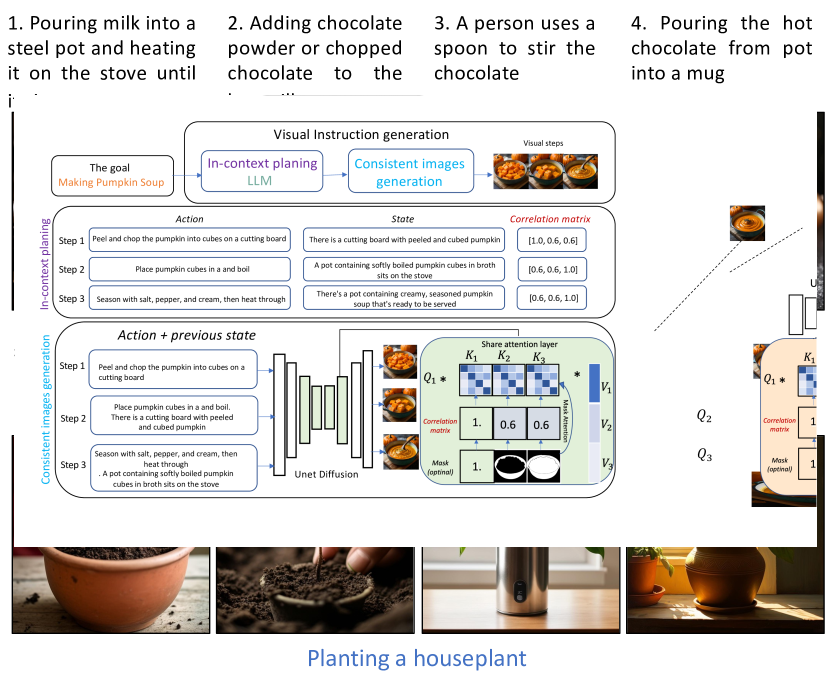

# 零-shot视觉指令生成：连贯性探索

发布时间：2024年06月06日

`LLM应用

这篇论文摘要描述了一种结合扩散模型和大型语言模型（LLMs）的方法，用于改进文本到图像合成技术中的视觉指令生成。这种方法特别强调了在连续步骤中保持物体一致性和状态平滑过渡的能力，并通过实验验证了其有效性。由于论文主要关注的是LLM在实际应用中的使用，即在文本到图像合成技术中的应用，因此将其归类为LLM应用。` `图像合成` `视觉指令`

> Coherent Zero-Shot Visual Instruction Generation

# 摘要

> 尽管扩散模型推动了文本到图像合成技术的进步，但生成在连续步骤中保持物体一致性和状态平滑过渡的视觉指令仍是一大挑战。本文提出了一种简单且无需额外训练的框架，巧妙结合扩散模型与大型语言模型（LLMs）的优势。我们的方法巧妙融合文本理解与图像生成，确保视觉指令既美观又能在整个序列中保持一致与精确。通过多步骤指令测试及与多个基准的文本对齐和一致性对比，我们验证了该方法的有效性。实验结果显示，我们的方法能生成既连贯又赏心悦目的视觉指令。

> Despite the advances in text-to-image synthesis, particularly with diffusion models, generating visual instructions that require consistent representation and smooth state transitions of objects across sequential steps remains a formidable challenge. This paper introduces a simple, training-free framework to tackle the issues, capitalizing on the advancements in diffusion models and large language models (LLMs). Our approach systematically integrates text comprehension and image generation to ensure visual instructions are visually appealing and maintain consistency and accuracy throughout the instruction sequence. We validate the effectiveness by testing multi-step instructions and comparing the text alignment and consistency with several baselines. Our experiments show that our approach can visualize coherent and visually pleasing instructions

[Arxiv](https://arxiv.org/abs/2406.04337)