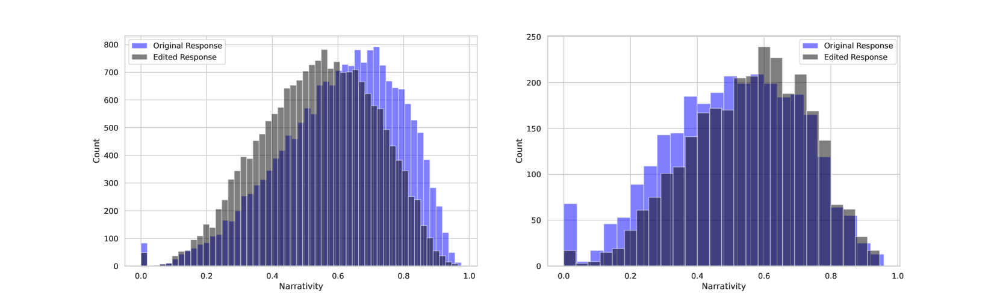

# 虚构之美：探索大型语言模型幻觉的意外价值

发布时间：2024年06月06日

`LLM理论

理由：这篇论文探讨了大型语言模型（LLM）产生“虚构”内容的能力，并将其视为一种潜在的优势而非缺陷。研究通过实证分析，探讨了LLM生成的虚构内容在叙述性和语义一致性方面的优势，这与人类沟通和理解的需求相吻合。这种对LLM生成能力的深入分析和理论探讨，属于对LLM理论层面的研究，因此应归类为LLM理论。` `叙事生成`

> Confabulation: The Surprising Value of Large Language Model Hallucinations

# 摘要

> 本文挑战了将大型语言模型（LLM）的“虚构”视为缺陷的传统观点，提出它们可能是一种有价值的资源。我们通过实证研究发现，LLM产生的虚构内容在叙述性和语义一致性上优于真实信息，这与人类利用叙述性增强理解与沟通的倾向相呼应。这一发现颠覆了我们对虚构的常规看法，暗示LLM的虚构能力可能是其生成连贯叙事文本的关键。

> This paper presents a systematic defense of large language model (LLM) hallucinations or 'confabulations' as a potential resource instead of a categorically negative pitfall. The standard view is that confabulations are inherently problematic and AI research should eliminate this flaw. In this paper, we argue and empirically demonstrate that measurable semantic characteristics of LLM confabulations mirror a human propensity to utilize increased narrativity as a cognitive resource for sense-making and communication. In other words, it has potential value. Specifically, we analyze popular hallucination benchmarks and reveal that hallucinated outputs display increased levels of narrativity and semantic coherence relative to veridical outputs. This finding reveals a tension in our usually dismissive understandings of confabulation. It suggests, counter-intuitively, that the tendency for LLMs to confabulate may be intimately associated with a positive capacity for coherent narrative-text generation.

[Arxiv](https://arxiv.org/abs/2406.04175)