# DICE：检测 LLM 数学推理微调中的分布内污染问题

发布时间：2024年06月06日

`LLM理论

理由：这篇论文主要探讨了大型语言模型（LLMs）评估中的数据污染问题，并提出了一种新的方法（DICE）来检测这种污染。这种方法涉及到对模型内部状态的深入分析，以识别和测量分布内污染。论文的内容更多地关注于LLMs的理论分析和评估方法的改进，而不是直接的应用或Agent的行为，也不是关于RAG（Retrieval-Augmented Generation）的具体研究。因此，将其归类为LLM理论是合适的。` `人工智能评估` `数学推理`

> DICE: Detecting In-distribution Contamination in LLM's Fine-tuning Phase for Math Reasoning

# 摘要

> 大型语言模型（LLMs）的评估依赖于公共基准，但数据污染可能导致性能评估失真。传统方法通过检查模型是否在训练中接触过基准数据来检测污染，而我们发现，即使训练数据与基准数据相似，也可能导致模型在特定任务上的表现虚高，而整体能力并未提升，这种现象我们称之为分布内污染。为此，我们开发了DICE方法，它通过分析LLMs的内部状态来精确定位并检测这种污染。DICE首先找出对污染最敏感的模型层，然后在该层内部状态的基础上训练分类器。实验证明，DICE在多种LLMs和数学推理数据集上检测分布内污染的准确性极高。此外，DICE检测器展现出强大的泛化能力，能跨多个分布相似的基准检测污染。我们还发现，DICE的检测分数与十种LLMs在四个数学推理数据集上的性能呈正相关，这暗示了分布内污染可能导致对模型真实能力的过高估计。相关代码和数据已公开于https://github.com/THU-KEG/DICE。

> The advancement of large language models (LLMs) relies on evaluation using public benchmarks, but data contamination can lead to overestimated performance. Previous researches focus on detecting contamination by determining whether the model has seen the exact same data during training. In this work, we argue that even training on data similar to benchmark data inflates performance on in-distribution tasks without improving overall capacity, which we called In-distribution contamination. To effectively detect in-distribution contamination, we propose DICE, a novel method that leverages the internal states of LLMs to locate-then-detect the contamination. DICE first identifies the most sensitive layer to contamination, then trains a classifier based on the internal states of that layer. Experiments reveal DICE's high accuracy in detecting in-distribution contamination across various LLMs and math reasoning datasets. We also show the generalization capability of the trained DICE detector, which is able to detect contamination across multiple benchmarks with similar distributions. Additionally, we find that the DICE detection scores are positively correlated with the performance of ten LLMs fine-tuned by either us or other organizations on four math reasoning datasets (with $R^2$ values between 0.6 and 0.75). This indicates that the in-distribution contamination problem potentially lead to an overestimation of the true capabilities of many existing models. The code and data are available at https://github.com/THU-KEG/DICE.

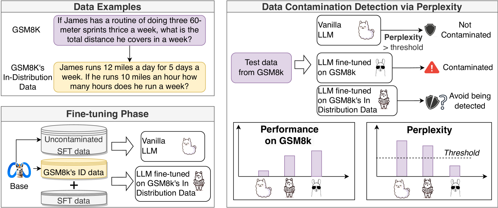

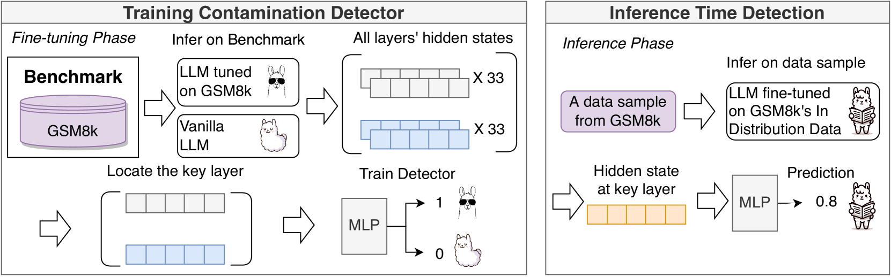

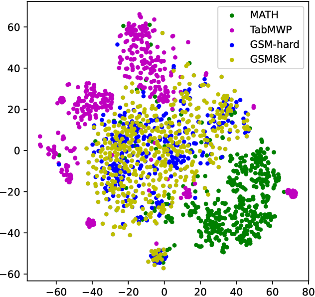

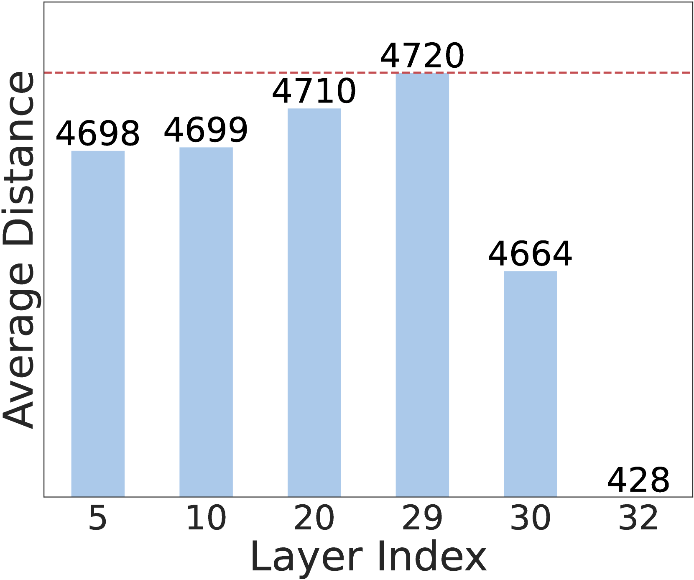

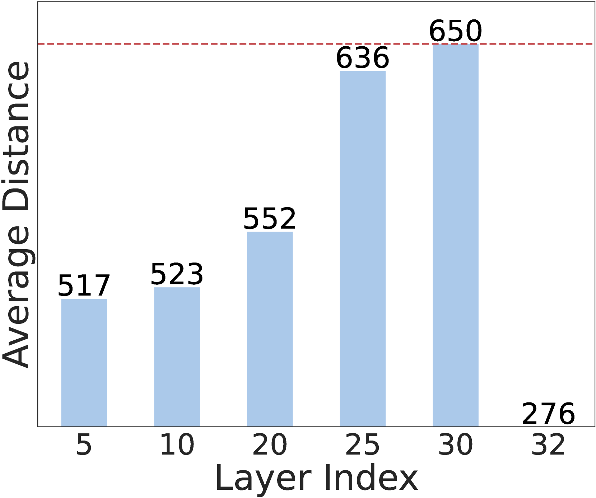

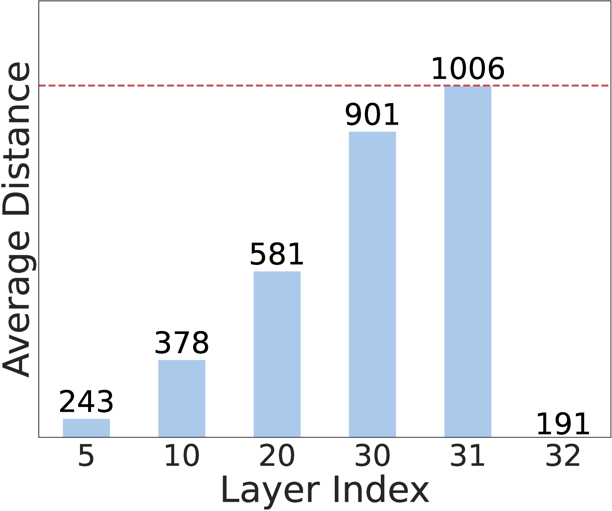

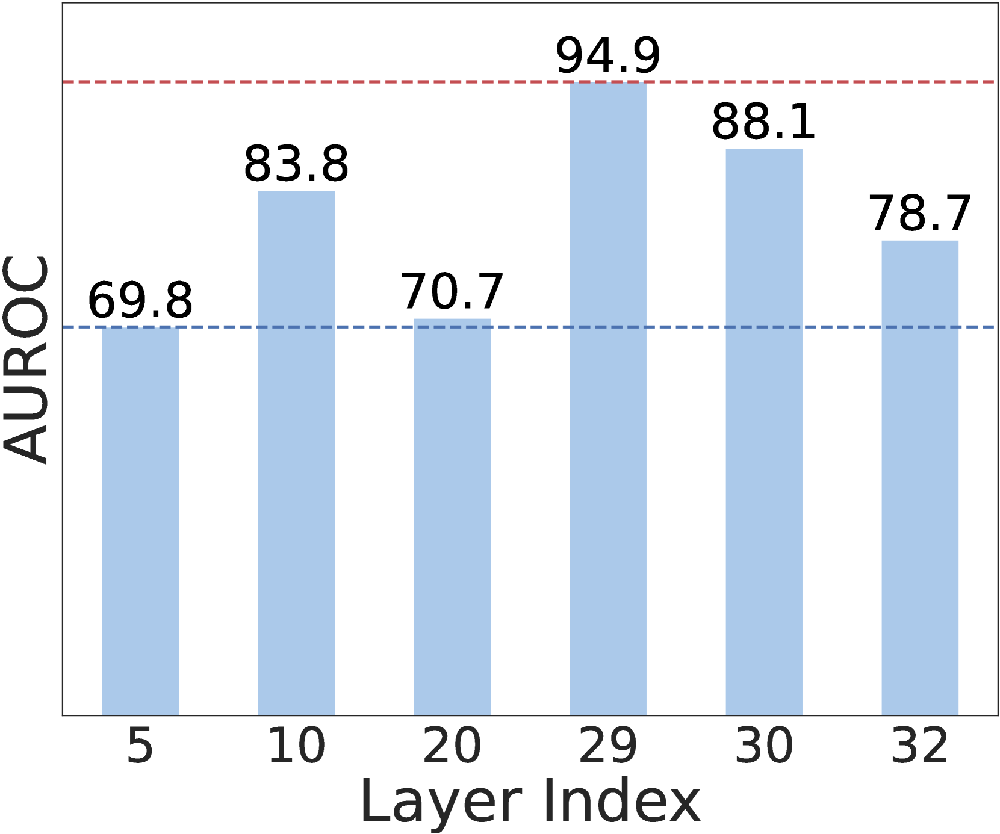

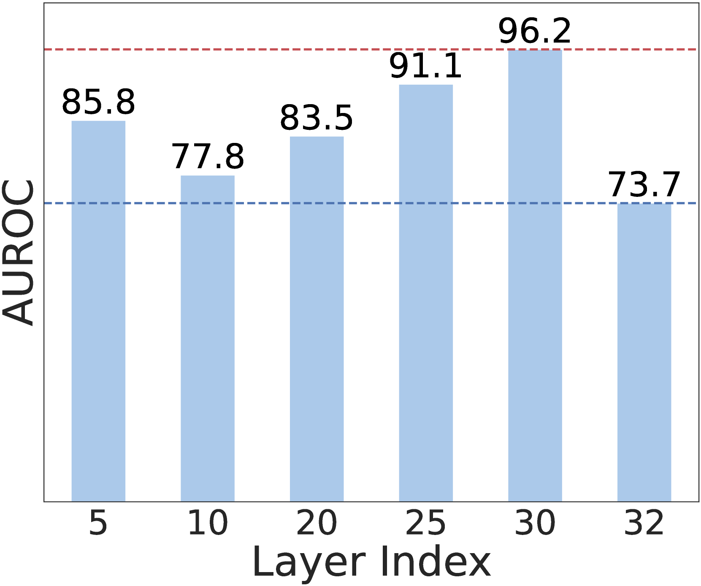

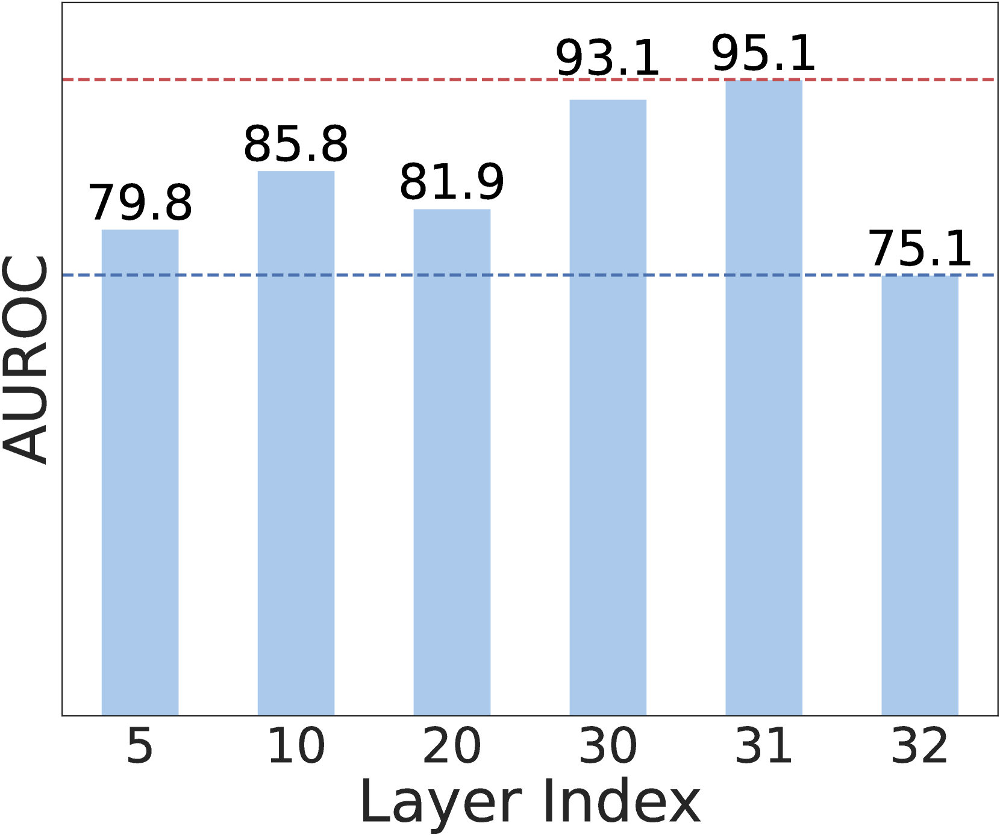

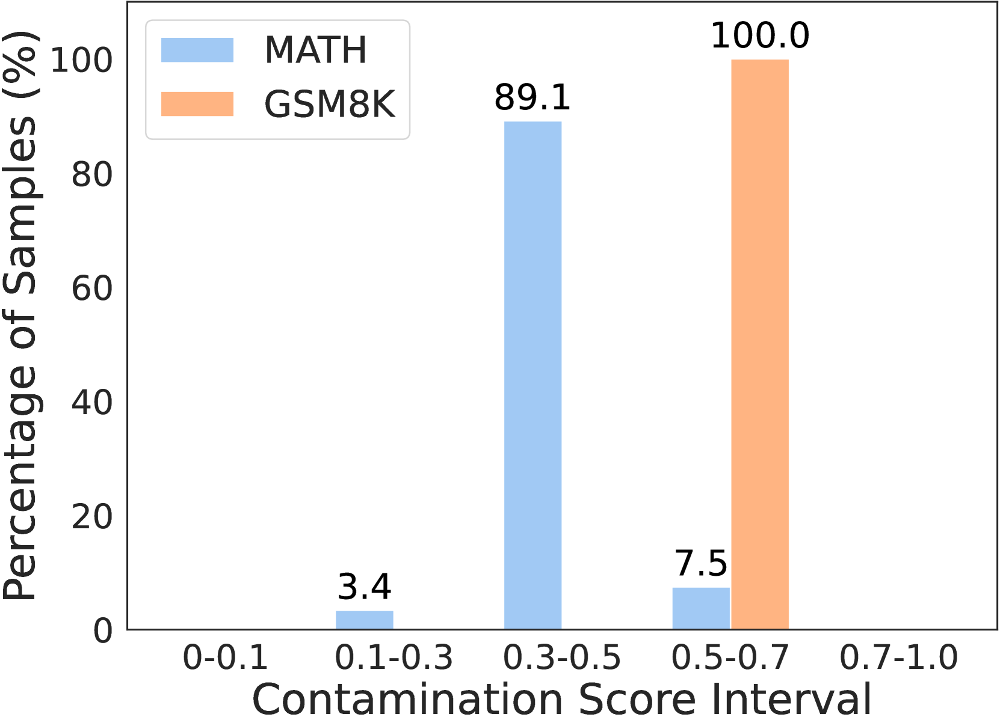

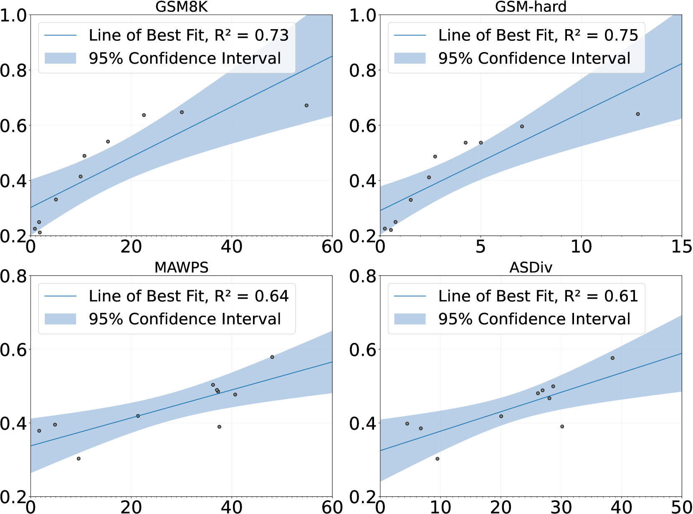

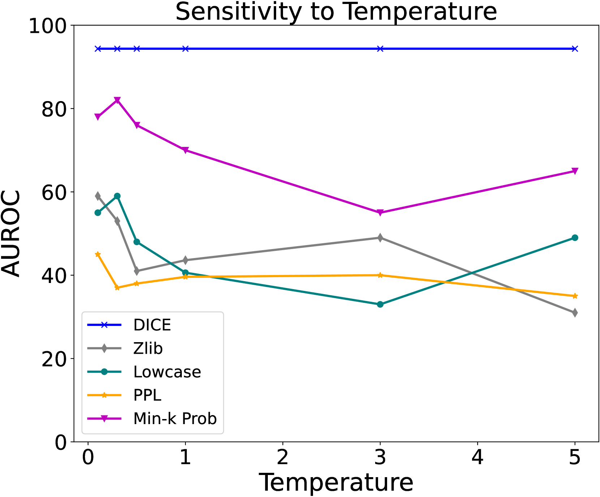

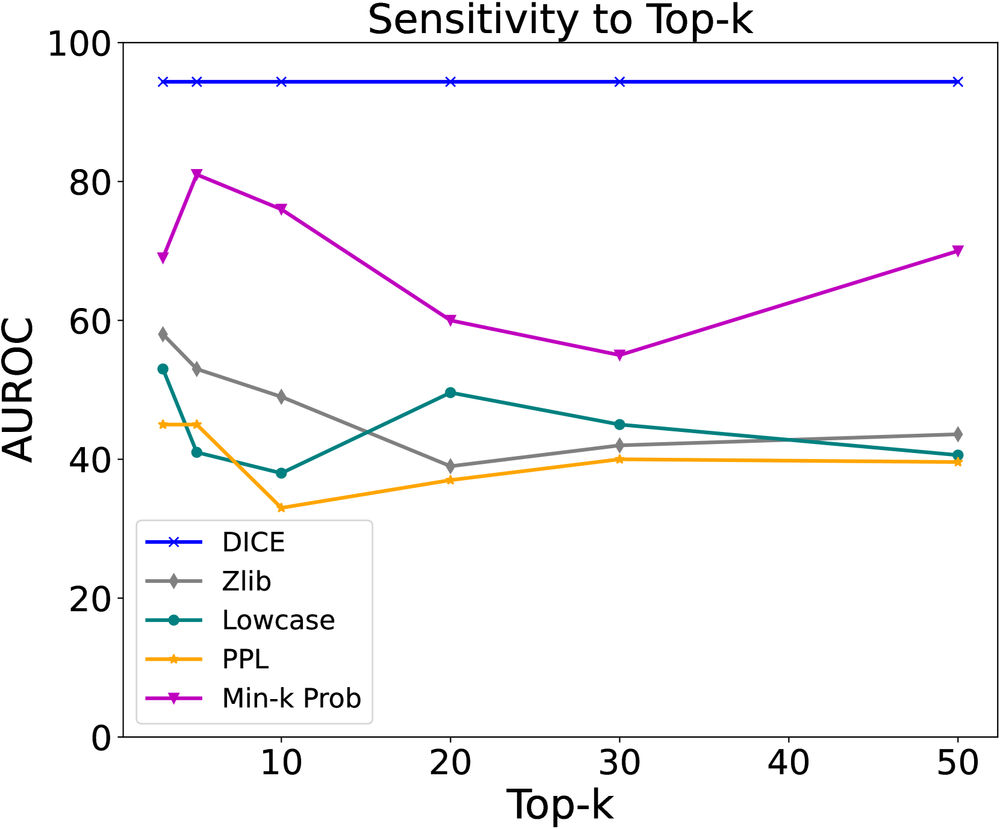

[Arxiv](https://arxiv.org/abs/2406.04197)