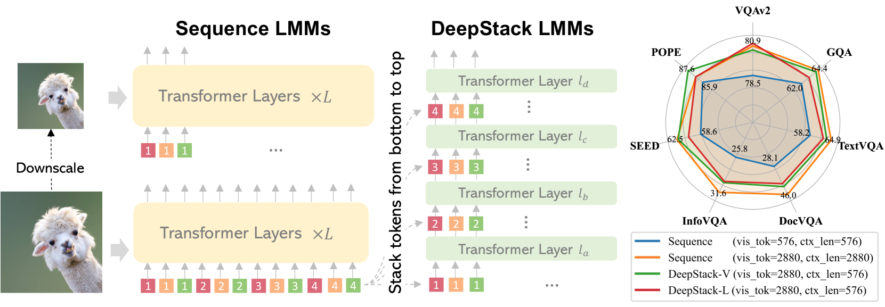
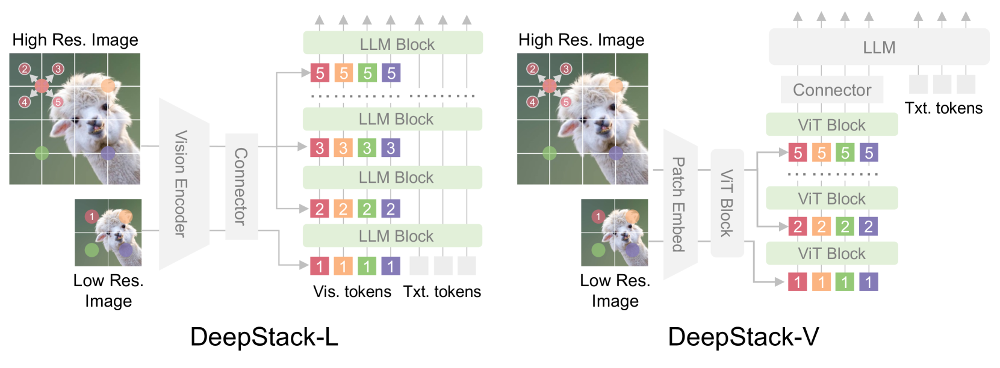
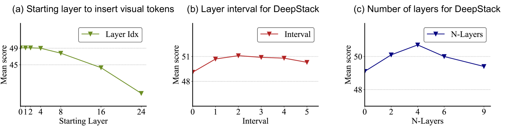
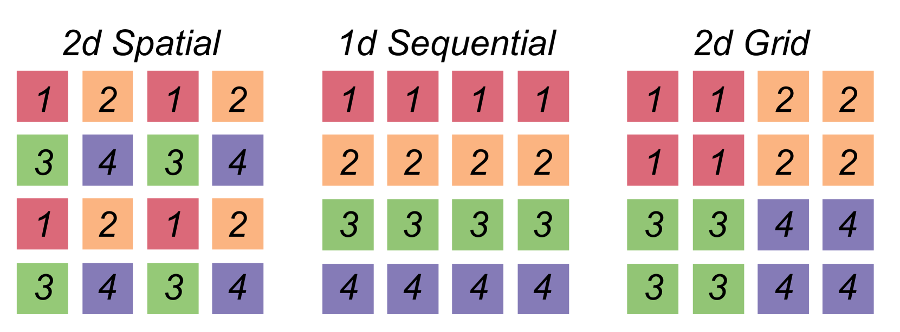

# DeepStack：通过深度堆叠视觉令牌，大型多模态模型（LMMs）的性能提升既简单又出乎意料地有效。

发布时间：2024年06月06日

`LLM应用

这篇论文介绍了一种新型的多模态模型架构DeepStack，该架构通过优化视觉令牌的处理方式，显著提升了大型多模态模型（LMMs）在处理视觉和语言信息时的性能。论文通过实证研究验证了DeepStack在多个基准测试中的有效性，展示了其在提升模型性能方面的优势。这种改进主要集中在应用层面，即如何更有效地利用大型语言模型（LLM）处理多模态数据，因此属于LLM应用分类。` `人工智能` `计算机视觉`

> DeepStack: Deeply Stacking Visual Tokens is Surprisingly Simple and Effective for LMMs

# 摘要

> 大多数大型多模态模型（LMMs）通过将视觉令牌序列输入至大型语言模型（LLM）的首层来构建。尽管架构简洁，但计算与内存开销显著增加，因需处理大量额外输入令牌。本文介绍了一种名为DeepStack的新型LMMs架构。针对LMMs中语言与视觉转换器的$N$层，我们将视觉令牌分组堆叠，并自下而上地输入至相应转换器层。这一简单策略意外地大幅提升了LMMs在跨层视觉令牌交互建模上的能力，且额外成本极低。我们通过广泛的实证研究，验证了DeepStack在LMMs中语言与视觉转换器上的有效性。在相同上下文长度下，DeepStack 7B与13B模型在9项基准测试中分别平均超越了2.7与2.9分。即便仅使用五分之一的上下文长度，DeepStack的表现也与使用全长的对手相当。在高分辨率任务上，如TextVQA、DocVQA和InfoVQA，相较于LLaVA-1.5-7B，分别实现了4.2、11.0和4.0的显著提升。此外，将DeepStack应用于视觉转换器层，平均提升了3.8分。

> Most large multimodal models (LMMs) are implemented by feeding visual tokens as a sequence into the first layer of a large language model (LLM). The resulting architecture is simple but significantly increases computation and memory costs, as it has to handle a large number of additional tokens in its input layer. This paper presents a new architecture DeepStack for LMMs. Considering $N$ layers in the language and vision transformer of LMMs, we stack the visual tokens into $N$ groups and feed each group to its aligned transformer layer \textit{from bottom to top}. Surprisingly, this simple method greatly enhances the power of LMMs to model interactions among visual tokens across layers but with minimal additional cost. We apply DeepStack to both language and vision transformer in LMMs, and validate the effectiveness of DeepStack LMMs with extensive empirical results. Using the same context length, our DeepStack 7B and 13B parameters surpass their counterparts by \textbf{2.7} and \textbf{2.9} on average across \textbf{9} benchmarks, respectively. Using only one-fifth of the context length, DeepStack rivals closely to the counterparts that use the full context length. These gains are particularly pronounced on high-resolution tasks, e.g., \textbf{4.2}, \textbf{11.0}, and \textbf{4.0} improvements on TextVQA, DocVQA, and InfoVQA compared to LLaVA-1.5-7B, respectively. We further apply DeepStack to vision transformer layers, which brings us a similar amount of improvements, \textbf{3.8} on average compared with LLaVA-1.5-7B.

[Arxiv](https://arxiv.org/abs/2406.04334)