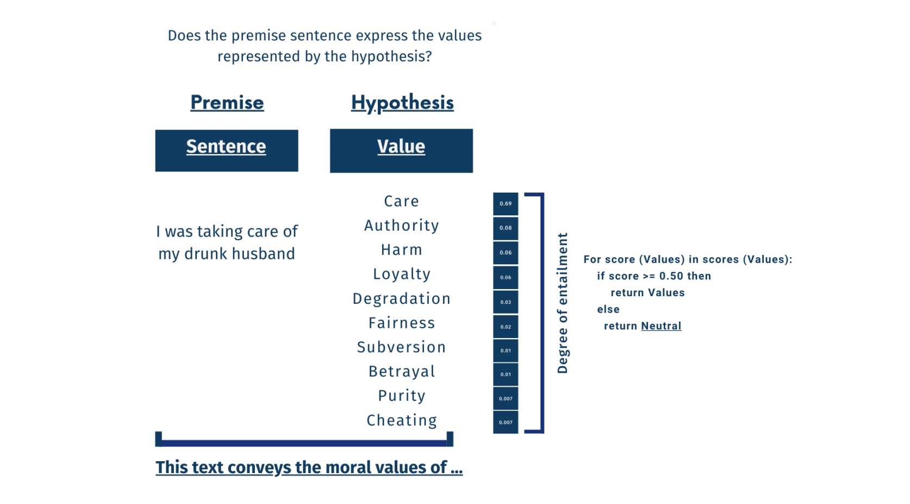

# 语言模型是否能理解道德？探索道德内容的稳健检测方法

发布时间：2024年06月06日

`LLM应用

这篇论文主要探讨了如何利用大型语言模型（如GPT 3.5）和自然语言推理模型来开发一个适应性强且稳健的道德价值观检测系统。研究中采用了零-shot无监督多标签分类器，并与基于NLI的零-shot模型进行了性能对比。这种方法的应用性质明显，因为它关注的是如何将LLM技术应用于道德价值观检测这一具体问题，而不是对LLM的理论研究或Agent的设计与实现。因此，这篇论文最适合归类为LLM应用。` `道德价值观检测`

> Do Language Models Understand Morality? Towards a Robust Detection of Moral Content

# 摘要

> 检测文本中的道德价值观对于自然语言处理、社会科学和伦理决策等领域至关重要。以往的监督模型常因过拟合而在跨领域数据上表现不佳。为此，我们开发了新系统，利用大型语言模型和自然语言推理模型在多源数据训练中积累的抽象概念和常识知识，旨在构建适应性强且稳健的道德价值观检测方法。我们采用GPT 3.5模型作为无需预训练的零-shot无监督多标签分类器，并与基于NLI的零-shot模型进行性能对比。结果表明，NLI方法与Davinci模型相比表现出色。我们还深入分析了监督模型在跨域多标签道德价值观检测中的表现，探索其在不同数据源上的有效性，并与无监督方法进行比较。我们的研究全面评估了跨域价值观检测的监督和无监督方法，并推出了Davinci模型，这一无需标记数据预训练的零-shot无监督道德价值观分类器，为道德价值观检测领域带来了新的突破。同时，我们通过与监督模型的比较，揭示了各自的优势与不足。

> The task of detecting moral values in text has significant implications in various fields, including natural language processing, social sciences, and ethical decision-making. Previously proposed supervised models often suffer from overfitting, leading to hyper-specialized moral classifiers that struggle to perform well on data from different domains. To address this issue, we introduce novel systems that leverage abstract concepts and common-sense knowledge acquired from Large Language Models and Natural Language Inference models during previous stages of training on multiple data sources. By doing so, we aim to develop versatile and robust methods for detecting moral values in real-world scenarios. Our approach uses the GPT 3.5 model as a zero-shot ready-made unsupervised multi-label classifier for moral values detection, eliminating the need for explicit training on labeled data. We compare it with a smaller NLI-based zero-shot model. The results show that the NLI approach achieves competitive results compared to the Davinci model. Furthermore, we conduct an in-depth investigation of the performance of supervised systems in the context of cross-domain multi-label moral value detection. This involves training supervised models on different domains to explore their effectiveness in handling data from different sources and comparing their performance with the unsupervised methods. Our contributions encompass a thorough analysis of both supervised and unsupervised methodologies for cross-domain value detection. We introduce the Davinci model as a state-of-the-art zero-shot unsupervised moral values classifier, pushing the boundaries of moral value detection without the need for explicit training on labeled data. Additionally, we perform a comparative evaluation of our approach with the supervised models, shedding light on their respective strengths and weaknesses.

[Arxiv](https://arxiv.org/abs/2406.04143)