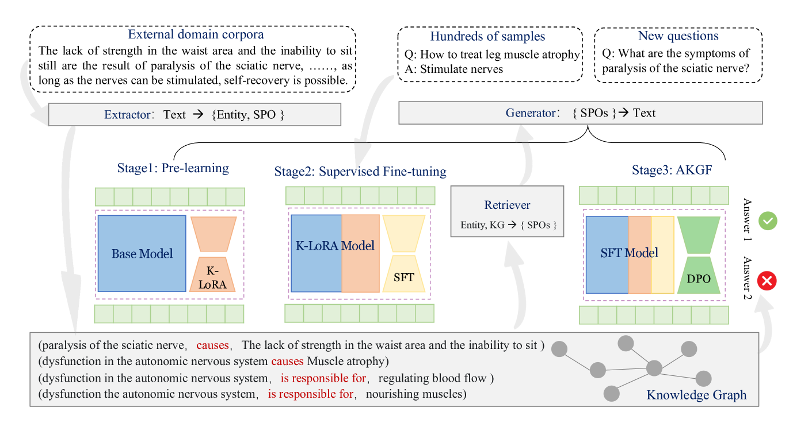
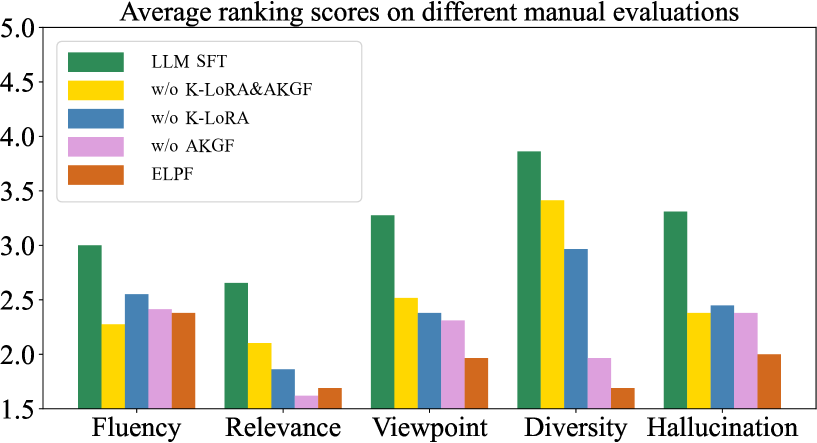
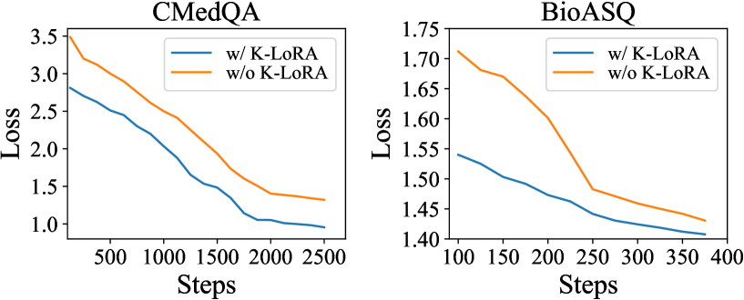
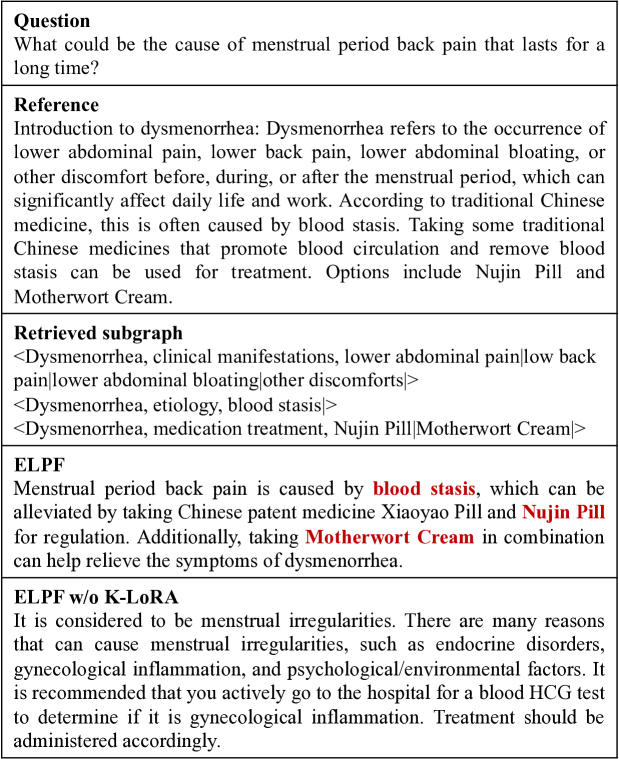
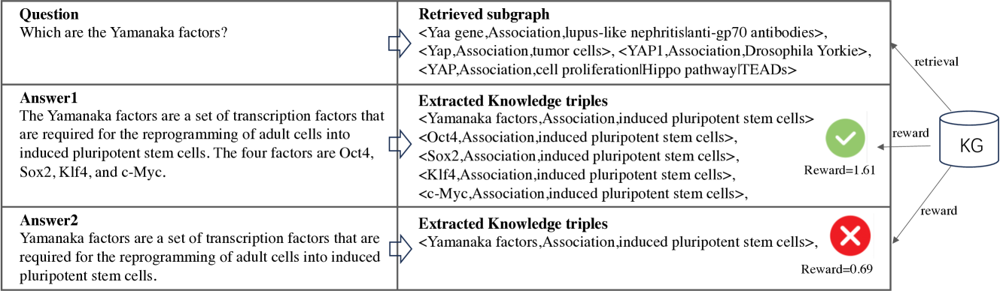
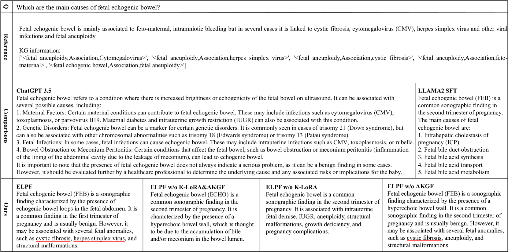

# 知识高效注入：KG-LLM对齐策略

发布时间：2024年06月06日

`RAG

这篇论文主要探讨了如何通过知识图谱检索增强技术来解决大型语言模型（LLMs）在特定领域知识不足的问题。论文提出了一种三阶段的对齐策略，旨在提升LLM利用知识图谱信息的能力。这种方法特别关注于如何通过LLM利用少量标记样本和大规模语料库来构建特定领域的知识图谱，并在生物医学问答数据集上进行了实验验证。因此，这篇论文更符合RAG分类，即检索增强生成（Retrieval-Augmented Generation），这是一种结合了检索系统和生成模型的技术，用于增强语言模型的知识表示和推理能力。` `生物医学` `问答系统`

> Efficient Knowledge Infusion via KG-LLM Alignment

# 摘要

> 针对大型语言模型（LLMs）特定领域知识不足的问题，我们采用知识图谱检索增强技术，有效注入知识。但现有方法受限于知识图谱与任务领域的不匹配及LLMs与知识图谱间的信息合规问题。为此，我们通过LLM利用少量标记样本和大规模语料库，构建了特定领域的知识图谱，并提出三阶段KG-LLM对齐策略，以提升LLM利用知识图谱信息的能力。实验在两个生物医学问答数据集上进行，有限样本设置下，我们的方法表现优于现有基线。

> To tackle the problem of domain-specific knowledge scarcity within large language models (LLMs), knowledge graph-retrievalaugmented method has been proven to be an effective and efficient technique for knowledge infusion. However, existing approaches face two primary challenges: knowledge mismatch between public available knowledge graphs and the specific domain of the task at hand, and poor information compliance of LLMs with knowledge graphs. In this paper, we leverage a small set of labeled samples and a large-scale corpus to efficiently construct domain-specific knowledge graphs by an LLM, addressing the issue of knowledge mismatch. Additionally, we propose a three-stage KG-LLM alignment strategyto enhance the LLM's capability to utilize information from knowledge graphs. We conduct experiments with a limited-sample setting on two biomedical question-answering datasets, and the results demonstrate that our approach outperforms existing baselines.

[Arxiv](https://arxiv.org/abs/2406.03746)