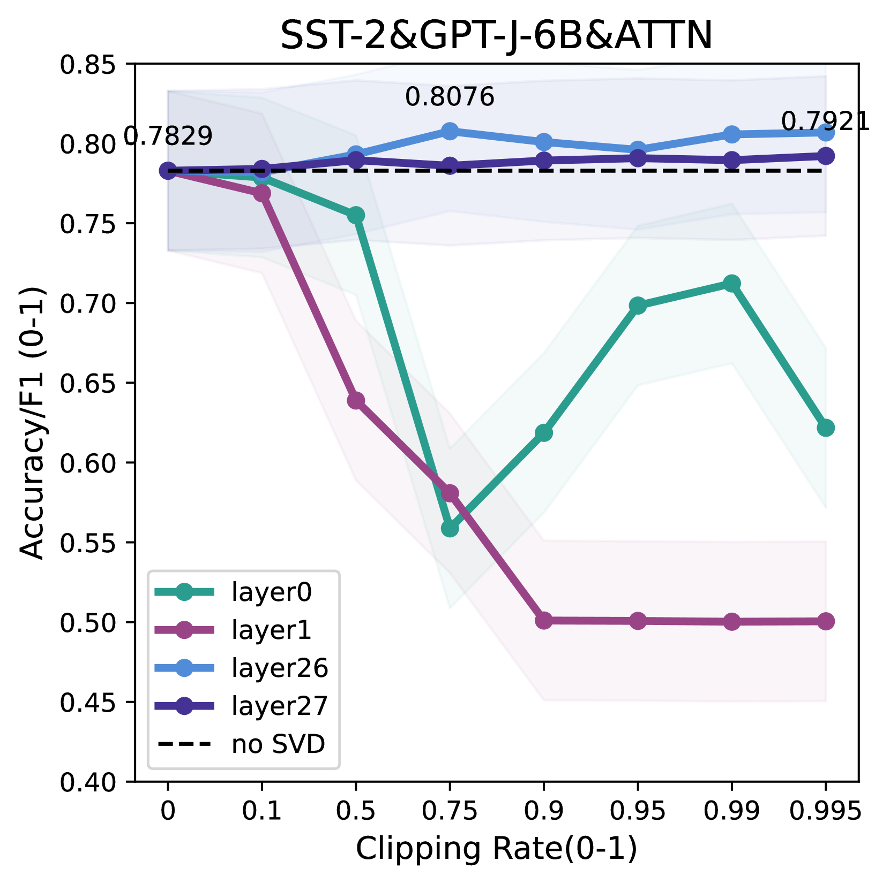
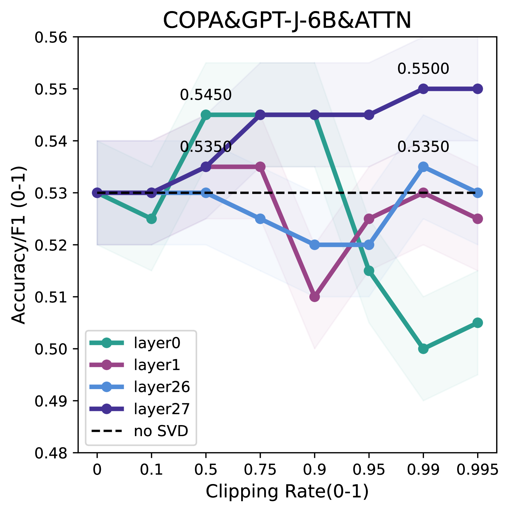

# 基于SVD的权重剪枝：理论视角下的上下文学习性能提升之道

发布时间：2024年06月06日

`LLM理论

这篇论文主要探讨了基于Transformer的大型语言模型（LLMs）在上下文学习（ICL）方面的性能提升机制，特别是通过基于SVD的权重剪枝方法。论文通过理论分析揭示了ICL的隐式梯度下降轨迹，并基于互信息提供了泛化界限，这些都是对LLM理论深层次的理解和探索。此外，论文还提出了一种新的模型压缩算法，这虽然涉及到应用层面的内容，但核心贡献在于理论分析和解释，因此更适合归类为LLM理论。` `机器学习` `模型压缩`

> Enhancing In-Context Learning Performance with just SVD-Based Weight Pruning: A Theoretical Perspective

# 摘要

> 基于Transformer的预训练大型语言模型（LLMs）在上下文学习（ICL）方面表现出色，仅凭几个示例输入-标签对就能准确预测未知输入的标签。本文揭示了一个有趣现象：基于SVD的权重剪枝能提升ICL性能，且深层剪枝竟能增强浅层的稳定性。尽管背后的机制尚不明确，我们通过深入的理论分析，展示了ICL的隐式梯度下降轨迹，并基于互信息提供了泛化界限，从而合理解释了这些实验结果。此外，结合实验与理论洞察，我们提出了一种简洁、无需导数的模型压缩算法，有效提升了下游任务的ICL推理能力。实验结果在多个数据集和开源模型上验证了其有效性。

> Pre-trained large language models (LLMs) based on Transformer have demonstrated striking in-context learning (ICL) abilities. With a few demonstration input-label pairs, they can predict the label for an unseen input without any parameter updates. In this paper, we show an exciting phenomenon that SVD-based weight pruning can enhance ICL performance, and more surprising, pruning weights in deep layers often results in more stable performance improvements in shallow layers. However, the underlying mechanism of those findings still remains an open question. To reveal those findings, we conduct an in-depth theoretical analysis by presenting the implicit gradient descent (GD) trajectories of ICL and giving the mutual information based generalization bounds of ICL via full implicit GD trajectories. This helps us reasonably explain the surprising experimental findings. Besides, based on all our experimental and theoretical insights, we intuitively propose a simple, model-compression and derivative-free algorithm for downstream tasks in enhancing ICL inference. Experiments on benchmark datasets and open source LLMs display the method effectiveness\footnote{The code is available at \url{https://github.com/chen123CtrlS/EnhancingICL_SVDPruning}}.

[Arxiv](https://arxiv.org/abs/2406.03768)