# 每个答案皆关键：运用概率度量评估常识

发布时间：2024年06月06日

`LLM理论

理由：这篇论文探讨了大型语言模型（LLM）在处理常识任务时的局限性，并提出了一种新的评估任务（常识框架补全，CFC）和评估方法。这表明论文主要关注的是LLM的理论发展和评估方法的改进，而不是具体的应用或Agent的设计。因此，它更适合归类于LLM理论。` `人工智能` `常识推理`

> Every Answer Matters: Evaluating Commonsense with Probabilistic Measures

# 摘要

> 大型语言模型在处理常识任务时表现卓越，但这些任务多为选择题，模型可利用其中的系统偏差。常识本质上是多答案的概率性问题，如“烧开水”既可用于泡茶烹饪，也可用于杀菌。现有任务未能体现常识的这一特性。因此，我们引入了常识框架补全（CFC），一项通过开放式生成评估常识的新任务，并提出了一种与人类判断紧密相关的概率评估方法。在我们的数据集中，人类表现远超语言模型，证明此方法对评估机器常识既具挑战又实用。

> Large language models have demonstrated impressive performance on commonsense tasks; however, these tasks are often posed as multiple-choice questions, allowing models to exploit systematic biases. Commonsense is also inherently probabilistic with multiple correct answers. The purpose of "boiling water" could be making tea and cooking, but it also could be killing germs. Existing tasks do not capture the probabilistic nature of common sense. To this end, we present commonsense frame completion (CFC), a new generative task that evaluates common sense via multiple open-ended generations. We also propose a method of probabilistic evaluation that strongly correlates with human judgments. Humans drastically outperform strong language model baselines on our dataset, indicating this approach is both a challenging and useful evaluation of machine common sense.

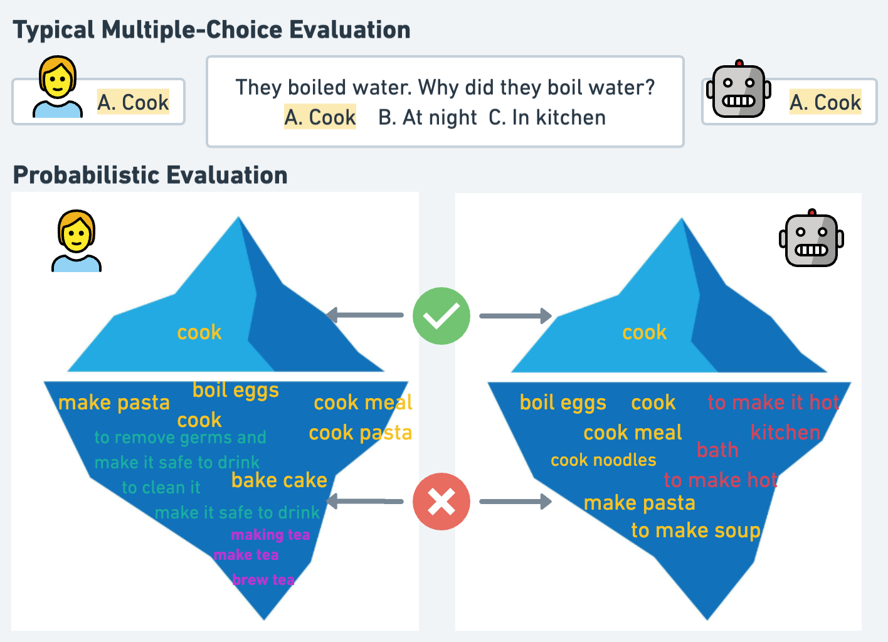

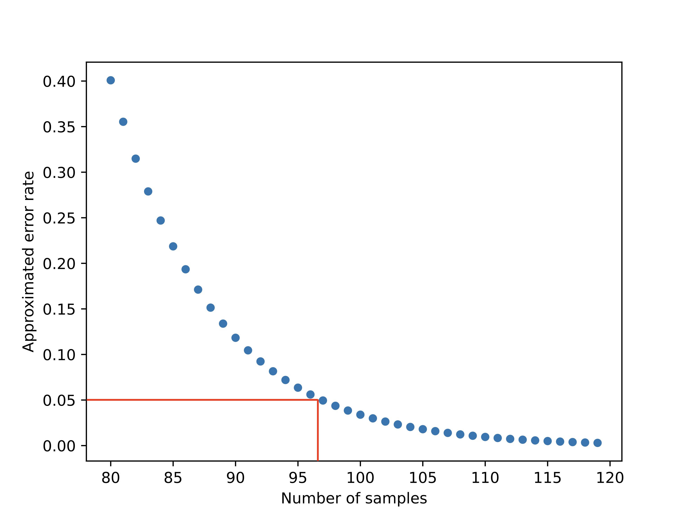

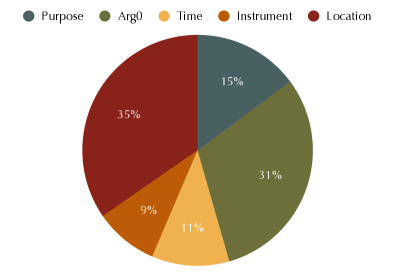

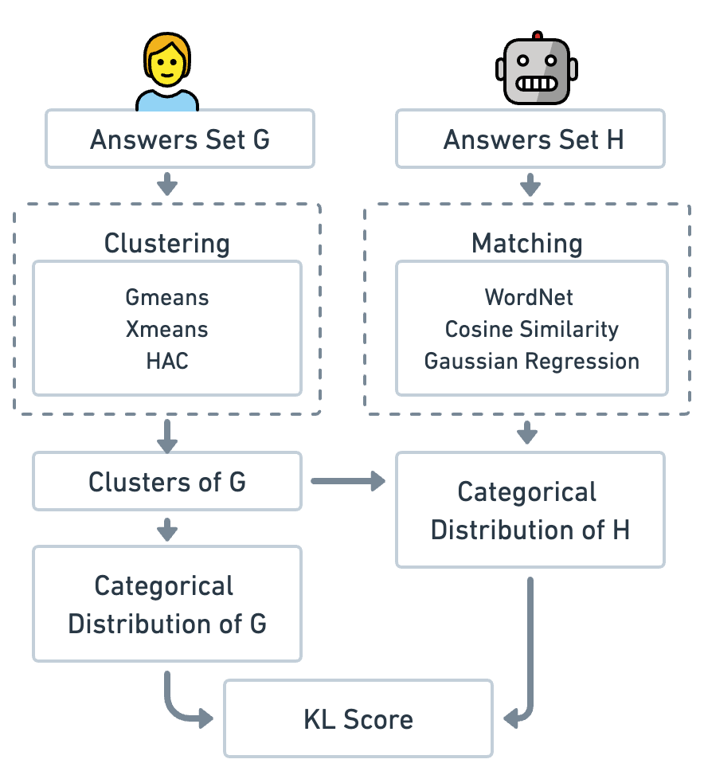

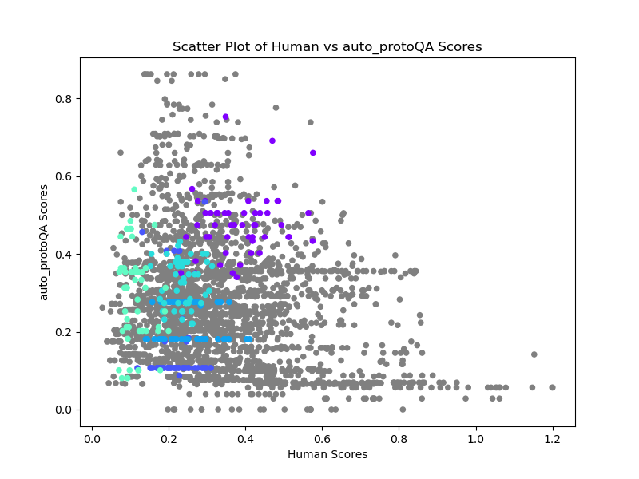

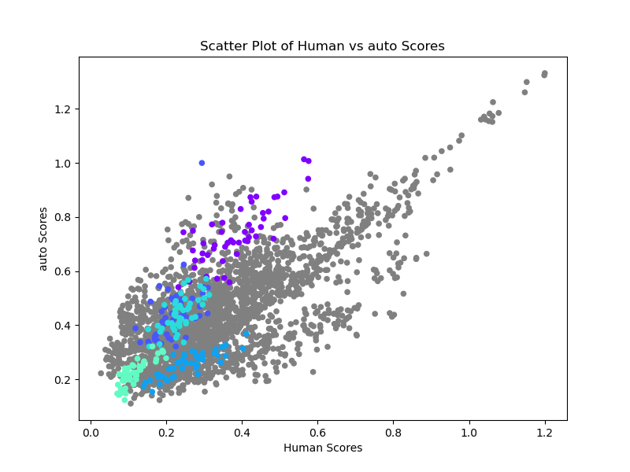

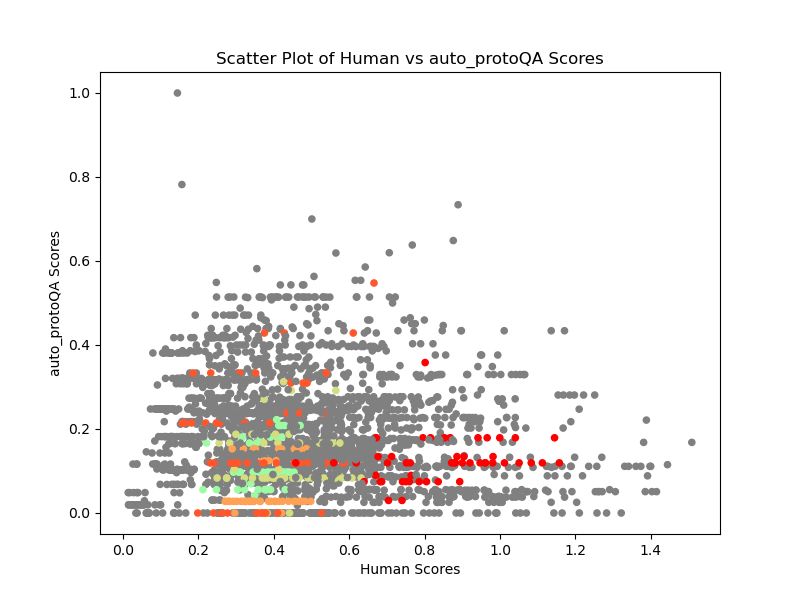

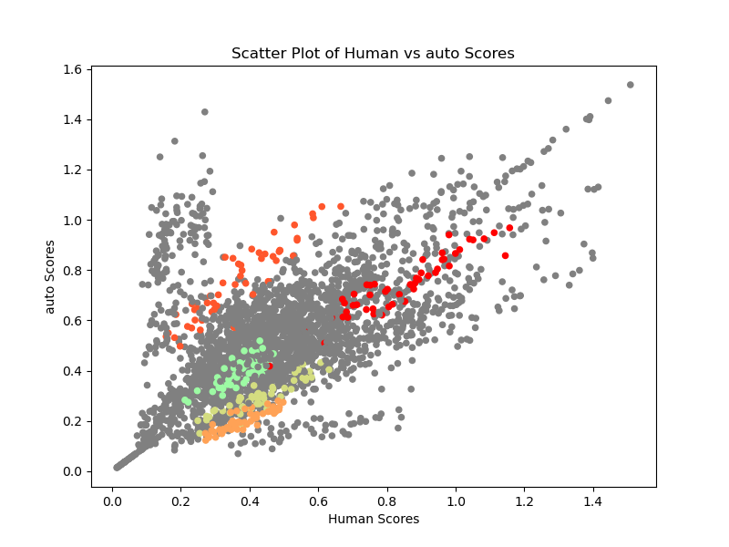

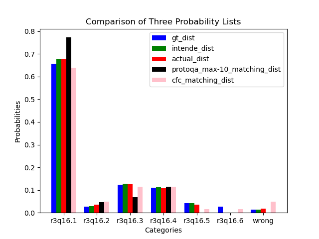

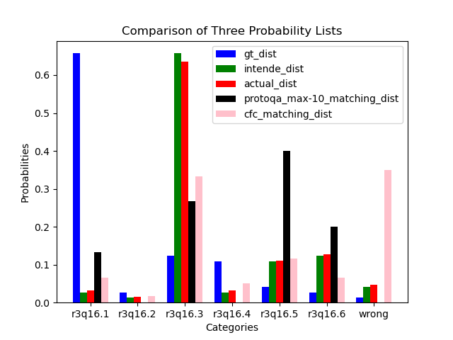

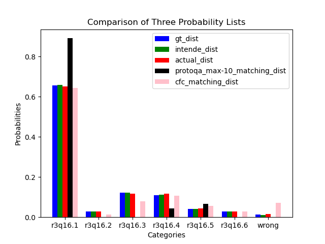

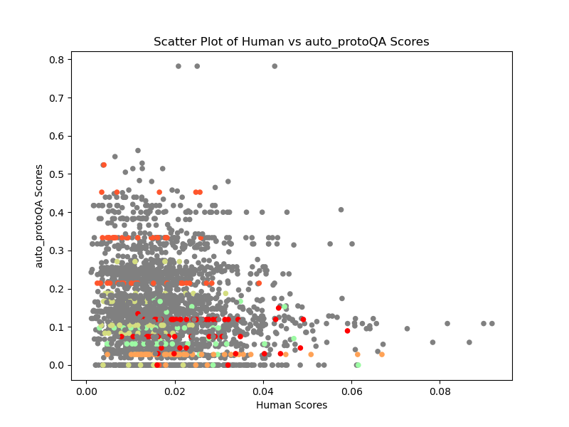

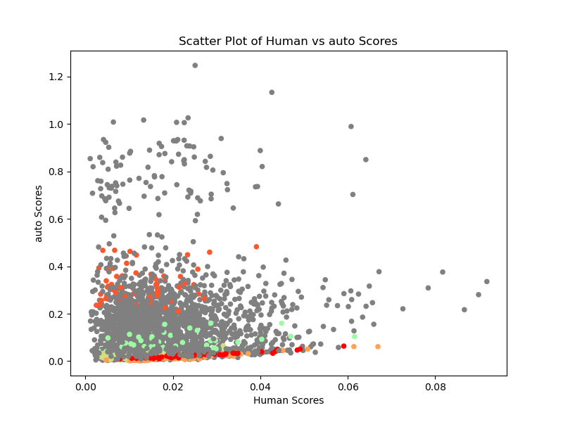

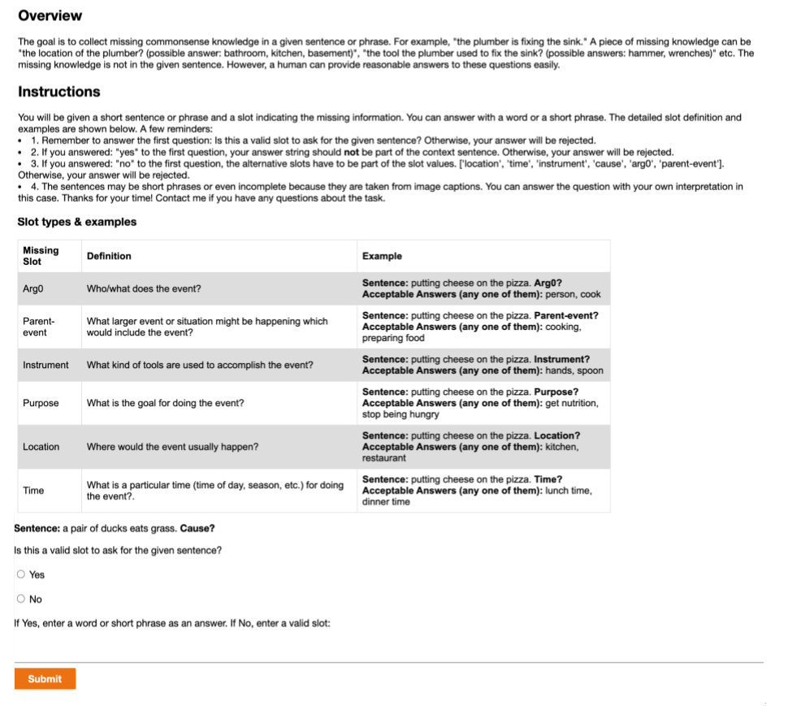

[Arxiv](https://arxiv.org/abs/2406.04145)