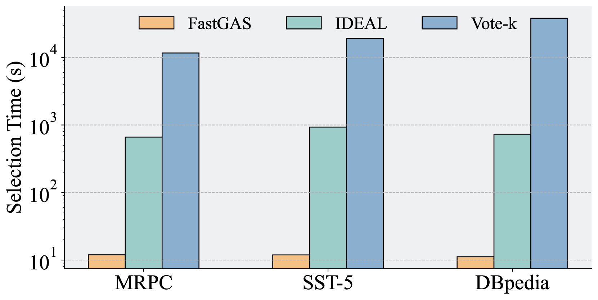
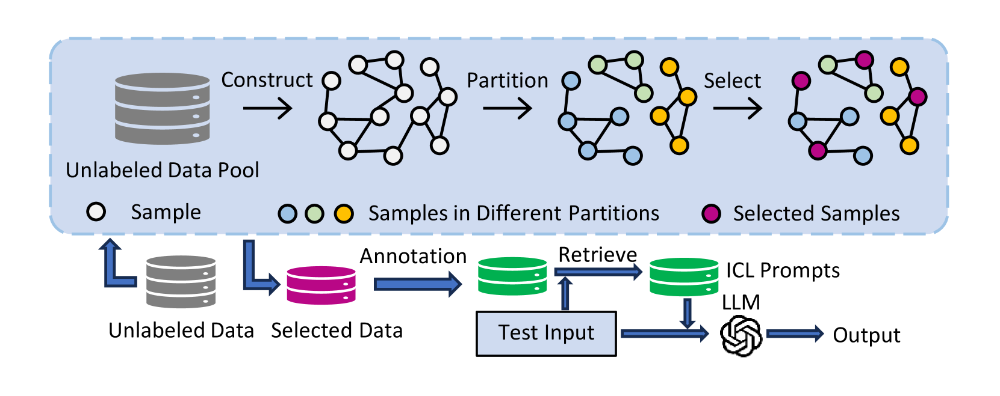
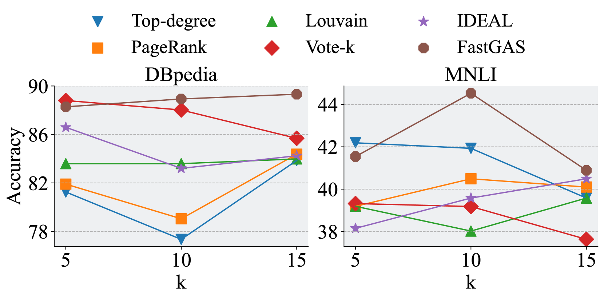
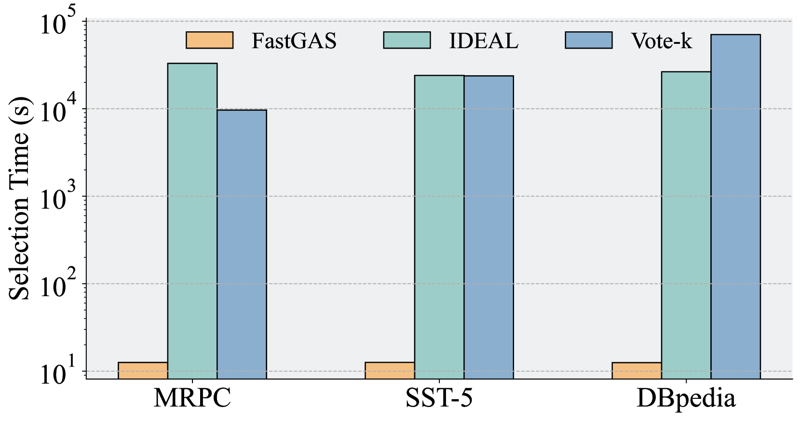
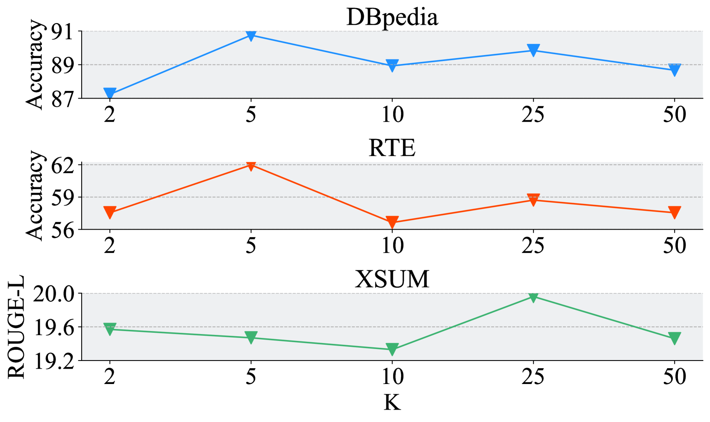
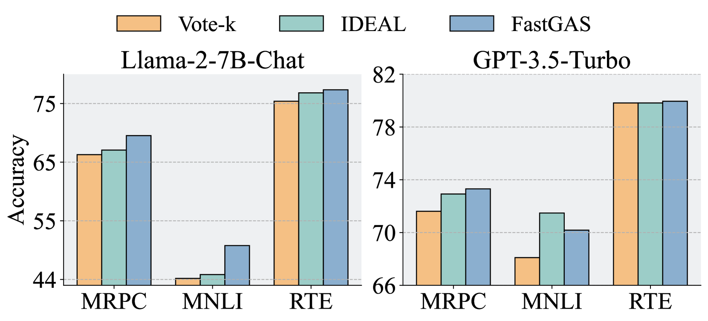

# FastGAS：快速图解标注选择，助力上下文学习

发布时间：2024年06月06日

`Agent

理由：这篇论文介绍了一种名为 FastGAS 的新方法，用于高效地选择高质量的训练实例，以提升大型语言模型（LLMs）的上下文学习（ICL）能力。FastGAS 通过构建基于实例相似性的数据图，并使用图分割算法和贪婪策略来选择最具代表性的节点，从而快速识别和标注高质量实例。这种方法可以被视为一个智能代理（Agent），因为它能够自主地执行任务（选择实例），并优化其性能。因此，这篇论文更适合归类到Agent分类中。` `机器学习`

> FastGAS: Fast Graph-based Annotation Selection for In-Context Learning

# 摘要

> ICL 赋予 LLMs 通过利用一系列训练实例作为提示来应对新任务的能力。生成这些提示涉及从庞大的实例库中抽样并进行标注，为此，现有技术倾向于挑选未标注的子集以提升提示质量并降低标注成本。但这些方法因复杂性而选择实例耗时，实用性受限。为此，我们开发了 FastGAS，一种基于图的高效选择方法，旨在快速识别高质量实例同时减少计算负担。我们首先构建基于实例相似性的数据图，然后运用图分割算法将其细分。在每个子图中，我们采用贪婪策略选取最具代表性的节点。通过整合来自不同子图的节点并标注相应实例，我们为 ICL 精选出既多样又具代表性的实例集。与以往方法相比，FastGAS 在多个任务上表现更佳，且大幅缩短了选择时间，并在更大规模的 LLMs 中验证了其有效性。

> In-context learning (ICL) empowers large language models (LLMs) to tackle new tasks by using a series of training instances as prompts. Since generating the prompts needs to sample from a vast pool of instances and annotate them (e.g., add labels in classification task), existing methods have proposed to select a subset of unlabeled examples for annotation, thus enhancing the quality of prompts and concurrently mitigating annotation costs. However, these methods often require a long time to select instances due to their complexity, hindering their practical viability. To address this limitation, we propose a graph-based selection method, FastGAS, designed to efficiently identify high-quality instances while minimizing computational overhead. Initially, we construct a data similarity graph based on instance similarities. Subsequently, employing a graph partitioning algorithm, we partition the graph into pieces. Within each piece (i.e., subgraph), we adopt a greedy approach to pick the most representative nodes. By aggregating nodes from diverse pieces and annotating the corresponding instances, we identify a set of diverse and representative instances for ICL. Compared to prior approaches, our method not only exhibits superior performance on different tasks but also significantly reduces selection time. In addition, we demonstrate the efficacy of our approach in LLMs of larger sizes.

[Arxiv](https://arxiv.org/abs/2406.03730)