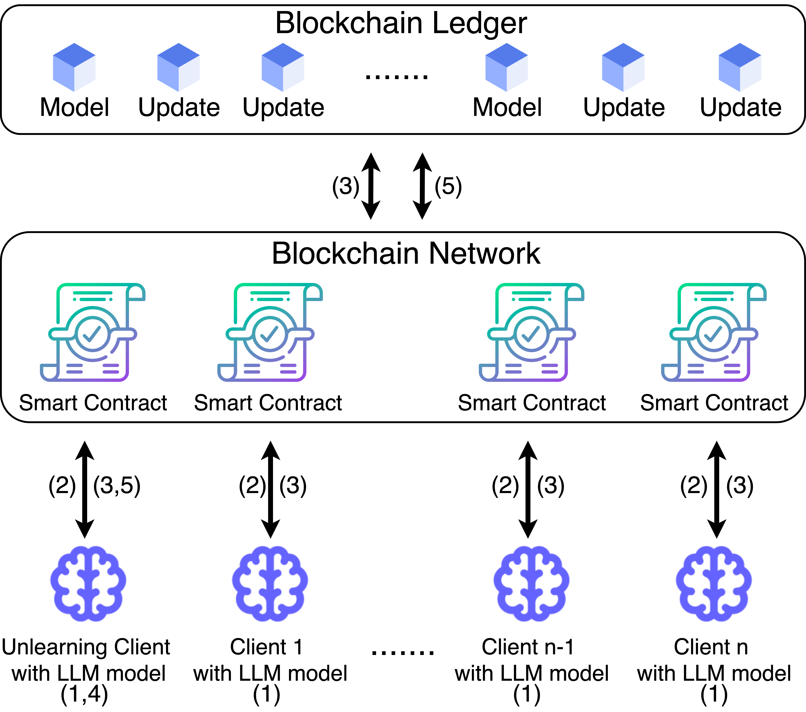
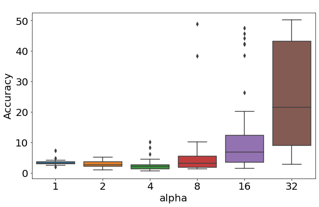
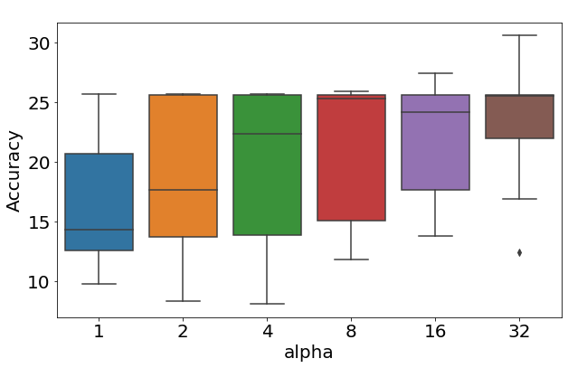
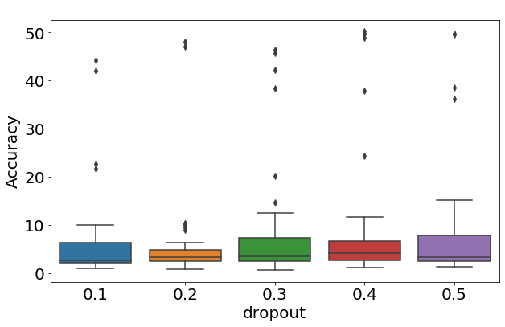
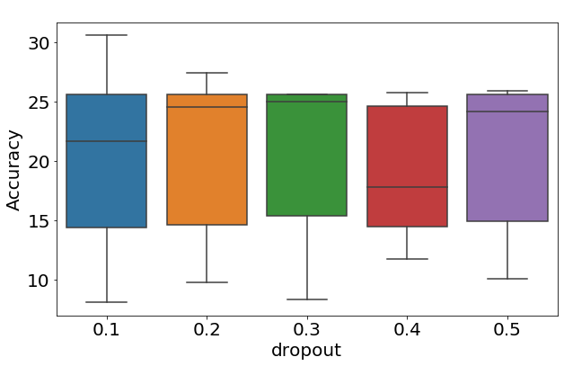
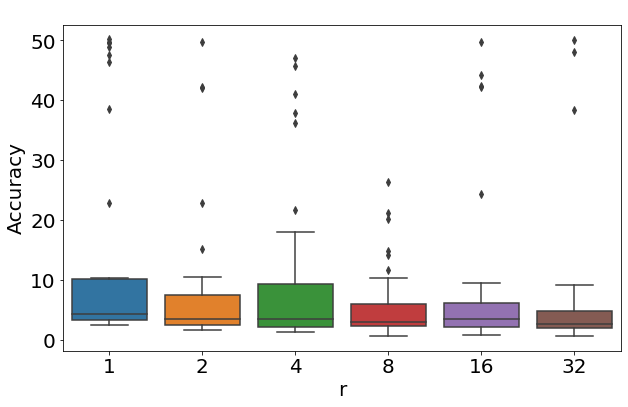
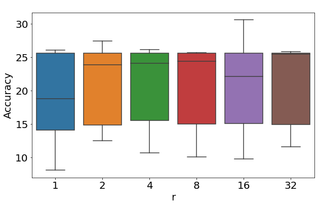

# 联邦信任链：利用区块链优化大型语言模型训练与遗忘机制

发布时间：2024年06月06日

`LLM应用

这篇论文探讨了大型语言模型（LLMs）在联邦学习环境下的透明度、问责制和遗忘机制问题，并提出了一种基于区块链的解决方案。该研究关注的是LLMs在实际应用中的具体问题和解决方案，特别是如何通过技术手段（如区块链）来增强模型的安全性和可信度，因此属于LLM应用分类。` `区块链` `联邦学习`

> Federated TrustChain: Blockchain-Enhanced LLM Training and Unlearning

# 摘要

> 大型语言模型（LLMs）的训练面临数据枯竭的难题，联邦学习为此提供了解决方案，允许各模型共享私有数据以支持全局模型。但这一结合也带来了透明度不足和遗忘机制缺失的新挑战。透明度是维护参与者信任与公平的关键，问责制则是防止恶意行为和实施必要纠正措施的基石。为此，我们提出了一种基于区块链的联邦学习框架，旨在提升LLMs的透明度、问责制和遗忘能力。该框架通过区块链技术确保模型贡献的不可篡改性，并创新性地整合了遗忘功能。我们探讨了LoRA超参数对遗忘效果的影响，并利用Hyperledger Fabric保障遗忘过程的安全、透明和可验证。实验结果证实，我们的框架能有效实现LLMs中的高效遗忘，证明了区块链技术与联邦学习框架结合的可行性。

> The development of Large Language Models (LLMs) faces a significant challenge: the exhausting of publicly available fresh data. This is because training a LLM needs a large demanding of new data. Federated learning emerges as a promising solution, enabling collaborative model to contribute their private data to LLM global model. However, integrating federated learning with LLMs introduces new challenges, including the lack of transparency and the need for effective unlearning mechanisms. Transparency is essential to ensuring trust and fairness among participants, while accountability is crucial for deterring malicious behaviour and enabling corrective actions when necessary. To address these challenges, we propose a novel blockchain-based federated learning framework for LLMs that enhances transparency, accountability, and unlearning capabilities. Our framework leverages blockchain technology to create a tamper-proof record of each model's contributions and introduces an innovative unlearning function that seamlessly integrates with the federated learning mechanism. We investigate the impact of Low-Rank Adaptation (LoRA) hyperparameters on unlearning performance and integrate Hyperledger Fabric to ensure the security, transparency, and verifiability of the unlearning process. Through comprehensive experiments and analysis, we showcase the effectiveness of our proposed framework in achieving highly effective unlearning in LLMs trained using federated learning. Our findings highlight the feasibility of integrating blockchain technology into federated learning frameworks for LLMs.

[Arxiv](https://arxiv.org/abs/2406.04076)