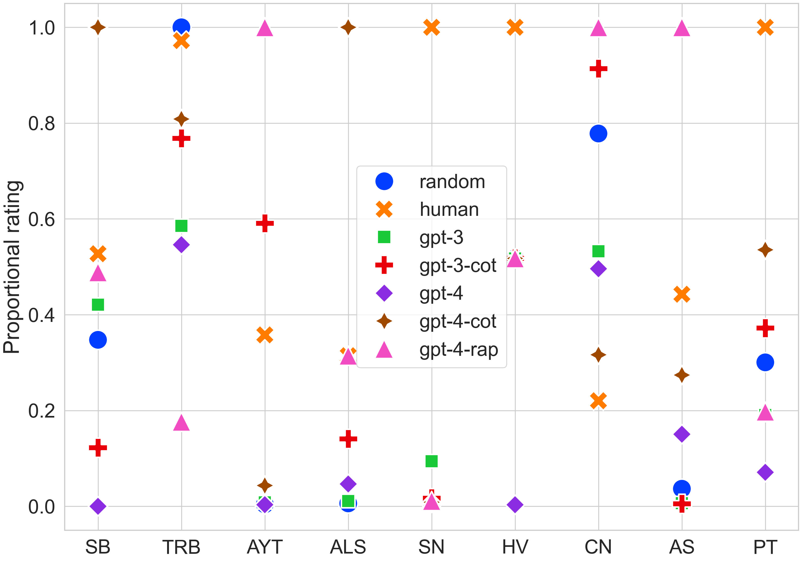
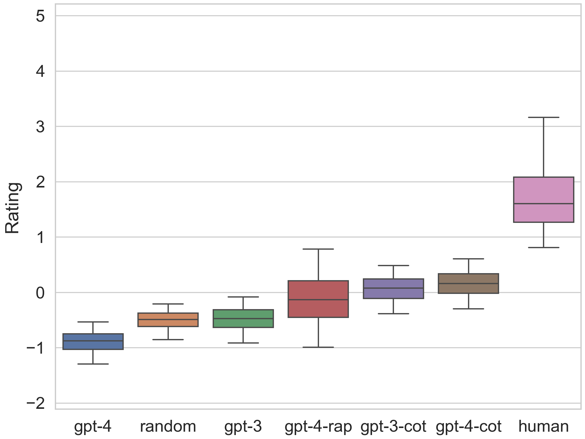
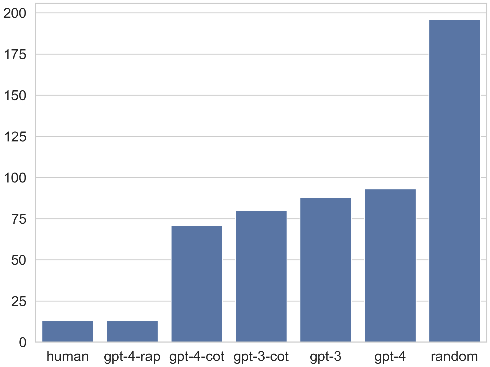
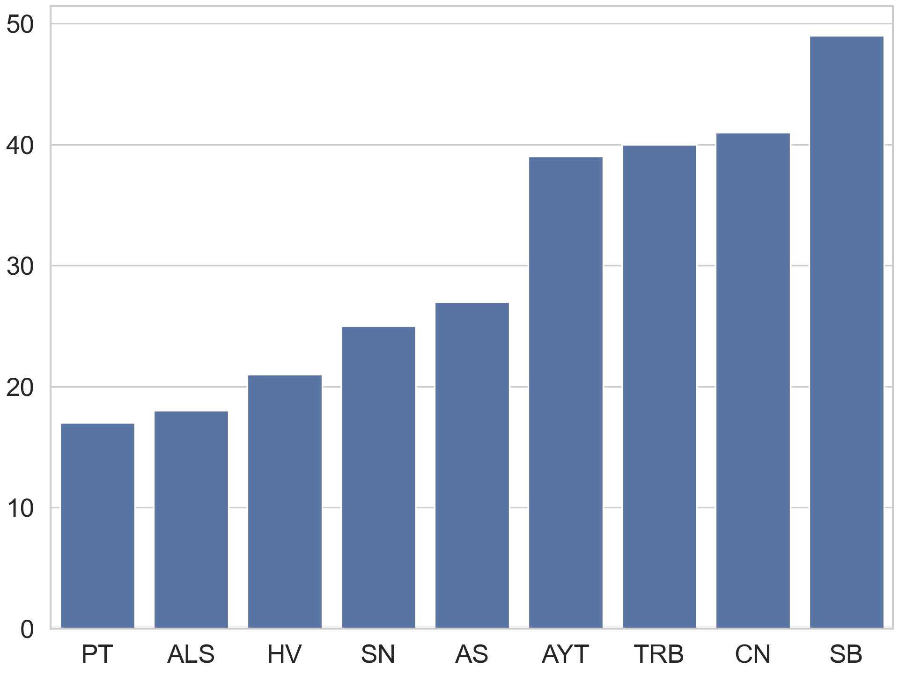

# GameBench：探究 LLM 代理在战略推理上的表现

发布时间：2024年06月06日

`Agent

这篇论文主要关注的是大型语言模型（LLM）在游戏环境中作为代理（Agent）的推理能力评估。论文中提到的GameBench是一个专门用于衡量LLM代理在策略游戏中的推理技能的基准。它涉及了多种游戏环境和不同的推理技能维度，并使用了GPT-3和GPT-4模型进行评估，同时探讨了思维链（CoT）提示和通过规划进行推理（RAP）框架对提升模型表现的影响。因此，这篇论文更符合Agent分类，因为它专注于LLM在特定任务（即游戏策略推理）中的应用和性能评估。` `人工智能`

> GameBench: Evaluating Strategic Reasoning Abilities of LLM Agents

# 摘要

> 大型语言模型在众多自然语言理解任务上展现了卓越的少量样本学习能力。尽管已有多个案例展示了大型语言模型在复杂策略场景中的应用，但目前尚缺乏一个全面框架来评估代理在游戏中的多样化推理能力。为此，我们推出了GameBench，这是一个跨领域的基准，专门用于衡量LLM代理的战略推理技能。我们选取了9种不同的游戏环境，每种都至少涵盖了策略游戏中关键推理技能的一个维度，并特别挑选了那些策略解释不太可能成为模型预训练语料库重要组成部分的游戏。在评估中，我们使用了GPT-3和GPT-4的基础版本，并结合了两种旨在提升战略推理能力的框架：思维链（CoT）提示和通过规划进行推理（RAP）。结果表明，尽管CoT和RAP提升了模型表现，但仍未能达到人类水平，且在最差情况下，GPT-4的表现甚至不如随机选择。

> Large language models have demonstrated remarkable few-shot performance on many natural language understanding tasks. Despite several demonstrations of using large language models in complex, strategic scenarios, there lacks a comprehensive framework for evaluating agents' performance across various types of reasoning found in games. To address this gap, we introduce GameBench, a cross-domain benchmark for evaluating strategic reasoning abilities of LLM agents. We focus on 9 different game environments, where each covers at least one axis of key reasoning skill identified in strategy games, and select games for which strategy explanations are unlikely to form a significant portion of models' pretraining corpuses. Our evaluations use GPT-3 and GPT-4 in their base form along with two scaffolding frameworks designed to enhance strategic reasoning ability: Chain-of-Thought (CoT) prompting and Reasoning Via Planning (RAP). Our results show that none of the tested models match human performance, and at worse GPT-4 performs worse than random action. CoT and RAP both improve scores but not comparable to human levels.

[Arxiv](https://arxiv.org/abs/2406.06613)