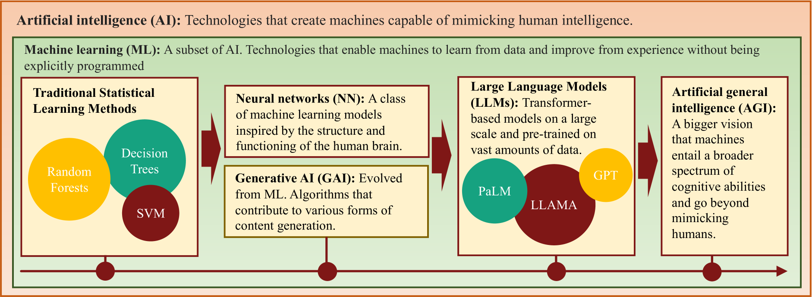
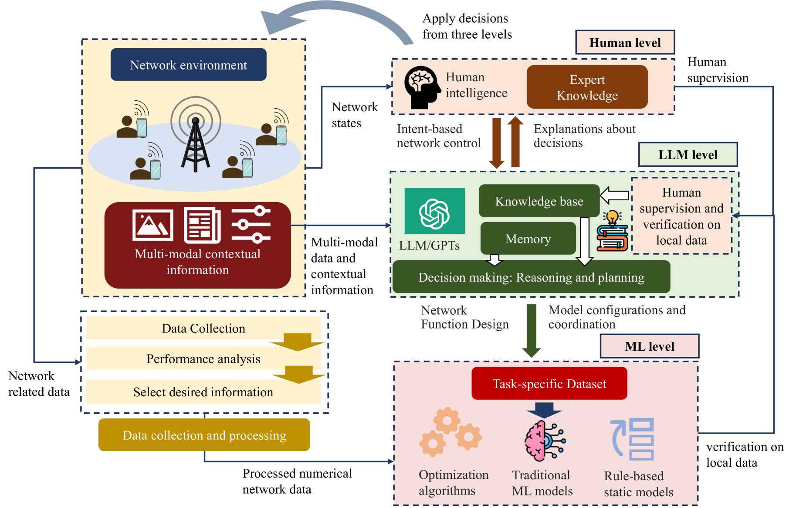
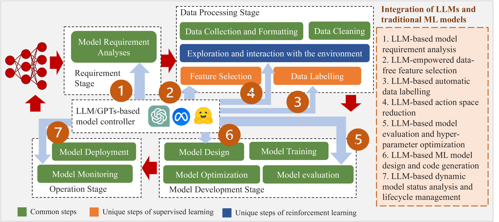
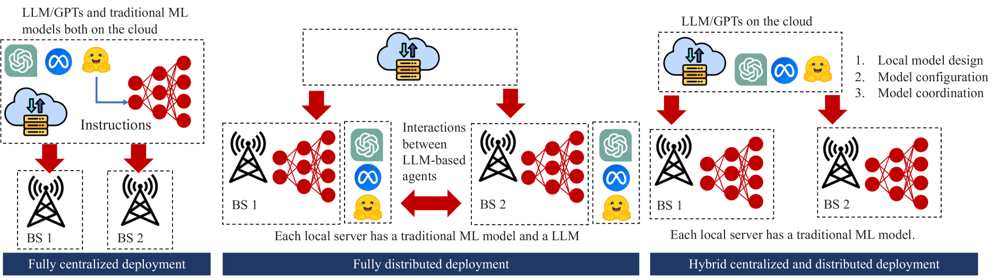
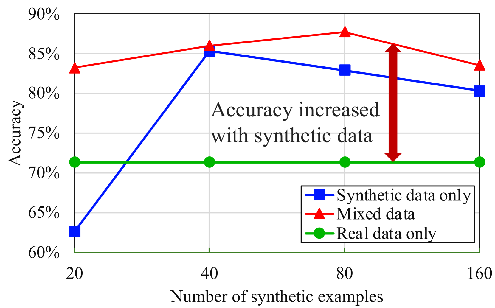
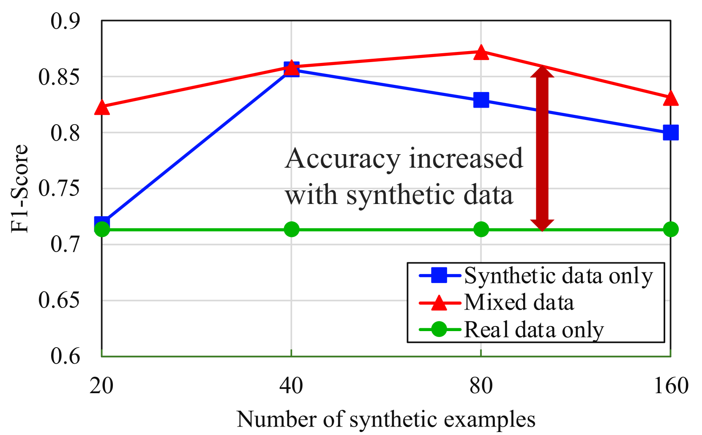
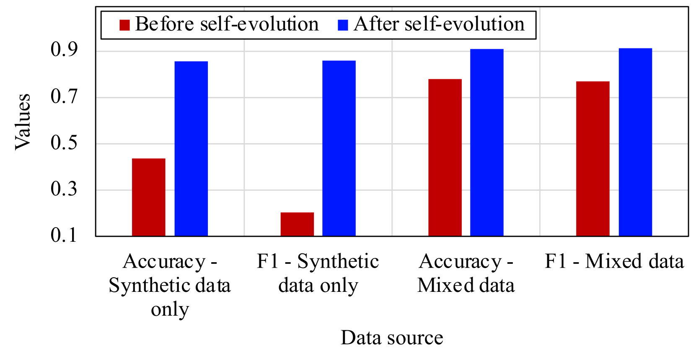
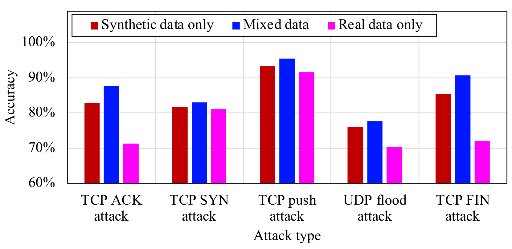
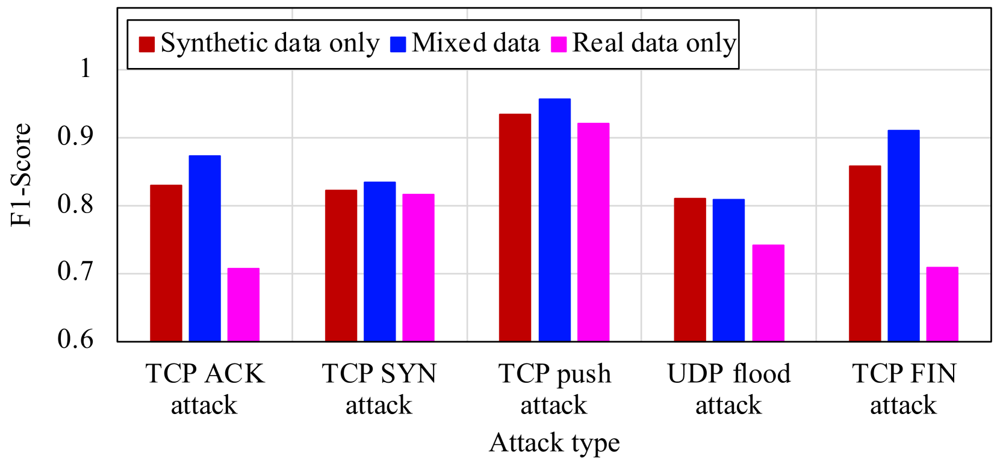

# 下一代网络中的生成式AI整合：融合大型语言模型与GPT技术

发布时间：2024年06月06日

`LLM应用

这篇论文探讨了大型语言模型（LLMs）在移动通信网络中的应用，特别是在与传统机器学习（ML）技术结合的情况下，如何提升网络自动化和应对复杂或突发情况的能力。论文提出了“生成AI-in-the-loop”的概念，并分析了LLMs与传统ML算法的能力对比，探讨了它们在移动网络中的协同应用。此外，论文还通过案例研究展示了LLMs生成的合成数据如何提升基于ML的网络入侵检测系统。这些内容主要关注LLMs的实际应用，特别是在网络技术领域，因此属于LLM应用分类。` `移动通信网络` `网络安全`

> Generative AI-in-the-loop: Integrating LLMs and GPTs into the Next Generation Networks

# 摘要

> 近年来，机器学习技术极大地推动了智能移动网络的发展，并加速了网络自动化的进程。然而，面对复杂的网络任务，传统ML算法有时力不从心。与此同时，大型语言模型（LLMs）崭露头角，在多领域的认知任务中展现出接近人类的表现。尽管如此，LLMs仍易产生错误信息，且在基础任务中缺乏常识，因此它们更多被视为辅助工具。本研究提出了“生成AI-in-the-loop”的概念，旨在利用LLMs的语义理解、上下文感知和推理能力，辅助人类应对移动通信网络中的复杂或突发情况。我们相信，ML与LLMs的结合能够互补优势，共同提升性能。为此，我们首先对比分析了LLMs与传统ML算法的能力，并探讨了符合未来网络需求的LLM应用。接着，我们深入研究了ML与LLMs的融合方式，并探讨了它们在移动网络中的协同应用。与以往研究不同，我们强调LLMs与传统ML技术在下一代网络中的融合，并对现有研究进行了全面梳理。最后，我们通过一个案例研究展示了如何利用LLMs生成的合成数据提升基于ML的网络入侵检测系统，进一步验证了我们理念的优势。

> In recent years, machine learning (ML) techniques have created numerous opportunities for intelligent mobile networks and have accelerated the automation of network operations. However, complex network tasks may involve variables and considerations even beyond the capacity of traditional ML algorithms. On the other hand, large language models (LLMs) have recently emerged, demonstrating near-human-level performance in cognitive tasks across various fields. However, they remain prone to hallucinations and often lack common sense in basic tasks. Therefore, they are regarded as assistive tools for humans. In this work, we propose the concept of "generative AI-in-the-loop" and utilize the semantic understanding, context awareness, and reasoning abilities of LLMs to assist humans in handling complex or unforeseen situations in mobile communication networks. We believe that combining LLMs and ML models allows both to leverage their respective capabilities and achieve better results than either model alone. To support this idea, we begin by analyzing the capabilities of LLMs and compare them with traditional ML algorithms. We then explore potential LLM-based applications in line with the requirements of next-generation networks. We further examine the integration of ML and LLMs, discussing how they can be used together in mobile networks. Unlike existing studies, our research emphasizes the fusion of LLMs with traditional ML-driven next-generation networks and serves as a comprehensive refinement of existing surveys. Finally, we provide a case study to enhance ML-based network intrusion detection with synthesized data generated by LLMs. Our case study further demonstrates the advantages of our proposed idea.

[Arxiv](https://arxiv.org/abs/2406.04276)