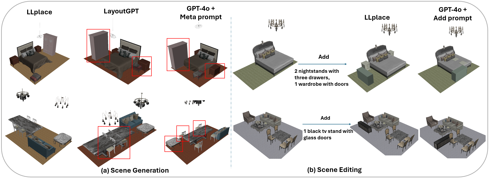
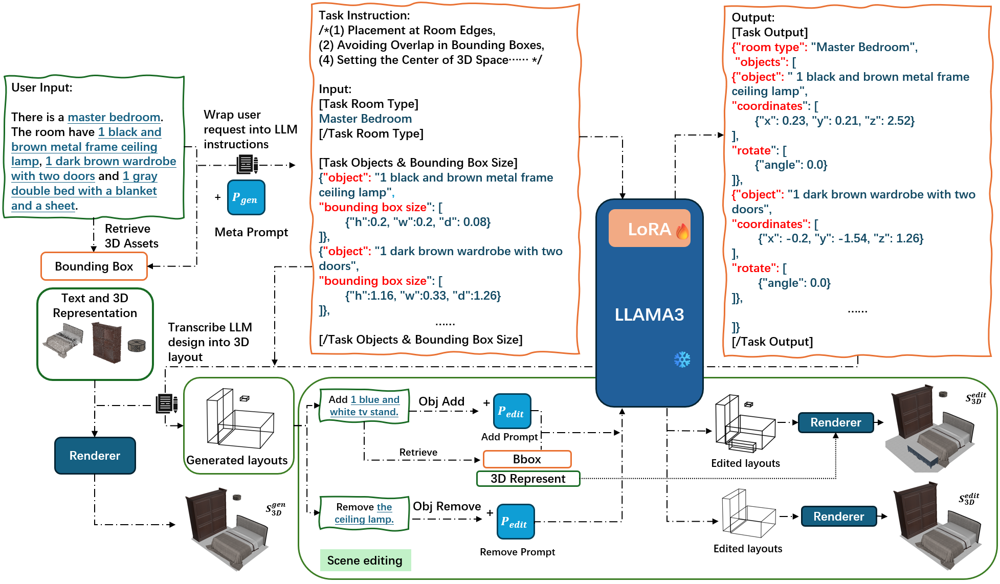
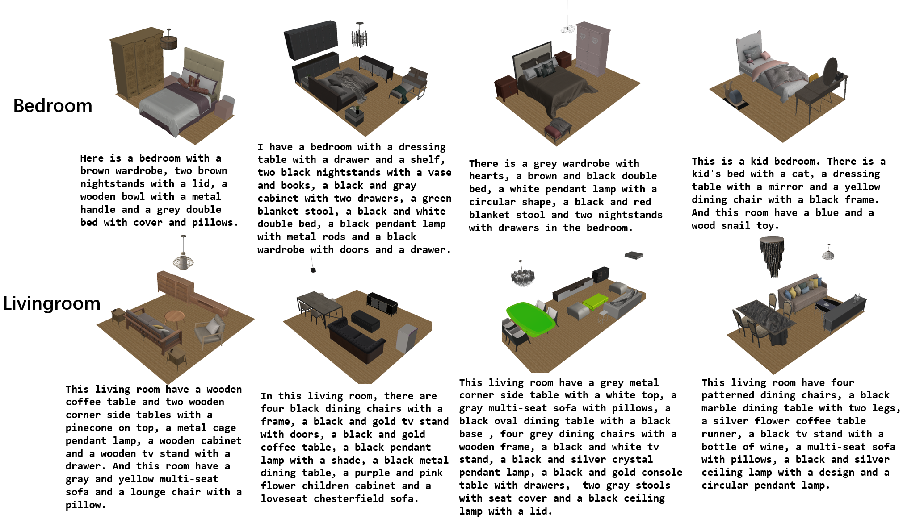
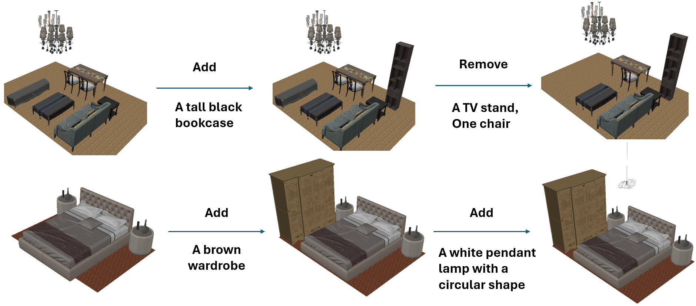
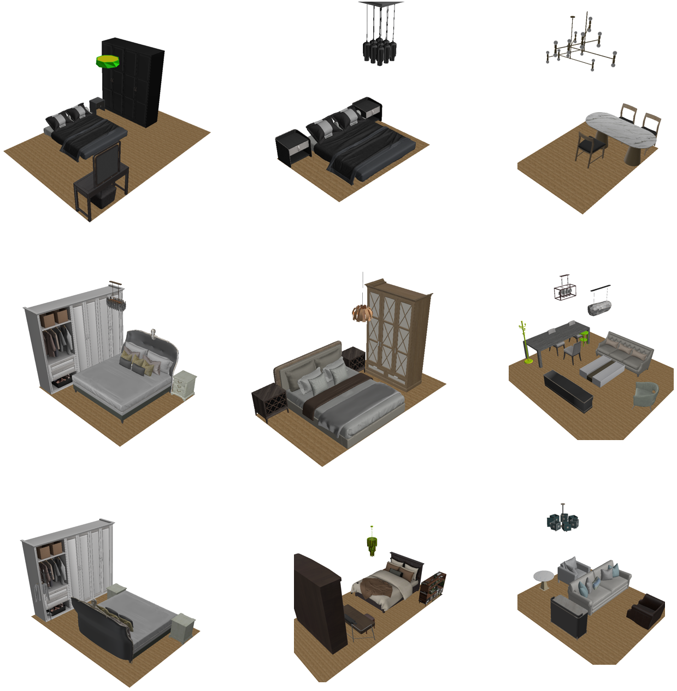
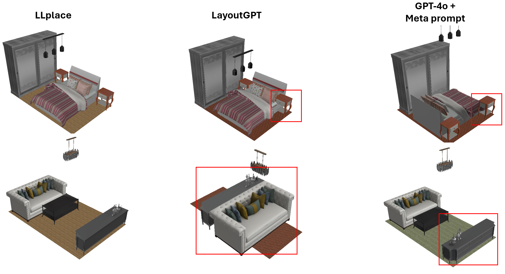

# LLplace：借助大型语言模型，实现三维室内场景布局的生成与编辑

发布时间：2024年06月06日

`LLM应用

这篇论文介绍了一种基于轻量级微调开源LLM（大型语言模型）的3D室内布局设计工具，名为LLplace。该工具利用了LLM的理解和推理能力来生成和编辑3D室内布局，而不依赖于空间关系的先验知识或专有LLMs。这种方法在泛化性和动态编辑方面显示出优势，能够根据用户的需求生成和调整布局。因此，这篇论文属于LLM应用类别，因为它展示了如何将LLM技术应用于特定的实际问题——3D室内布局设计。` `虚拟现实` `室内设计`

> LLplace: The 3D Indoor Scene Layout Generation and Editing via Large Language Model

# 摘要

> 设计3D室内布局在虚拟现实、室内设计和自动化空间规划等领域至关重要。现有方法或依赖空间关系先验的扩散模型，或过度依赖专有LLMs的推理能力，这些方法在泛化性和动态编辑方面存在局限。本文推出的LLplace，一种基于轻量级微调开源LLM Llama3的3D室内布局设计师，无需空间先验和上下文示例，仅凭用户指定的房间类型和所需物品，即可高效生成可信布局。我们基于3D-Front数据集创建了新的对话数据集，增强LLM的空间理解，并通过对话激活LLM的3D布局理解和动态编辑能力，实现物品的添加与移除。实验证明，LLplace能有效交互式生成和编辑3D布局，超越现有方法，提供高质量的3D设计方案。相关代码和数据集即将发布。

> Designing 3D indoor layouts is a crucial task with significant applications in virtual reality, interior design, and automated space planning. Existing methods for 3D layout design either rely on diffusion models, which utilize spatial relationship priors, or heavily leverage the inferential capabilities of proprietary Large Language Models (LLMs), which require extensive prompt engineering and in-context exemplars via black-box trials. These methods often face limitations in generalization and dynamic scene editing. In this paper, we introduce LLplace, a novel 3D indoor scene layout designer based on lightweight fine-tuned open-source LLM Llama3. LLplace circumvents the need for spatial relationship priors and in-context exemplars, enabling efficient and credible room layout generation based solely on user inputs specifying the room type and desired objects. We curated a new dialogue dataset based on the 3D-Front dataset, expanding the original data volume and incorporating dialogue data for adding and removing objects. This dataset can enhance the LLM's spatial understanding. Furthermore, through dialogue, LLplace activates the LLM's capability to understand 3D layouts and perform dynamic scene editing, enabling the addition and removal of objects. Our approach demonstrates that LLplace can effectively generate and edit 3D indoor layouts interactively and outperform existing methods in delivering high-quality 3D design solutions. Code and dataset will be released.

[Arxiv](https://arxiv.org/abs/2406.03866)