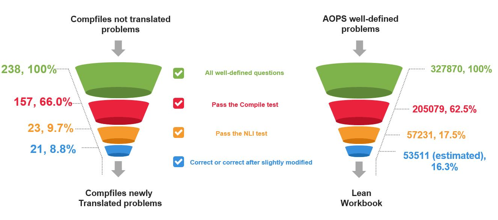
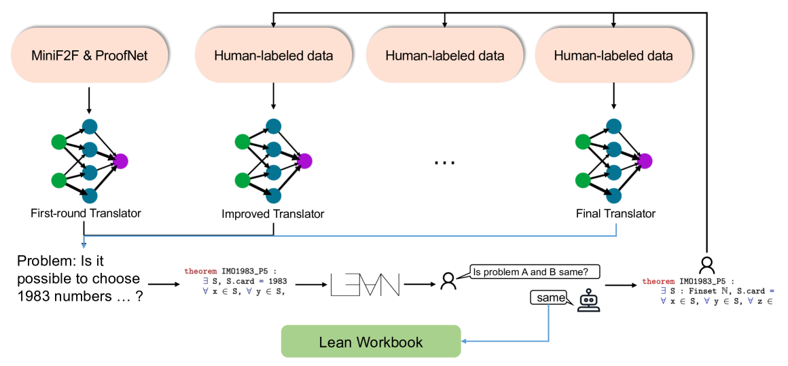

# 精益实践手册：一本源自自然语言数学问题的大规模问题集，旨在系统化精益解题方法。

发布时间：2024年06月06日

`LLM应用

理由：这篇论文主要探讨了如何通过合成数据来提升大型语言模型（LLMs）在处理形式语言（如Lean 4）中的数学定理证明任务的能力。它描述了一种创新的流程，用于生成和筛选数据，以帮助LLMs更好地理解和翻译自然语言与形式语言之间的数学问题。这种方法直接应用于提升LLMs的实际应用能力，特别是在数学定理证明这一特定领域，因此属于LLM应用类别。` `数学教育` `人工智能辅助证明`

> Lean Workbook: A large-scale Lean problem set formalized from natural language math problems

# 摘要

> 大型语言模型在处理各类自然语言任务，尤其是数学问题解决上表现出色，但在使用如Lean的形式语言进行数学定理证明时则显得力不从心。这一挑战主要源于形式语言训练数据的匮乏。为此，我们创新性地设计了一套流程，通过迭代生成与筛选合成数据，实现自然语言数学问题与Lean 4语句之间的互译。实验结果显示，这一流程不仅为LLMs提供了宝贵的训练资源，还显著提升了其在复杂数学问题及证明的翻译与理解上的表现。我们的数据集现已包含约57,000对形式与非形式的问答对，以及来自数学竞赛论坛的证明和21个新国际数学奥林匹克问题。我们已在GitHub上开源代码，并在Hugging Face数据平台上分享了我们的数据集。

> Large language models have demonstrated impressive capabilities across various natural language processing tasks, especially in solving mathematical problems. However, large language models are not good at math theorem proving using formal languages like Lean. A significant challenge in this area is the scarcity of training data available in these formal languages. To address this issue, we propose a novel pipeline that iteratively generates and filters synthetic data to translate natural language mathematical problems into Lean 4 statements, and vice versa. Our results indicate that the synthetic data pipeline can provide useful training data and improve the performance of LLMs in translating and understanding complex mathematical problems and proofs. Our final dataset contains about 57K formal-informal question pairs along with searched proof from the math contest forum and 21 new IMO questions. We open-source our code at https://github.com/InternLM/InternLM-Math and our data at https://huggingface.co/datasets/InternLM/Lean-Workbook.

[Arxiv](https://arxiv.org/abs/2406.03847)