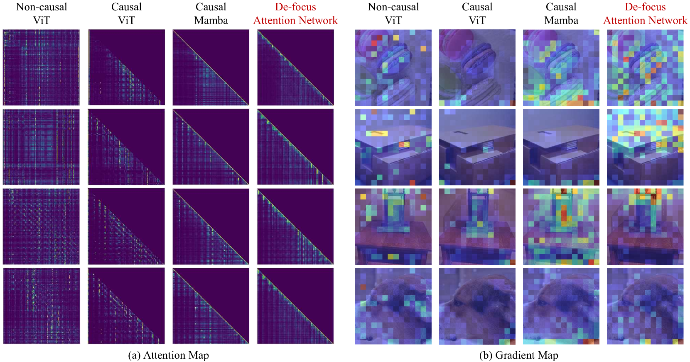

# 借助去焦注意力网络，探索一维因果视觉表示的学习之道

发布时间：2024年06月06日

`LLM应用

这篇论文主要探讨了如何通过改进1D因果建模来处理图像数据，以构建更有效的多模态模型。论文中提出的“去焦注意力网络”和相关的训练策略，旨在解决现有1D因果视觉模型中存在的“过度聚焦”问题，并提高模型在全局感知、密集预测和多模态理解等任务中的性能。这些研究内容虽然涉及模型的架构设计和训练方法，但其核心在于应用层面的改进和优化，以提升多模态模型的实际应用能力，因此归类为LLM应用。` `计算机视觉` `多模态学习`

> Learning 1D Causal Visual Representation with De-focus Attention Networks

# 摘要

> 模态差异促使视觉与语言模型采用不同的架构设计：图像需2D非因果建模，文本则用1D因果建模。这种差异给构建统一的多模态模型带来了挑战。本文探索了用1D因果建模来表示图像的可能性，并指出当前1D因果视觉模型存在“过度聚焦”问题，即注意力过分集中于少数视觉标记，这限制了模型提取多样化视觉特征和优化梯度的能力。为此，我们提出了去焦注意力网络，通过可学习的带通滤波器生成多样的注意力模式。训练中，我们采用了高比例且有计划的drop路径率，并引入了针对全局理解任务的全局池化特征的辅助损失，以鼓励模型关注更广泛的标记，并优化网络。大量实验证明，我们的方法在全局感知、密集预测和多模态理解等任务中，1D因果视觉表示能与2D非因果表示媲美。相关代码已发布于https://github.com/OpenGVLab/De-focus-Attention-Networks。

> Modality differences have led to the development of heterogeneous architectures for vision and language models. While images typically require 2D non-causal modeling, texts utilize 1D causal modeling. This distinction poses significant challenges in constructing unified multi-modal models. This paper explores the feasibility of representing images using 1D causal modeling. We identify an "over-focus" issue in existing 1D causal vision models, where attention overly concentrates on a small proportion of visual tokens. The issue of "over-focus" hinders the model's ability to extract diverse visual features and to receive effective gradients for optimization. To address this, we propose De-focus Attention Networks, which employ learnable bandpass filters to create varied attention patterns. During training, large and scheduled drop path rates, and an auxiliary loss on globally pooled features for global understanding tasks are introduced. These two strategies encourage the model to attend to a broader range of tokens and enhance network optimization. Extensive experiments validate the efficacy of our approach, demonstrating that 1D causal visual representation can perform comparably to 2D non-causal representation in tasks such as global perception, dense prediction, and multi-modal understanding. Code is released at https://github.com/OpenGVLab/De-focus-Attention-Networks.

[Arxiv](https://arxiv.org/abs/2406.04342)