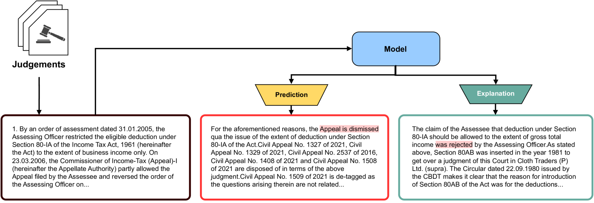
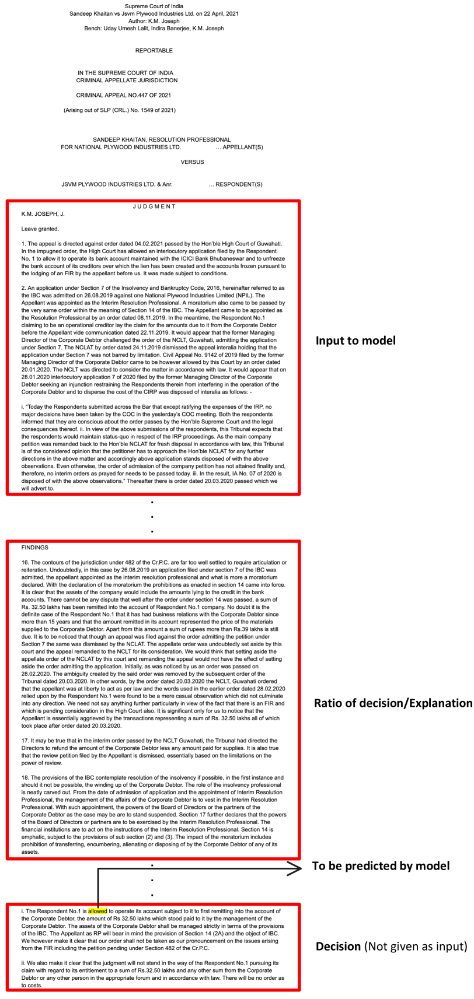

# 重塑法律判决：PredEx 引领印度法院智能 AI 解释的新潮流

发布时间：2024年06月06日

`LLM应用

这篇论文介绍了“预测与解释”（\texttt{PredEx}）数据集，这是一个专门为法律判决预测和解释设计的大型专家标注数据集。论文中提到，通过将指令调谐技术应用于大型语言模型（LLMs），该数据集能够显著提升预测的准确性和解释的深度。这一应用展示了LLMs在特定领域（如法律分析）的实际应用和改进，因此属于LLM应用分类。` `人工智能`

> Legal Judgment Reimagined: PredEx and the Rise of Intelligent AI Interpretation in Indian Courts

# 摘要

> 在大规模语言模型（LLMs）盛行的今天，预测司法结果因法律程序的复杂性和专家标注数据的稀缺而变得尤为困难。为此，我们推出了“预测与解释”（\texttt{PredEx}），这是印度最大的专家标注法律判决预测与解释数据集，拥有超过15,000个标注。这一创新数据集不仅强化了AI在法律分析中的训练与评估，还通过将指令调谐技术应用于LLMs，显著提升了预测的准确性和解释的深度。我们精心挑选了多种基于变压器的模型，确保它们既适用于通用法律环境，也特别针对印度法律环境。经过严格的词汇、语义及专家评估，我们的模型借助\texttt{PredEx}实现了精准预测和深刻解释，确立了其在法律界和自然语言处理领域的重要基准地位。

> In the era of Large Language Models (LLMs), predicting judicial outcomes poses significant challenges due to the complexity of legal proceedings and the scarcity of expert-annotated datasets. Addressing this, we introduce \textbf{Pred}iction with \textbf{Ex}planation (\texttt{PredEx}), the largest expert-annotated dataset for legal judgment prediction and explanation in the Indian context, featuring over 15,000 annotations. This groundbreaking corpus significantly enhances the training and evaluation of AI models in legal analysis, with innovations including the application of instruction tuning to LLMs. This method has markedly improved the predictive accuracy and explanatory depth of these models for legal judgments. We employed various transformer-based models, tailored for both general and Indian legal contexts. Through rigorous lexical, semantic, and expert assessments, our models effectively leverage \texttt{PredEx} to provide precise predictions and meaningful explanations, establishing it as a valuable benchmark for both the legal profession and the NLP community.

[Arxiv](https://arxiv.org/abs/2406.04136)