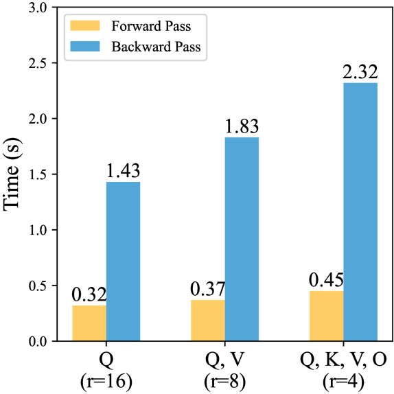
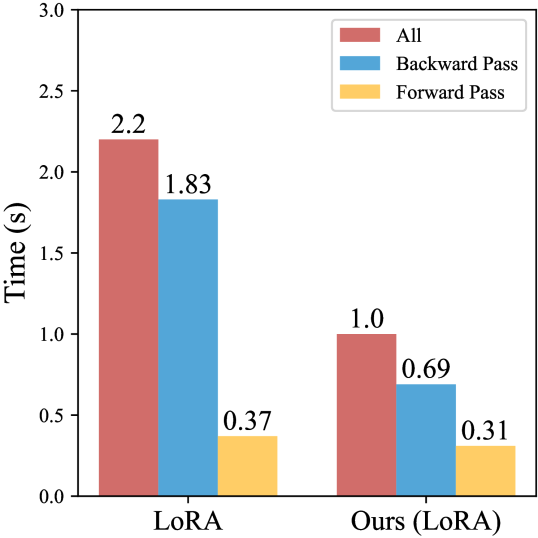

# Light-PEFT：借助早期剪枝，实现参数高效微调的轻量化方案

发布时间：2024年06月06日

`LLM理论

理由：这篇论文主要探讨了大型语言模型（LLM）的参数高效微调（PEFT）技术，并提出了新的框架Light-PEFT来提高训练效率。这涉及到对LLM内部机制的深入理解和优化，属于对LLM理论层面的研究。虽然该技术具有实际应用价值，但其核心贡献在于理论创新和方法论的改进，因此更适合归类于LLM理论。` `模型优化`

> Light-PEFT: Lightening Parameter-Efficient Fine-Tuning via Early Pruning

# 摘要

> 在大型语言模型时代，参数高效的微调（PEFT）已成为主流技术。尽管如此，现有PEFT方法的训练效率仍有待提高。首先，对于某些微调任务，训练过程中对大规模基础模型的利用显得过于冗余。其次，随着模型规模的扩大，PEFT模块中新增的可训练参数增长显著且冗余，影响了效率。为此，我们提出了Light-PEFT框架，包含基础模型的掩码早期剪枝和PEFT的多粒度早期剪枝两种策略。该框架能在训练初期识别并剪除基础模型和PEFT模块中的冗余参数，从而实现更高效的微调。我们在GLUE、SuperGLUE、问答任务及多种模型上验证了这一方法。使用Light-PEFT，基础模型参数可减少超过40%，同时将可训练参数控制在原始PEFT方法的25%。与直接应用PEFT相比，Light-PEFT不仅加速了训练和推理过程，降低了内存消耗，还保持了PEFT的性能和即插即用特性。

> Parameter-efficient fine-tuning (PEFT) has emerged as the predominant technique for fine-tuning in the era of large language models. However, existing PEFT methods still have inadequate training efficiency. Firstly, the utilization of large-scale foundation models during the training process is excessively redundant for certain fine-tuning tasks. Secondly, as the model size increases, the growth in trainable parameters of empirically added PEFT modules becomes non-negligible and redundant, leading to inefficiency. To achieve task-specific efficient fine-tuning, we propose the Light-PEFT framework, which includes two methods: Masked Early Pruning of the Foundation Model and Multi-Granularity Early Pruning of PEFT. The Light-PEFT framework allows for the simultaneous estimation of redundant parameters in both the foundation model and PEFT modules during the early stage of training. These parameters can then be pruned for more efficient fine-tuning. We validate our approach on GLUE, SuperGLUE, QA tasks, and various models. With Light-PEFT, parameters of the foundation model can be pruned by up to over 40%, while still controlling trainable parameters to be only 25% of the original PEFT method. Compared to utilizing the PEFT method directly, Light-PEFT achieves training and inference speedup, reduces memory usage, and maintains comparable performance and the plug-and-play feature of PEFT.

[Arxiv](https://arxiv.org/abs/2406.03792)