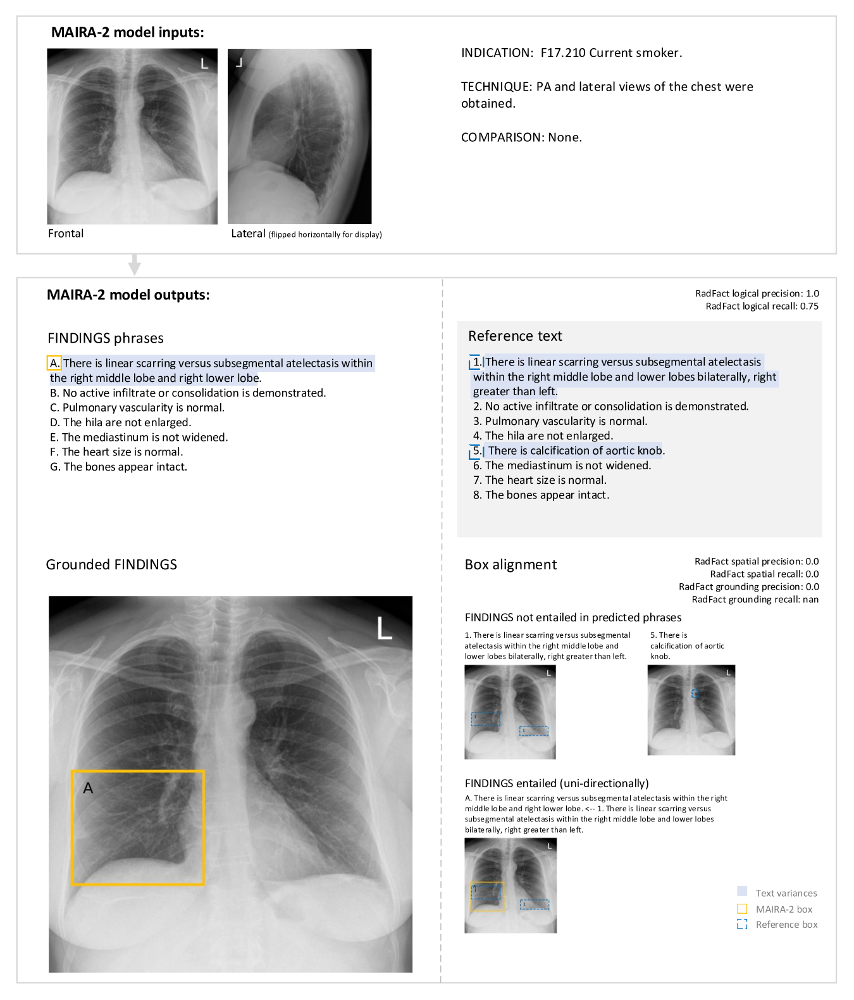

# MAIRA-2：精准生成放射学报告

发布时间：2024年06月06日

`RAG

理由：这篇论文主要关注的是放射学报告生成任务，特别是基于事实的报告生成，并开发了相应的评估框架和模型（MAIRA-2）。这个任务涉及到多模态信息的整合和处理，以及利用LLMs（大型语言模型）的推理能力来评估生成报告的真实性和空间定位的准确性。这与RAG（Retrieval-Augmented Generation）的概念相符，即通过检索增强生成过程，以提高生成内容的质量和准确性。因此，这篇论文更适合归类为RAG。` `放射学`

> MAIRA-2: Grounded Radiology Report Generation

# 摘要

> 放射学报告生成是一项复杂任务，涉及图像深度理解、多源信息整合及精准语言表达。这正是生成多模态模型的理想应用。我们在此基础上，进一步将报告生成任务扩展至图像中特定发现的定位，称之为“基于事实的报告生成”。已有研究表明，这种基于事实的报告对于提升AI文本解释的清晰度和图像理解至关重要。因此，它有望增强自动化报告的实用性和透明度。为了对此进行评估，我们开发了RadFact评估框架，该框架利用LLMs的推理能力，不仅评估生成句子的真实性，还验证空间定位的准确性。我们推出的MAIRA-2模型，结合了放射学专用图像编码器与LLM，专门针对胸部X光片的基于事实报告生成任务进行训练。MAIRA-2整合了更为全面的输入信息，包括当前及先前的图像和报告，以及报告中的指示、技术和比较部分。实验证明，这些新增信息大幅提升了报告质量，减少了错误，同时在MIMIC-CXR数据集上刷新了发现生成的记录，并验证了基于事实报告生成这一新任务的潜力和丰富性。

> Radiology reporting is a complex task that requires detailed image understanding, integration of multiple inputs, including comparison with prior imaging, and precise language generation. This makes it ideal for the development and use of generative multimodal models. Here, we extend report generation to include the localisation of individual findings on the image - a task we call grounded report generation. Prior work indicates that grounding is important for clarifying image understanding and interpreting AI-generated text. Therefore, grounded reporting stands to improve the utility and transparency of automated report drafting. To enable evaluation of grounded reporting, we propose a novel evaluation framework - RadFact - leveraging the reasoning capabilities of large language models (LLMs). RadFact assesses the factuality of individual generated sentences, as well as correctness of generated spatial localisations when present. We introduce MAIRA-2, a large multimodal model combining a radiology-specific image encoder with a LLM, and trained for the new task of grounded report generation on chest X-rays. MAIRA-2 uses more comprehensive inputs than explored previously: the current frontal image, the current lateral image, the prior frontal image and prior report, as well as the Indication, Technique and Comparison sections of the current report. We demonstrate that these additions significantly improve report quality and reduce hallucinations, establishing a new state of the art on findings generation (without grounding) on MIMIC-CXR while demonstrating the feasibility of grounded reporting as a novel and richer task.

[Arxiv](https://arxiv.org/abs/2406.04449)