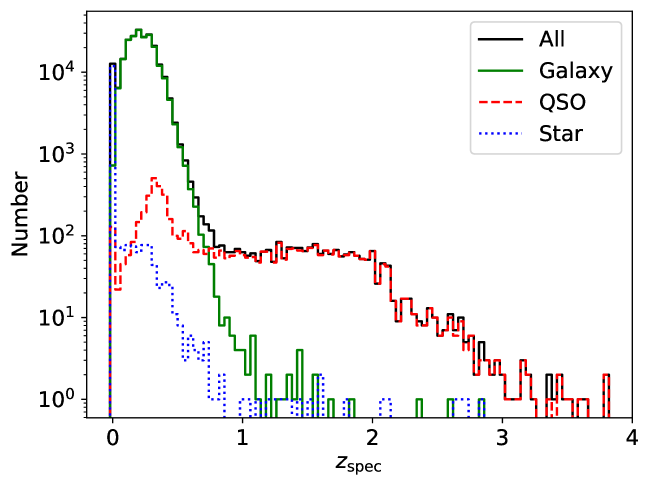

# 神经网络助力KiDS DR5源分类：打造详尽的恒星-类星体-星系目录

发布时间：2024年06月06日

`Agent

理由：这篇论文描述了一种多模态神经网络，该网络能够从多波段地面观测中区分恒星、星系和类星体。这种网络可以被视为一个智能Agent，因为它能够处理输入数据（多波段图像和光谱信息），并输出分类结果。虽然它涉及到神经网络的应用，但主要关注的是在天文学领域中的实际应用，即对天文源进行分类，而不是深入探讨大型语言模型（LLM）的理论或应用。因此，将其归类为Agent更为合适。` `天文学` `数据分类`

> Morpho-Photometric Classification of KiDS DR5 Sources Based on Neural Networks: A Comprehensive Star-Quasar-Galaxy Catalog

# 摘要

> 我们开发了一种创新的多模态神经网络，用于从光学到近红外的多波段地面观测中区分恒星、星系和类星体。该网络融合了卷积神经网络学习$r$波段图像形态特征和人工神经网络提取光谱能量分布信息的能力。利用千度调查第5次数据发布的9波段数据，网络的两个分支整合后通过全连接层进行精确分类。在斯隆数字天空调查与千度调查交叉匹配的样本上训练后，该模型在独立测试集上达到了98.76%的准确率，各类别的F1分数均超过95%。通过调整输出概率阈值，我们实现了更高的分类纯度，尽管完整性略有下降。此外，我们还通过与外部目录的交叉验证，确认了网络对纯恒星和星系样本的高准确率。最终，我们将此网络应用于27,334,751个亮度$r$ ≤ 23 mag的KiDS DR5源，生成了一个新的分类目录，展示了其在大型光度调查中对天文源进行高效、稳健分类的能力。

> We present a novel multimodal neural network for classifying astronomical sources in multiband ground-based observations, from optical to near infrared, to separate sources in stars, galaxies and quasars. Our approach combines a convolutional neural network branch for learning morphological features from $r$-band images with an artificial neural network branch for extracting spectral energy distribution (SED) information. Specifically, we have used 9-band optical ($ugri$) and NIR ($ZYHJK_s$) data from the Kilo-Degree Survey (KiDS) Data Release 5. The two branches of the network are concatenated and feed into fully-connected layers for final classification. We train the network on a spectroscopically confirmed sample from the Sloan Digital Sky Survey cross-matched with KiDS. The trained model achieves 98.76\% overall accuracy on an independent testing dataset, with F1 scores exceeding 95\% for each class. Raising the output probability threshold, we obtain higher purity at the cost of a lower completeness. We have also validated the network using external catalogs cross-matched with KiDS, correctly classifying 99.74\% of a pure star sample selected from Gaia parallaxes and proper motions, and 99.74\% of an external galaxy sample from the Galaxy and Mass Assembly survey, adjusted for low-redshift contamination. We apply the trained network to 27,334,751 KiDS DR5 sources with $r \leqslant 23$ mag to generate a new classification catalog. This multimodal neural network successfully leverages both morphological and SED information to enable efficient and robust classification of stars, quasars, and galaxies in large photometric surveys.

[Arxiv](https://arxiv.org/abs/2406.03797)