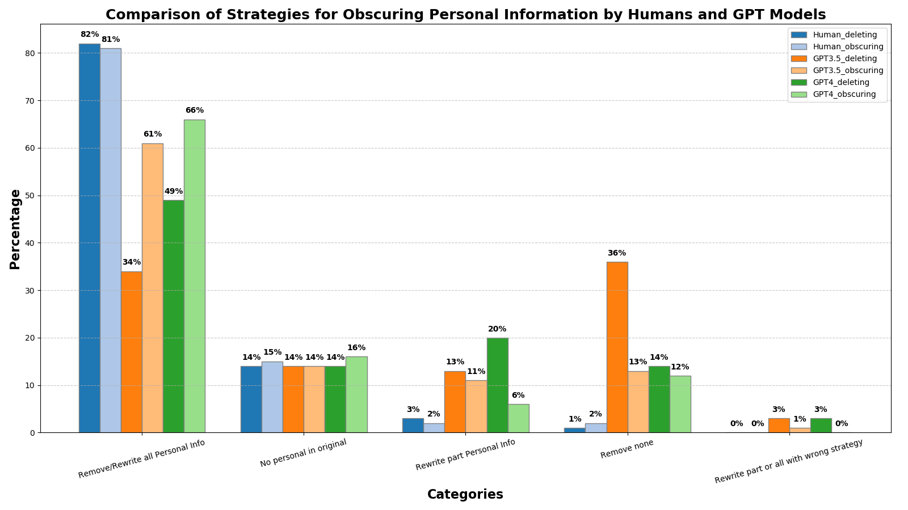
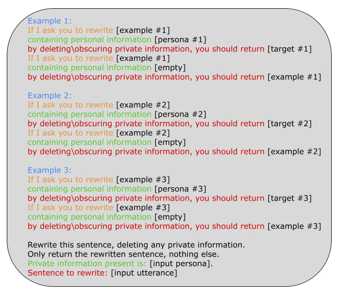

# NAP^2：人类学习驱动的自然与隐私保护文本重写基准

发布时间：2024年06月06日

`LLM应用

理由：这篇论文主要关注在使用第三方 NLP 模型处理敏感文本时的隐私保护问题，并提出了两种基于人类净化策略的方法。这些方法涉及到对大型语言模型（LLM）的应用，特别是在隐私保护和数据效用之间的平衡。因此，这篇论文更符合LLM应用分类，因为它探讨了如何在实际应用中使用LLM来解决特定的隐私和数据保护问题。` `隐私保护`

> NAP^2: A Benchmark for Naturalness and Privacy-Preserving Text Rewriting by Learning from Human

# 摘要

> 随着使用第三方NLP模型处理敏感文本时隐私泄露的担忧加剧，我们提出两种人类常用的净化策略：删除敏感表达和抽象化敏感细节。为此，我们创建了首个名为NAP^2的语料库，并通过众包和LLMs进行开发。与导致信息效用下降和文本不自然的差分隐私方法相比，我们的人类启发方法不仅重写更自然，还在隐私保护和数据效用之间实现了更佳平衡，这一点已通过广泛实验得到验证。

> Increasing concerns about privacy leakage issues in academia and industry arise when employing NLP models from third-party providers to process sensitive texts. To protect privacy before sending sensitive data to those models, we suggest sanitizing sensitive text using two common strategies used by humans: i) deleting sensitive expressions, and ii) obscuring sensitive details by abstracting them. To explore the issues and develop a tool for text rewriting, we curate the first corpus, coined NAP^2, through both crowdsourcing and the use of large language models (LLMs). Compared to the prior works based on differential privacy, which lead to a sharp drop in information utility and unnatural texts, the human-inspired approaches result in more natural rewrites and offer an improved balance between privacy protection and data utility, as demonstrated by our extensive experiments.

[Arxiv](https://arxiv.org/abs/2406.03749)