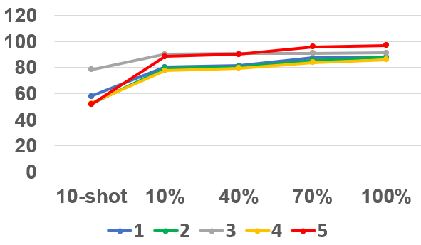
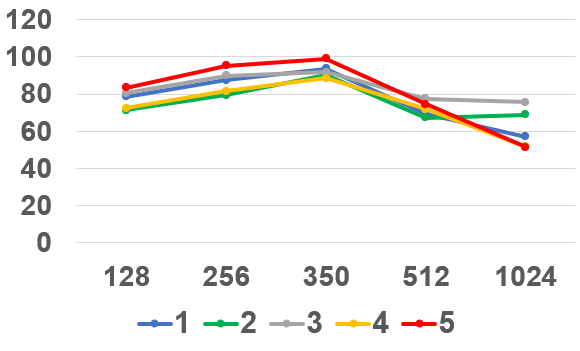
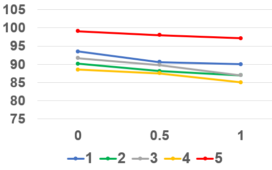
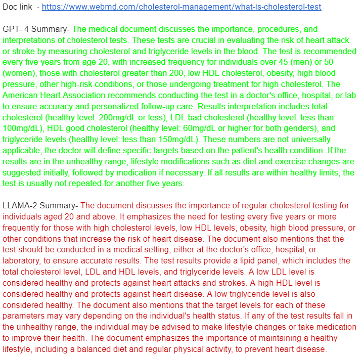
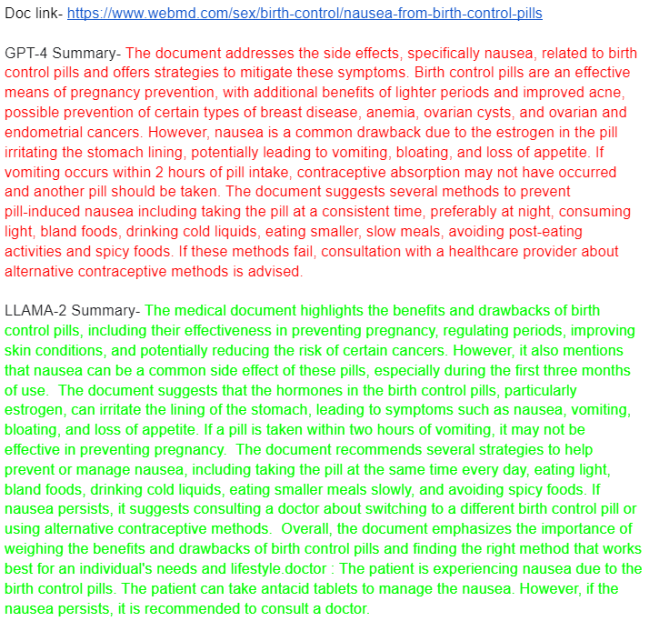

# 特定领域文档的人物角色化摘要研究

发布时间：2024年06月06日

`LLM应用

这篇论文主要探讨了如何通过微调特定领域的基础LLM来生成满足特定领域需求的定制化摘要，并展示了基于AI的批评在评估摘要质量方面的有效性。这种方法可以扩展到其他领域，以高效且经济的方式实现角色基础的摘要生成。因此，它属于LLM应用的范畴，因为它关注的是如何应用LLM技术来解决实际问题，即特定领域的信息摘要需求。` `信息提取`

> On The Persona-based Summarization of Domain-Specific Documents

# 摘要

> 在特定领域知识不断扩展的世界中，随着信息消费和存储的复杂性增加，从大型信息库中提取摘要变得至关重要。每个领域的不同角色对信息的需求各异，因此需要定制化的摘要。例如，在医疗领域，针对不同角色（如医生、护士、患者）的定制信息传递至关重要。然而，人类进行的角色基础领域信息摘要任务认知负荷高，且不同人产生的摘要差异大，难以随着领域和角色的扩展而经济高效地扩展。此外，通用大型语言模型（LLMs）生成的AI摘要可能无法满足特定领域的准确性需求，除非它们专门针对特定领域数据进行了训练，且在日常运营中使用成本高昂。本文中，我们的贡献有两方面：1) 我们提出了一种方法，通过医疗保健语料库高效微调特定领域的较小基础LLM，并展示了基于AI的批评可以有效评估摘要质量。2) 我们进一步证实，基于AI的批评与基于人类的批评在摘要评估上具有良好的一致性。因此，这种基于AI的生成特定领域角色基础摘要的管道可以轻松扩展到其他领域，如法律、企业文档、教育等，以高效且经济的方式实现。

> In an ever-expanding world of domain-specific knowledge, the increasing complexity of consuming, and storing information necessitates the generation of summaries from large information repositories. However, every persona of a domain has different requirements of information and hence their summarization. For example, in the healthcare domain, a persona-based (such as Doctor, Nurse, Patient etc.) approach is imperative to deliver targeted medical information efficiently. Persona-based summarization of domain-specific information by humans is a high cognitive load task and is generally not preferred. The summaries generated by two different humans have high variability and do not scale in cost and subject matter expertise as domains and personas grow. Further, AI-generated summaries using generic Large Language Models (LLMs) may not necessarily offer satisfactory accuracy for different domains unless they have been specifically trained on domain-specific data and can also be very expensive to use in day-to-day operations. Our contribution in this paper is two-fold: 1) We present an approach to efficiently fine-tune a domain-specific small foundation LLM using a healthcare corpus and also show that we can effectively evaluate the summarization quality using AI-based critiquing. 2) We further show that AI-based critiquing has good concordance with Human-based critiquing of the summaries. Hence, such AI-based pipelines to generate domain-specific persona-based summaries can be easily scaled to other domains such as legal, enterprise documents, education etc. in a very efficient and cost-effective manner.

[Arxiv](https://arxiv.org/abs/2406.03986)