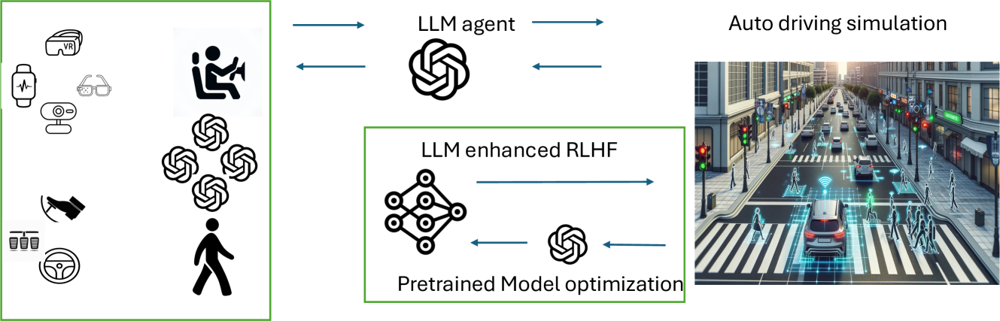
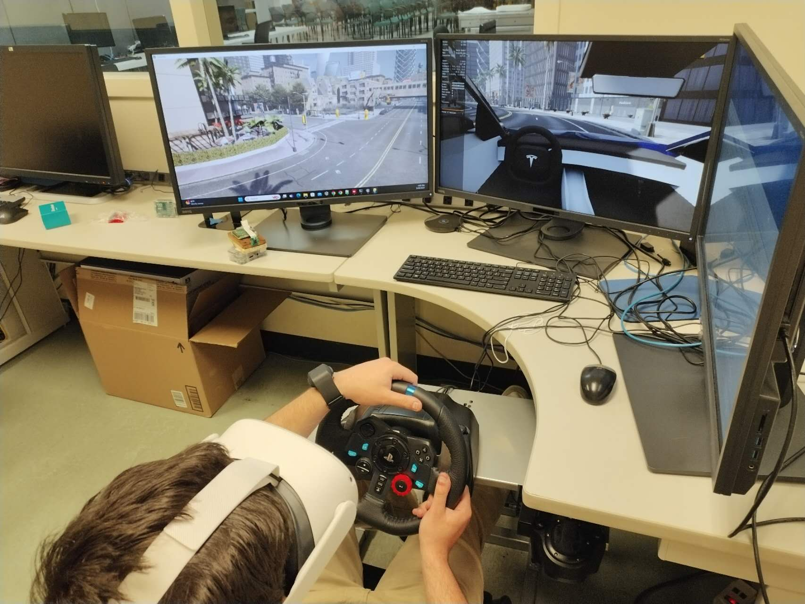
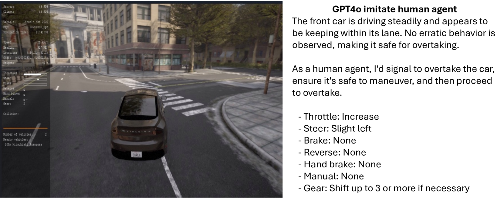
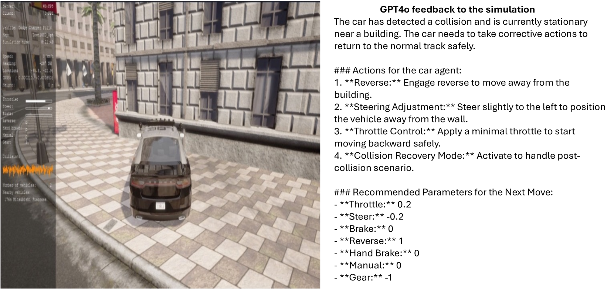
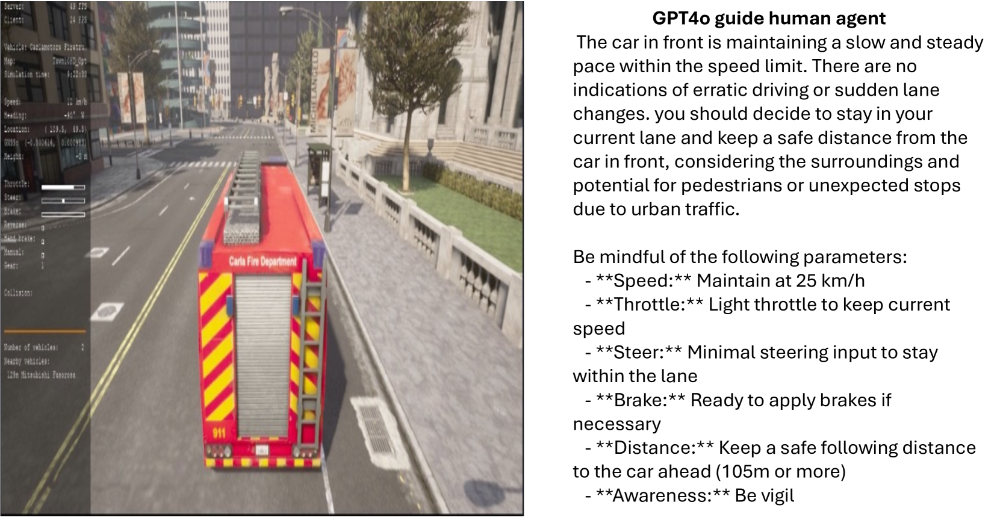
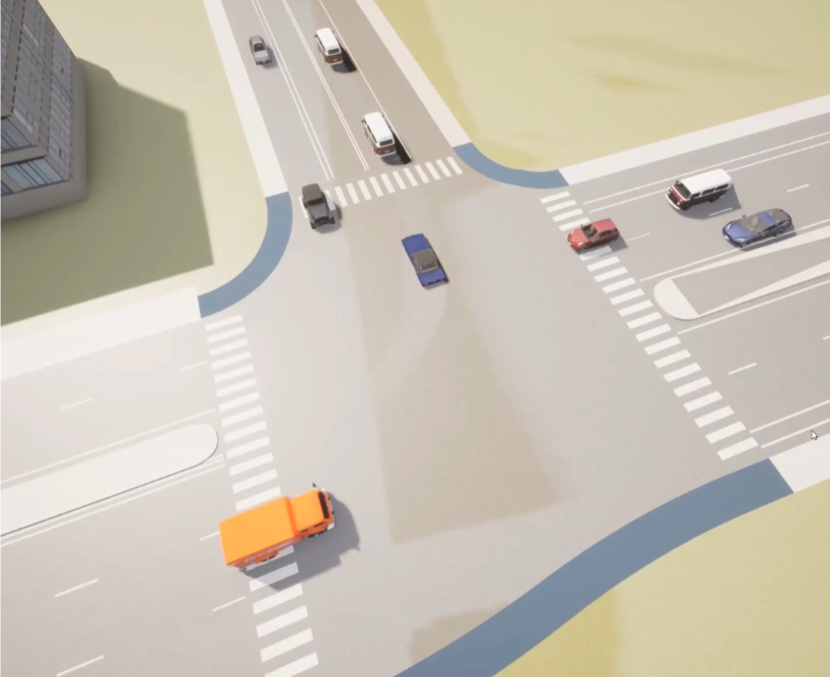

# 提升自动驾驶安全：以人为本，借助LLM强化RLHF技术

发布时间：2024年06月06日

`Agent

理由：这篇论文主要探讨了如何将基于人类反馈的强化学习（RLHF）与大型语言模型（LLMs）结合，以提升自动驾驶系统的安全性。研究中提出了一个框架，该框架通过引入多个由人类操控的代理（如汽车和行人）来模拟真实交通环境，从而对预训练的自动驾驶汽车模型进行微调。这种方法涉及多个代理的交互，旨在创建一个安全且真实的交互环境。因此，这篇论文更符合Agent分类，因为它侧重于通过代理（Agent）的交互来改进自动驾驶系统的性能和安全性。` `自动驾驶` `交通系统`

> Optimizing Autonomous Driving for Safety: A Human-Centric Approach with LLM-Enhanced RLHF

# 摘要

> 在大型语言模型中，基于人类反馈的强化学习（RLHF）备受青睐，而传统强化学习（RL）则显得力不从心。目前自动驾驶技术多采用机器学习中的人类反馈，包括RL，或依赖LLMs。这些反馈主要用于指导汽车学习过程，如操控汽车。RLHF常用于模型微调阶段，需借助人类直接的“偏好”输入，这在自动驾驶模型的优化中并不常见。本研究独辟蹊径，将RLHF与LLMs融合，旨在提升自动驾驶的安全性。从零开始，依赖人类指导训练模型效率不高。我们的框架以预训练的自动驾驶汽车模型为基础，引入多个由人类操控的代理，如汽车和行人，以模拟真实交通环境。自动驾驶汽车模型不直接受人类操控。我们通过结合物理与生理反馈对模型进行微调，并利用LLMs优化这一过程。这种多代理交互环境确保了在实际应用前的安全、真实交互。最终，我们将通过新泽西州和纽约市真实测试床收集的数据来验证我们的模型。

> Reinforcement Learning from Human Feedback (RLHF) is popular in large language models (LLMs), whereas traditional Reinforcement Learning (RL) often falls short. Current autonomous driving methods typically utilize either human feedback in machine learning, including RL, or LLMs. Most feedback guides the car agent's learning process (e.g., controlling the car). RLHF is usually applied in the fine-tuning step, requiring direct human "preferences," which are not commonly used in optimizing autonomous driving models. In this research, we innovatively combine RLHF and LLMs to enhance autonomous driving safety. Training a model with human guidance from scratch is inefficient. Our framework starts with a pre-trained autonomous car agent model and implements multiple human-controlled agents, such as cars and pedestrians, to simulate real-life road environments. The autonomous car model is not directly controlled by humans. We integrate both physical and physiological feedback to fine-tune the model, optimizing this process using LLMs. This multi-agent interactive environment ensures safe, realistic interactions before real-world application. Finally, we will validate our model using data gathered from real-life testbeds located in New Jersey and New York City.

[Arxiv](https://arxiv.org/abs/2406.04481)