# PCART：解决Python API参数兼容性问题的自动化修复方案

发布时间：2024年06月06日

`Agent

理由：这篇论文介绍了一个名为PCART的自动化解决方案，专门用于解决Python第三方库API参数兼容性问题。PCART的功能包括从API提取、代码注入、映射建立、兼容性评估到修复验证的全过程。这种自动化的解决方案可以被视为一个智能代理（Agent），因为它能够自主地执行任务，解决特定的问题，如检测和修复API参数兼容性问题。此外，论文中提到的PCART在实际项目中的应用和其高效率也表明了它作为一个Agent的有效性。因此，这篇论文更适合归类到Agent分类中。` `软件开发` `自动化工具`

> PCART: Automated Repair of Python API Parameter Compatibility Issues

# 摘要

> 在现代软件开发领域，Python的第三方库因其广泛应用于深度学习和科学计算等关键领域而变得不可或缺。然而，这些库的API参数在演化过程中频繁变动，给依赖特定版本的客户端应用带来了兼容性挑战。Python灵活的参数传递机制使得不同传递方式可能引发不同的兼容性问题，而目前尚无工具能自动解决这些问题。为此，我们开发了PCART，这是首个全自动化的解决方案，涵盖了从API提取、代码注入、映射建立、兼容性评估到修复验证的全过程，专门应对Python API参数兼容性的各种挑战，如参数增删、重命名、顺序调整及位置参数向关键字参数的转换。我们创建了PCBENCH这一大规模基准，包含来自33个流行Python库的844个变更API的47,478个测试案例，以验证PCART的效能。结果表明，PCART在检测API参数兼容性问题上的F值高达96.49%，修复准确率达91.36%，远超现有工具和ChatGPT-4。对GitHub上14个实际Python项目的测试进一步证实了PCART的实用价值。我们期待PCART能大幅减轻程序员在维护API更新上的负担，并推动Python API兼容性问题的自动化修复。

> In modern software development, Python third-party libraries have become crucial, particularly due to their widespread use in fields such as deep learning and scientific computing. However, the parameters of APIs in third-party libraries often change during evolution, causing compatibility issues for client applications that depend on specific versions. Due to Python's flexible parameter-passing mechanism, different methods of parameter passing can result in different API compatibility. Currently, no tool is capable of automatically detecting and repairing Python API parameter compatibility issues. To fill this gap, we propose PCART, the first to implement a fully automated process from API extraction, code instrumentation, and API mapping establishment, to compatibility assessment, and finally to repair and validation, for solving various types of Python API parameter compatibility issues, i.e., parameter addition, removal, renaming, reordering of parameters, as well as the conversion of positional parameters to keyword parameters. We construct a large-scale benchmark PCBENCH, including 47,478 test cases mutated from 844 parameter-changed APIs of 33 popular Python libraries, to evaluate PCART. The evaluation results show that PCART is effective yet efficient, significantly outperforming existing tools (MLCatchUp and Relancer) and the large language model ChatGPT-4, achieving an F-measure of 96.49% in detecting API parameter compatibility issues and a repair accuracy of 91.36%. The evaluation on 14 real-world Python projects from GitHub further demonstrates that PCART has good practicality. We believe PCART can help programmers reduce the time spent on maintaining Python API updates and facilitate automated Python API compatibility issue repair.

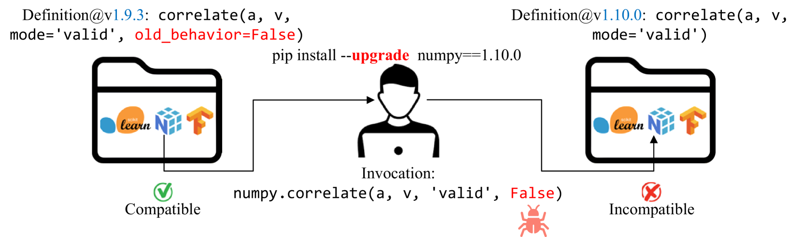

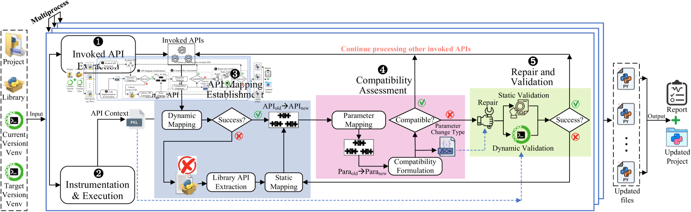

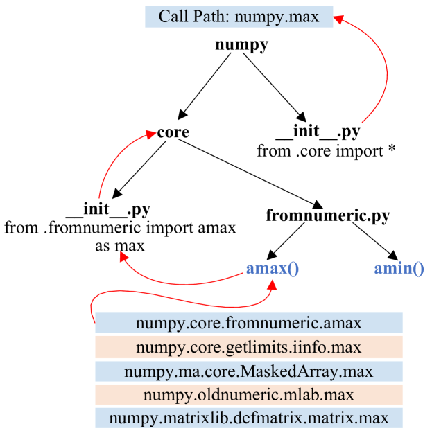

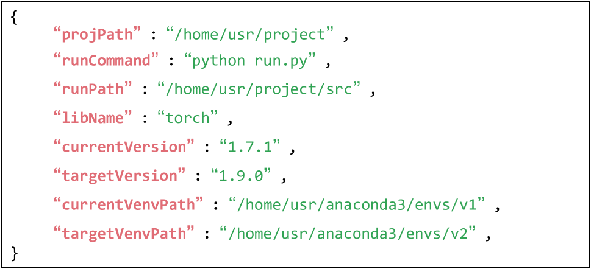

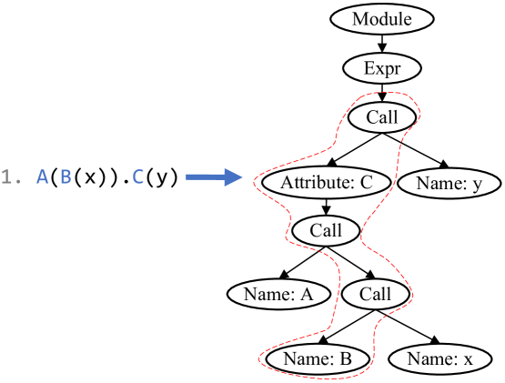

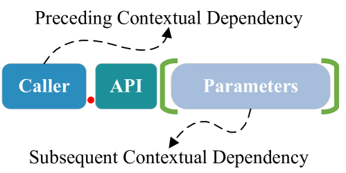

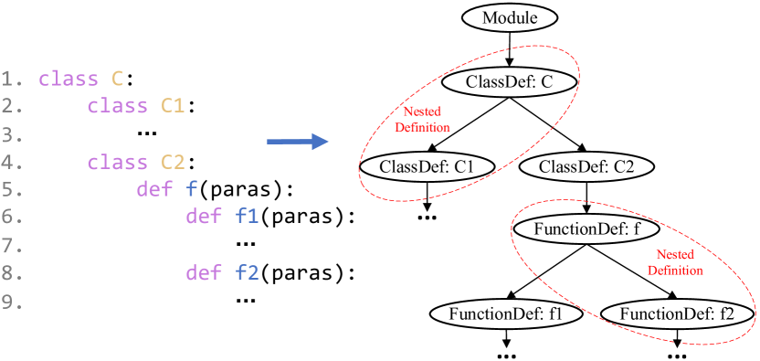

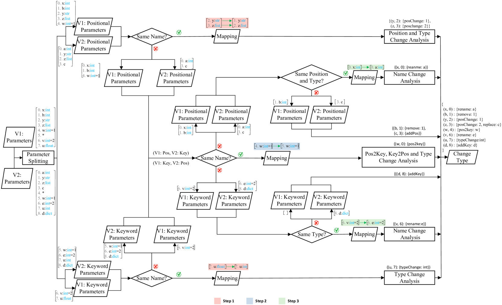

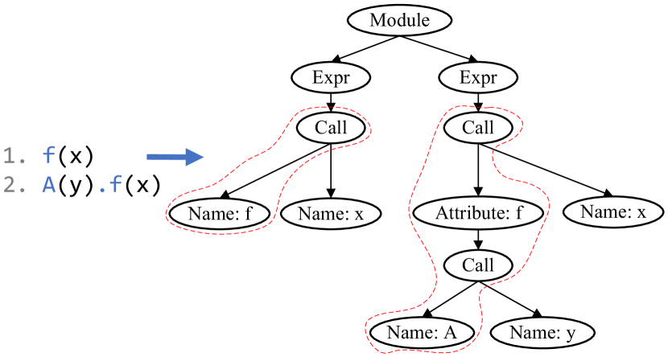

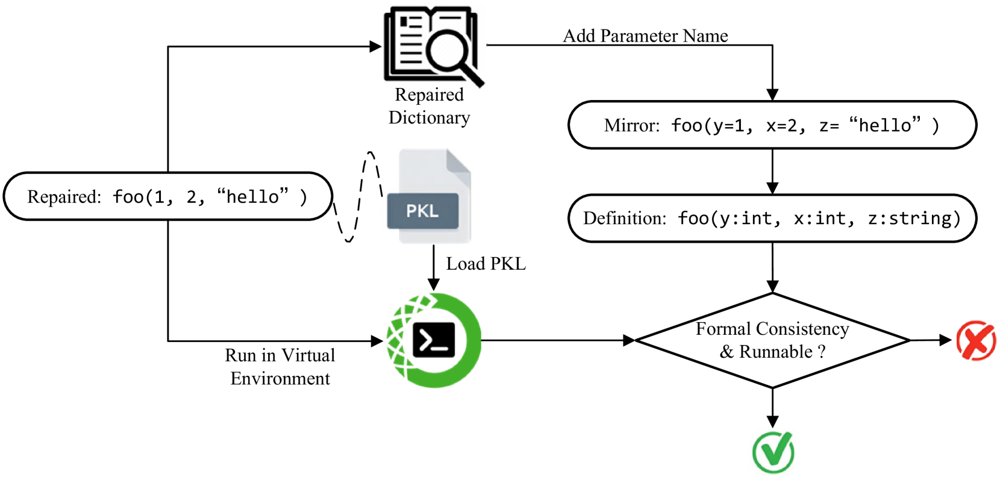

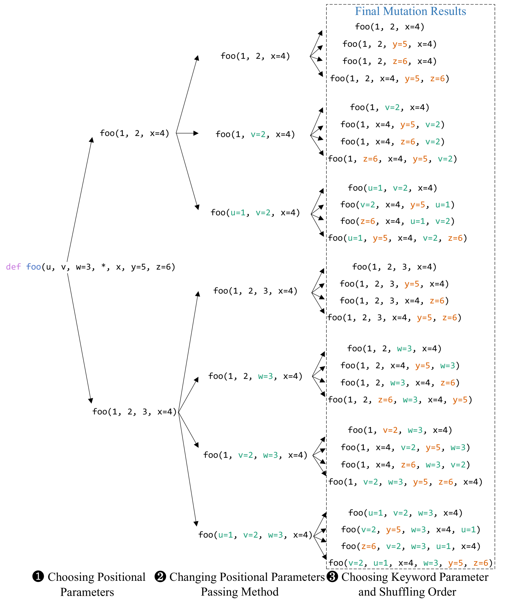

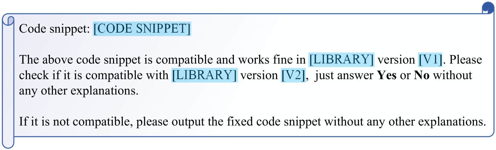

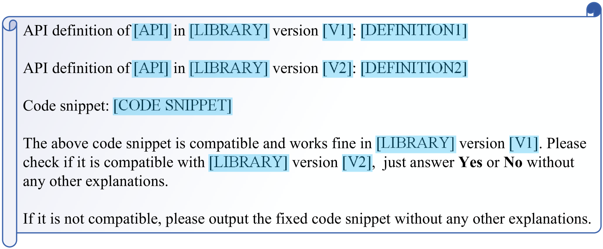

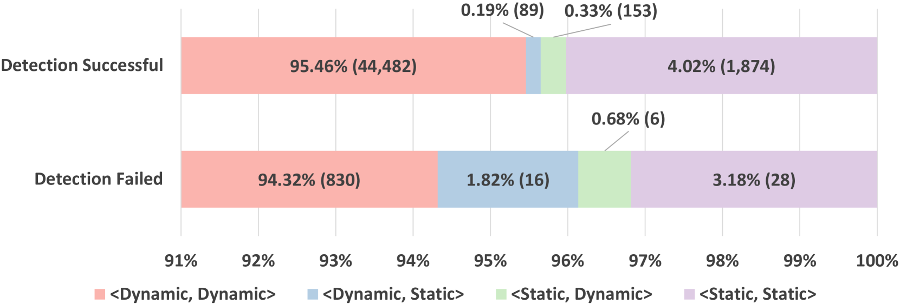

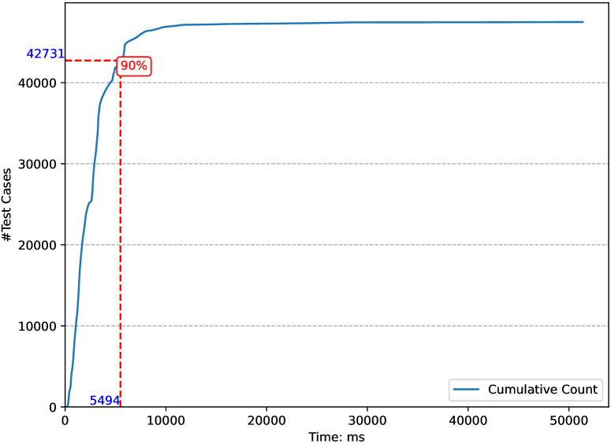

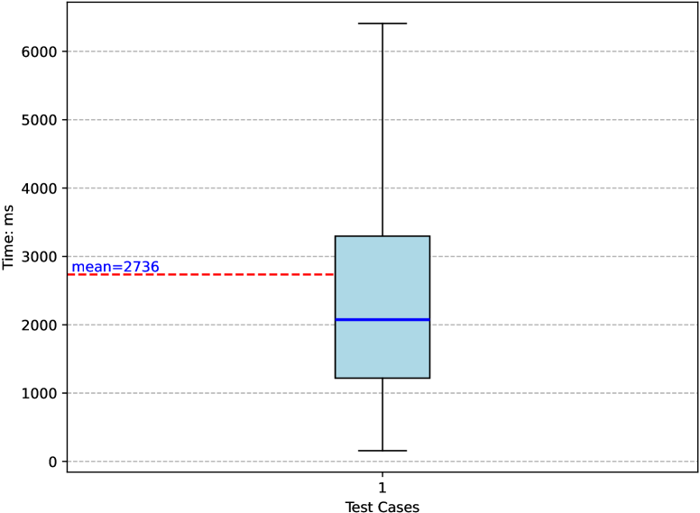

[Arxiv](https://arxiv.org/abs/2406.03839)