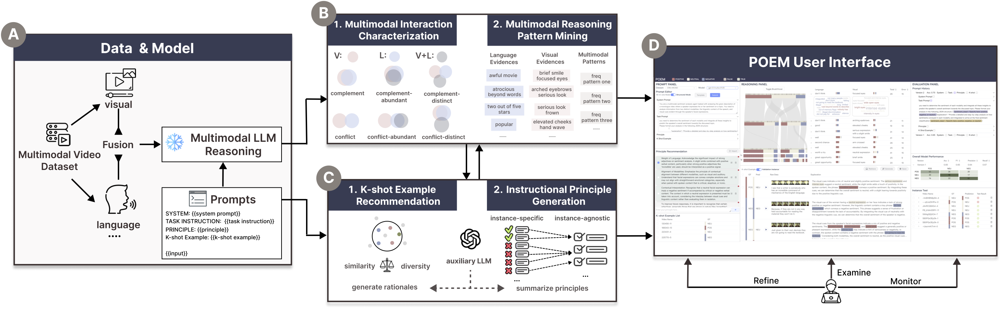
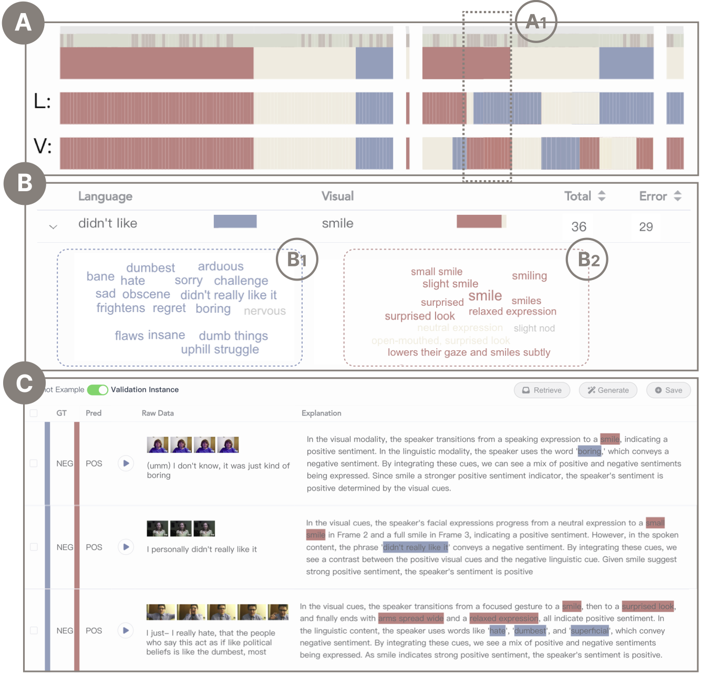
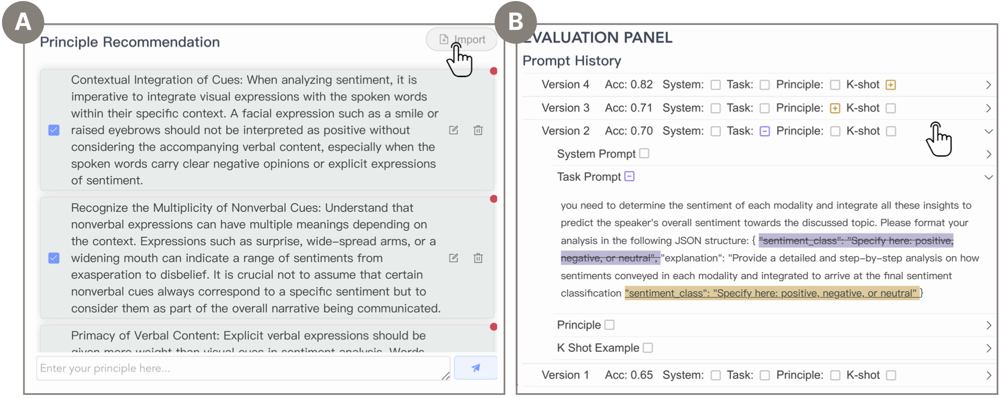
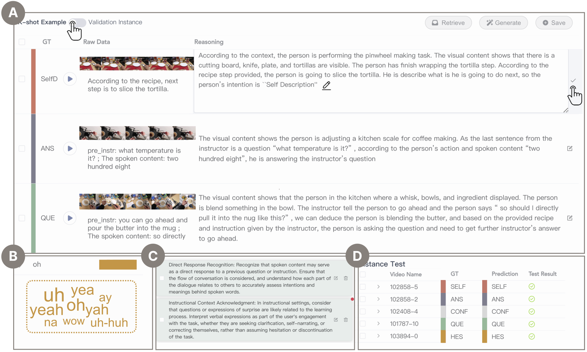

# POEM：通过交互式提示优化提升大型语言模型的多模态推理能力

发布时间：2024年06月06日

`LLM应用

这篇论文介绍了一个名为POEM的视觉分析系统，旨在通过高效的提示工程提升大型语言模型（LLMs）的多模态推理能力。该系统专注于多模态输入中的模态间互动，以优化提示设计，从而更好地利用多模态上下文进行推理。这与LLM的应用层面相关，因为它涉及如何通过特定的工具和方法来增强LLM在多模态环境下的性能，而不是探讨LLM的理论基础或Agent的设计与实现。因此，将其归类为LLM应用是合适的。` `多模态分析` `教育技术`

> POEM: Interactive Prompt Optimization for Enhancing Multimodal Reasoning of Large Language Models

# 摘要

> 大型语言模型（LLMs）在零-或少量-shot环境下，通过恰当的提示，已展现出对多模态内容理解和推理的卓越能力。尽管市面上涌现了许多旨在支持LLMs在多任务中进行提示工程的交互系统，但多数系统仅关注文本或视觉输入，忽略了多模态输入中模态间的复杂互动。这一疏忽限制了开发能够充分利用多模态丰富上下文来指导模型进行多模态推理的有效提示。为此，本文介绍了POEM，一个视觉分析系统，旨在通过高效的提示工程提升LLMs的多模态推理能力。POEM允许用户深入探索不同层次的模态交互模式，全面理解各种提示所激发的多模态知识。通过提供多样化的示例和教学原则，POEM助力用户迭代优化提示，以更好地融合模型知识与人类智慧。通过两个案例研究及专家访谈，我们验证了POEM系统的有效性与效率。

> Large language models (LLMs) have exhibited impressive abilities for multimodal content comprehension and reasoning with proper prompting in zero- or few-shot settings. Despite the proliferation of interactive systems developed to support prompt engineering for LLMs across various tasks, most have primarily focused on textual or visual inputs, thus neglecting the complex interplay between modalities within multimodal inputs. This oversight hinders the development of effective prompts that guide model multimodal reasoning processes by fully exploiting the rich context provided by multiple modalities. In this paper, we present POEM, a visual analytics system to facilitate efficient prompt engineering for enhancing the multimodal reasoning performance of LLMs. The system enables users to explore the interaction patterns across modalities at varying levels of detail for a comprehensive understanding of the multimodal knowledge elicited by various prompts. Through diverse recommendations of demonstration examples and instructional principles, POEM supports users in iteratively crafting and refining prompts to better align and enhance model knowledge with human insights. The effectiveness and efficiency of our system are validated through two case studies and interviews with experts.

[Arxiv](https://arxiv.org/abs/2406.03843)