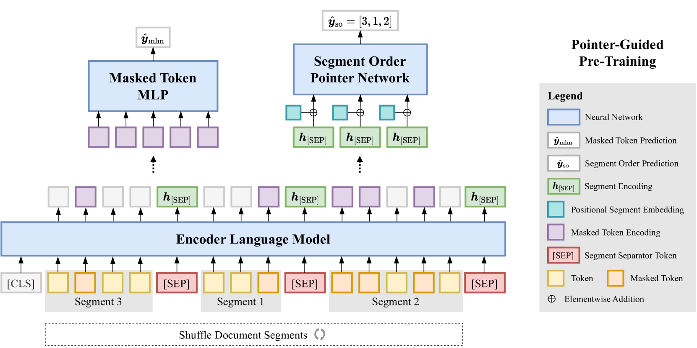
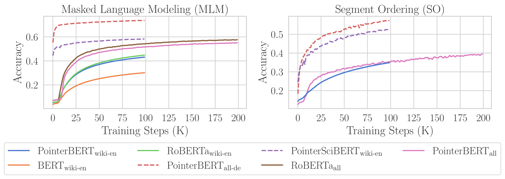
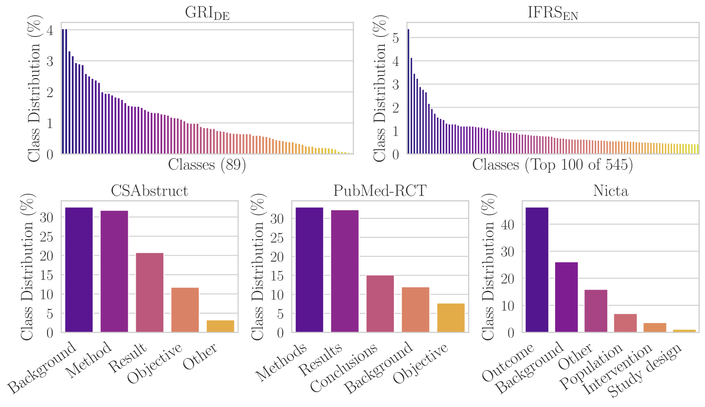

# 指针引导预训练：赋予大型语言模型段落级上下文感知力

发布时间：2024年06月06日

`RAG

理由：该论文介绍了一种新的预训练方法“指针引导段落排序”（SO），旨在提升大型语言模型对段落级文本上下文的理解能力。这种方法通过自注意力指针网络重构文本段落顺序，增强了对文档结构连贯性和上下文关联的捕捉能力。这与RAG（Retrieval-Augmented Generation）模型的目标相似，即通过改进模型对文本上下文的理解来提高其在特定任务上的表现。虽然该论文没有直接提到检索增强生成，但其关注的是提升模型对文本结构和上下文的理解，这是RAG模型中的一个关键方面。因此，将其归类为RAG是合适的。` `科学文献`

> Pointer-Guided Pre-Training: Infusing Large Language Models with Paragraph-Level Contextual Awareness

# 摘要

> 我们创新性地提出了“指针引导段落排序”（SO）技术，这是一种旨在提升大型语言模型对段落级文本上下文理解的预训练方法。通过自注意力指针网络，我们能够重构打乱的文本段落顺序，有效捕捉文档的结构连贯与上下文关联。结合动态采样的微调策略，该方法不仅丰富了训练样本的多样性，还提高了下游应用的效率。在多个领域的数据集测试中，我们的方法在需要顺序文本分类的任务上表现出色，特别是在科学文献和金融报告领域。实验结果显示，这种预训练技术极大地提升了模型处理复杂文档结构的能力，使其在分类任务中达到了业界领先水平。

> We introduce "pointer-guided segment ordering" (SO), a novel pre-training technique aimed at enhancing the contextual understanding of paragraph-level text representations in large language models. Our methodology leverages a self-attention-driven pointer network to restore the original sequence of shuffled text segments, addressing the challenge of capturing the structural coherence and contextual dependencies within documents. This pre-training approach is complemented by a fine-tuning methodology that incorporates dynamic sampling, augmenting the diversity of training instances and improving sample efficiency for various downstream applications. We evaluate our method on a diverse set of datasets, demonstrating its efficacy in tasks requiring sequential text classification across scientific literature and financial reporting domains. Our experiments show that pointer-guided pre-training significantly enhances the model's ability to understand complex document structures, leading to state-of-the-art performance in downstream classification tasks.

[Arxiv](https://arxiv.org/abs/2406.04156)