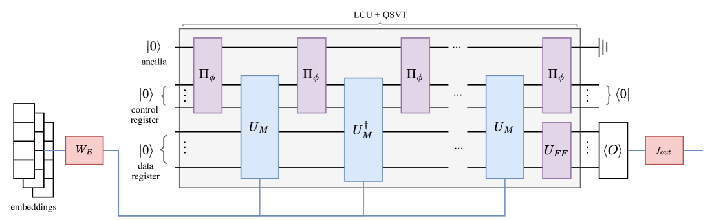
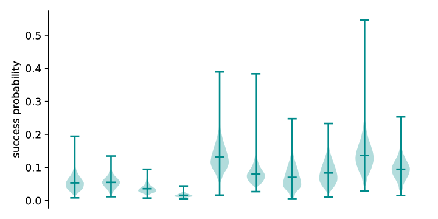

# Quixer：量子Transformer的新篇章

发布时间：2024年06月06日

`LLM理论

理由：这篇论文介绍了Quixer，一种创新的量子Transformer模型，并探讨了其在语言建模任务中的应用和性能。论文不仅提出了一个新的模型，还对其在量子硬件上的运行进行了资源评估，并讨论了其参数化组件的可替换性，从而衍生出新的量子Transformer类别。这些内容涉及大型语言模型（LLM）的理论研究和模型设计，因此属于LLM理论分类。` `量子计算` `机器学习`

> Quixer: A Quantum Transformer Model

# 摘要

> 随着可靠大规模量子计算机的实现取得进展，量子机器学习模型的设计研究也日益活跃。我们推出了Quixer：一种创新的量子Transformer模型，它以线性组合单位和量子奇异值变换为基础构建。Quixer通过创建令牌叠加并施加可训练的非线性变换来运作。我们首次将此模型应用于实际语言建模任务，并取得了与经典基准相媲美的成果。同时，我们提供了在量子硬件上运行该模型的资源评估，并公开了用于经典模拟的开源实现。最后，我们展示了Quixer的广泛适用性，其参数化组件可替换为固定结构，从而衍生出新的量子Transformer类别。

> Progress in the realisation of reliable large-scale quantum computers has motivated research into the design of quantum machine learning models. We present Quixer: a novel quantum transformer model which utilises the Linear Combination of Unitaries and Quantum Singular Value Transform primitives as building blocks. Quixer operates by preparing a superposition of tokens and applying a trainable non-linear transformation to this mix. We present the first results for a quantum transformer model applied to a practical language modelling task, obtaining results competitive with an equivalent classical baseline. In addition, we include resource estimates for evaluating the model on quantum hardware, and provide an open-source implementation for classical simulation. We conclude by highlighting the generality of Quixer, showing that its parameterised components can be substituted with fixed structures to yield new classes of quantum transformers.

[Arxiv](https://arxiv.org/abs/2406.04305)