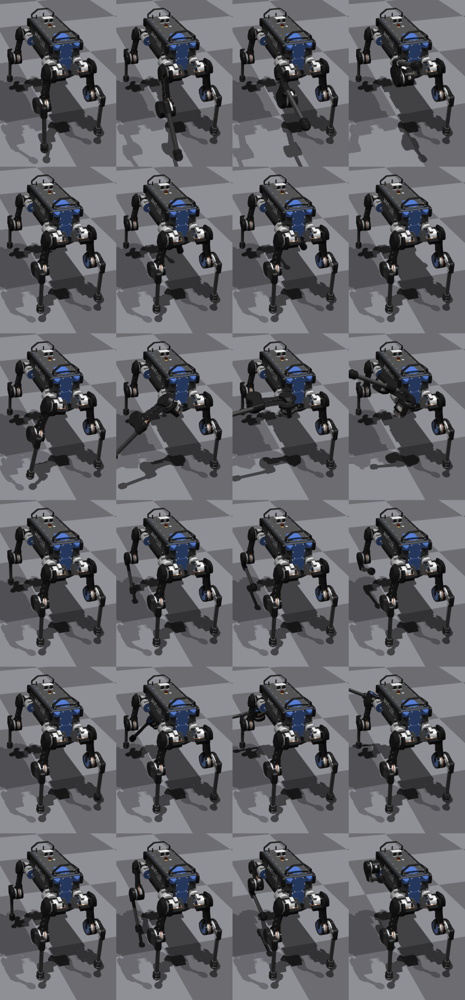

# RoboCoder：借助大型语言模型，机器人从基础技能逐步掌握通用任务的学习之旅

发布时间：2024年06月06日

`Agent

这篇论文介绍了一个名为RoboCoder的全面基准和自主学习框架，旨在提升机器人在复杂环境中的适应性。它专注于开发一种通用机器人编程算法，使机器人能够运用基础技能应对日益复杂的挑战。这与Agent的分类相符，因为Agent通常指的是能够自主执行任务、做出决策并适应环境的实体或系统。RoboCoder框架结合了大型语言模型（LLMs）和动态学习系统，利用实时环境反馈不断优化动作代码，这体现了Agent在实际应用中的自主性和适应性。` `机器人技术` `自主学习`

> RoboCoder: Robotic Learning from Basic Skills to General Tasks with Large Language Models

# 摘要

> 大型语言模型（LLMs）的兴起为机器人任务带来了新的希望，但现有基准仍局限于单一任务，泛化能力不足。为此，我们推出了RoboCoder——一个全面基准和自主学习框架，旨在提升机器人在复杂环境中的适应性。与传统单一任务学习方法不同，我们致力于开发一种通用机器人编程算法，让机器人能够运用基础技能应对日益复杂的挑战。新基准涵盖80项手工设计任务，涉及7种不同实体，考验模型从零基础快速学习的能力。初步测试表明，即便如GPT-4这样的尖端模型，在人形实体的三次尝试中也仅能达到47%的通过率。为克服这些挑战，RoboCoder框架结合LLMs与动态学习系统，利用实时环境反馈不断优化动作代码，实现了36%的显著性能提升。我们即将公开相关代码。

> The emergence of Large Language Models (LLMs) has improved the prospects for robotic tasks. However, existing benchmarks are still limited to single tasks with limited generalization capabilities. In this work, we introduce a comprehensive benchmark and an autonomous learning framework, RoboCoder aimed at enhancing the generalization capabilities of robots in complex environments. Unlike traditional methods that focus on single-task learning, our research emphasizes the development of a general-purpose robotic coding algorithm that enables robots to leverage basic skills to tackle increasingly complex tasks. The newly proposed benchmark consists of 80 manually designed tasks across 7 distinct entities, testing the models' ability to learn from minimal initial mastery. Initial testing revealed that even advanced models like GPT-4 could only achieve a 47% pass rate in three-shot scenarios with humanoid entities. To address these limitations, the RoboCoder framework integrates Large Language Models (LLMs) with a dynamic learning system that uses real-time environmental feedback to continuously update and refine action codes. This adaptive method showed a remarkable improvement, achieving a 36% relative improvement. Our codes will be released.

[Arxiv](https://arxiv.org/abs/2406.03757)