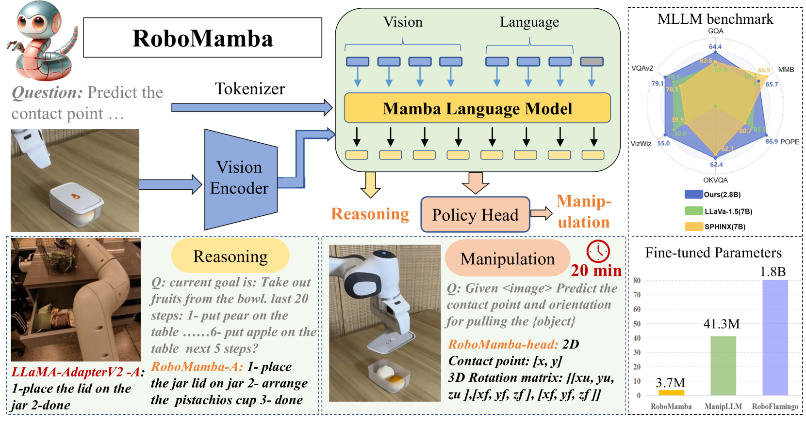

# RoboMamba：融合多模态信息的状态空间模型，助力机器人高效推理与操作

发布时间：2024年06月06日

`Agent

理由：这篇论文介绍了一个名为RoboMamba的集成模型，它是一个端到端的机器人多模态大型语言模型（MLLM），专门设计用于机器人操作，包括视觉理解和推理能力。该模型通过结合视觉编码器和Mamba模型，并进行协同训练，实现了高效的推理和行动能力。此外，RoboMamba还优化了微调和推理过程，使其在机器人操作任务中表现出色。因此，这篇论文更符合Agent分类，因为它涉及的是一个能够理解和执行动作的机器人模型。` `机器人技术` `人工智能`

> RoboMamba: Multimodal State Space Model for Efficient Robot Reasoning and Manipulation

# 摘要

> 机器人操作的核心在于让模型理解视觉场景并执行动作。尽管现有的多模态大型语言模型（MLLMs）能处理基础任务，但在复杂任务推理和模型微调及推理的高计算成本上仍显不足。最近的状态空间模型Mamba在序列建模上展现了潜力，其推理复杂度为线性。基于此，我们开发了RoboMamba，一个集成了Mamba模型的端到端机器人MLLM，它不仅提供高效的推理和行动能力，还优化了微调和推理过程。我们通过将视觉编码器与Mamba结合，并进行协同训练，使模型具备了视觉理解和机器人推理能力。此外，我们采用了一种简化的策略头进行高效微调，使RoboMamba在具备强大推理能力后，能以极少的参数（仅0.1%的模型参数）和极短的时间（20分钟）掌握操作技能。实验证明，RoboMamba在通用和机器人评估中表现卓越，其姿势预测能力在模拟和真实环境中均表现出色，推理速度是现有模型的7倍。项目详情请访问：https://sites.google.com/view/robomamba-web。

> A fundamental objective in robot manipulation is to enable models to comprehend visual scenes and execute actions. Although existing robot Multimodal Large Language Models (MLLMs) can handle a range of basic tasks, they still face challenges in two areas: 1) inadequate reasoning ability to tackle complex tasks, and 2) high computational costs for MLLM fine-tuning and inference. The recently proposed state space model (SSM) known as Mamba demonstrates promising capabilities in non-trivial sequence modeling with linear inference complexity. Inspired by this, we introduce RoboMamba, an end-to-end robotic MLLM that leverages the Mamba model to deliver both robotic reasoning and action capabilities, while maintaining efficient fine-tuning and inference. Specifically, we first integrate the vision encoder with Mamba, aligning visual data with language embedding through co-training, empowering our model with visual common sense and robot-related reasoning. To further equip RoboMamba with action pose prediction abilities, we explore an efficient fine-tuning strategy with a simple policy head. We find that once RoboMamba possesses sufficient reasoning capability, it can acquire manipulation skills with minimal fine-tuning parameters (0.1\% of the model) and time (20 minutes). In experiments, RoboMamba demonstrates outstanding reasoning capabilities on general and robotic evaluation benchmarks. Meanwhile, our model showcases impressive pose prediction results in both simulation and real-world experiments, achieving inference speeds 7 times faster than existing robot MLLMs. Our project web page: https://sites.google.com/view/robomamba-web

[Arxiv](https://arxiv.org/abs/2406.04339)