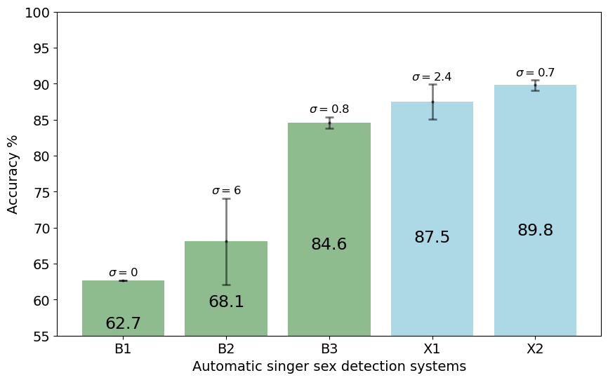

# STraDa：歌手特质数据集

发布时间：2024年06月06日

`Agent

理由：这篇论文主要介绍了一个名为 Singer Traits Dataset（STraDa）的数据集的创建和应用，该数据集旨在助力歌唱声音研究。虽然数据集的创建和使用可以被视为一种工具或资源，但论文的重点在于通过这个数据集进行歌手性别分类（SSC）和偏差分析，这更接近于一个智能代理（Agent）的行为，即利用特定资源进行分析和决策。因此，将其归类为Agent更为合适。其他分类如RAG、LLM应用和LLM理论与论文内容不直接相关。` `音乐研究` `数据集`

> STraDa: A Singer Traits Dataset

# 摘要

> 目前，大规模公共数据集中包含可下载音乐音频文件及丰富领唱者元数据的并不多。为此，我们创建了Singer Traits Dataset（STraDa），旨在助力歌唱声音研究。该数据集包含两个子集：自动-strada和标注-strada。自动-strada收录了超过五千名领唱者的二十五万首曲目，涵盖多种风格和语言，并附有交叉验证的领唱者元数据及其他曲目信息。标注-strada则精选了两百首曲目，确保在性别、语言和年龄组上保持平衡。我们利用这一数据集进行了歌手性别分类（SSC）和偏差分析，展示了其丰富的元数据和可下载音频文件在模型训练和偏差研究中的价值。

> There is a limited amount of large-scale public datasets that contain downloadable music audio files and rich lead singer metadata. To provide such a dataset to benefit research in singing voices, we created Singer Traits Dataset (STraDa) with two subsets: automatic-strada and annotated-strada. The automatic-strada contains twenty-five thousand tracks across numerous genres and languages of more than five thousand unique lead singers, which includes cross-validated lead singer metadata as well as other track metadata. The annotated-strada consists of two hundred tracks that are balanced in terms of 2 genders, 5 languages, and 4 age groups. To show its use for model training and bias analysis thanks to its metadata's richness and downloadable audio files, we benchmarked singer sex classification (SSC) and conducted bias analysis.

[Arxiv](https://arxiv.org/abs/2406.04140)