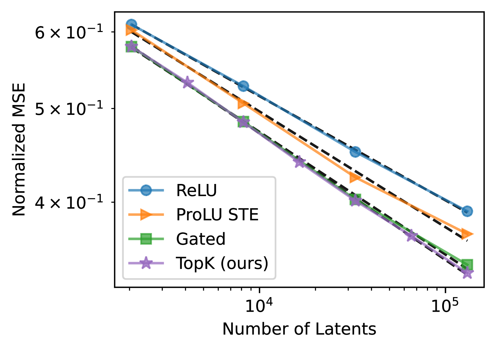
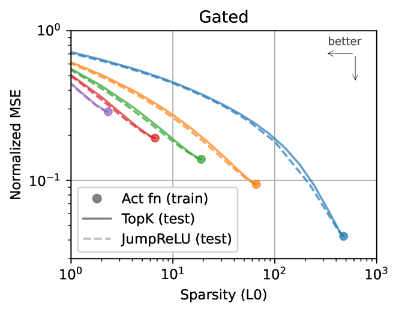
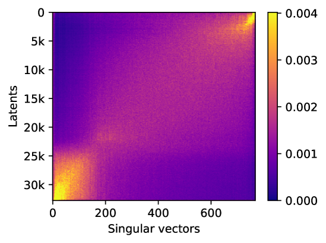
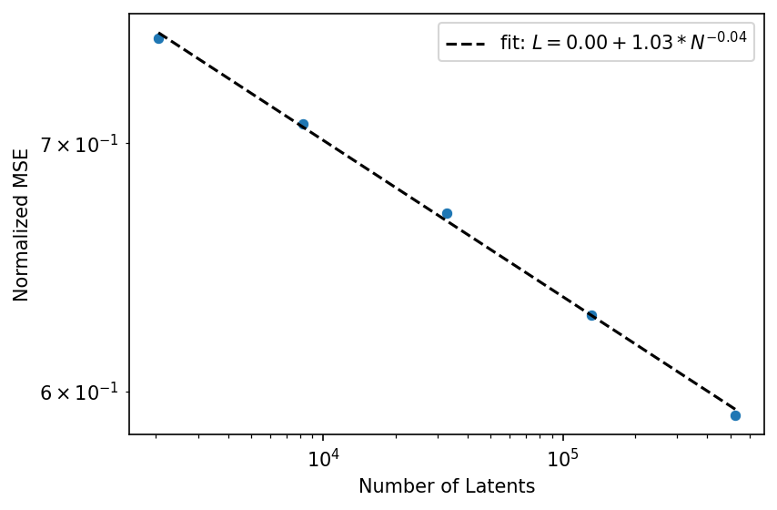

# 探究与评估稀疏自编码器的扩展性能

发布时间：2024年06月06日

`LLM理论

理由：这篇论文主要探讨了稀疏自编码器在语言模型中的应用，特别是在处理大规模语言模型（如GPT-4）时的性能和效率问题。论文通过引入新的评估指标和优化技术，研究了自编码器大小与稀疏性之间的关系，并提供了理论上的深入分析。这些内容更偏向于对大型语言模型（LLM）的理论研究，而非具体的应用开发、代理（Agent）行为研究或检索增强生成（RAG）技术。因此，将其归类为LLM理论是合适的。` `机器学习`

> Scaling and evaluating sparse autoencoders

# 摘要

> 稀疏自编码器通过重建稀疏瓶颈层的激活，为从语言模型中提取可解释特征提供了一种高效的无监督方法。由于语言模型涉及众多概念，自编码器需庞大以捕捉所有关键特征。然而，平衡重建与稀疏性目标，以及处理潜在的无效区域，使得自编码器的规模研究颇具挑战。我们采用k-稀疏自编码器[Makhzani和Frey, 2013]，直接调控稀疏性，简化调优过程，并优化了重建与稀疏性的平衡。此外，我们通过特定修改，即使在最大规模下也能显著减少无效区域。这些技术帮助我们揭示了自编码器大小与稀疏性之间的明确缩放规律。同时，我们引入了新的评估指标，基于特征恢复、激活模式的解释性及下游效应的稀疏性来衡量特征质量，这些指标随着自编码器规模的增大而普遍提升。为了验证我们方法的扩展性，我们在GPT-4的400亿令牌激活数据上训练了一个拥有1600万个潜在变量的自编码器。我们公开了开源模型的训练代码、自编码器及一个可视化工具。

> Sparse autoencoders provide a promising unsupervised approach for extracting interpretable features from a language model by reconstructing activations from a sparse bottleneck layer. Since language models learn many concepts, autoencoders need to be very large to recover all relevant features. However, studying the properties of autoencoder scaling is difficult due to the need to balance reconstruction and sparsity objectives and the presence of dead latents. We propose using k-sparse autoencoders [Makhzani and Frey, 2013] to directly control sparsity, simplifying tuning and improving the reconstruction-sparsity frontier. Additionally, we find modifications that result in few dead latents, even at the largest scales we tried. Using these techniques, we find clean scaling laws with respect to autoencoder size and sparsity. We also introduce several new metrics for evaluating feature quality based on the recovery of hypothesized features, the explainability of activation patterns, and the sparsity of downstream effects. These metrics all generally improve with autoencoder size. To demonstrate the scalability of our approach, we train a 16 million latent autoencoder on GPT-4 activations for 40 billion tokens. We release training code and autoencoders for open-source models, as well as a visualizer.

[Arxiv](https://arxiv.org/abs/2406.04093)