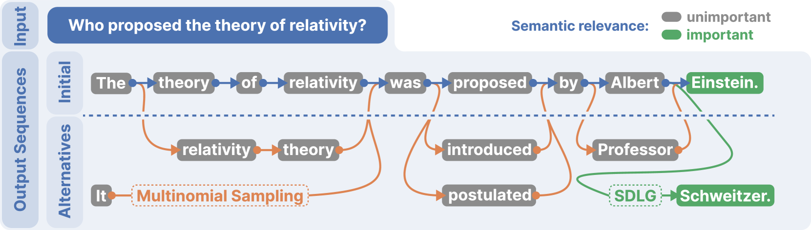
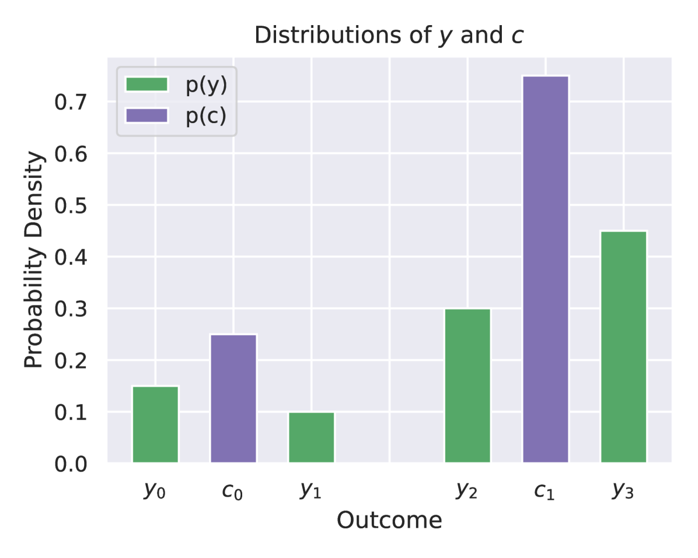
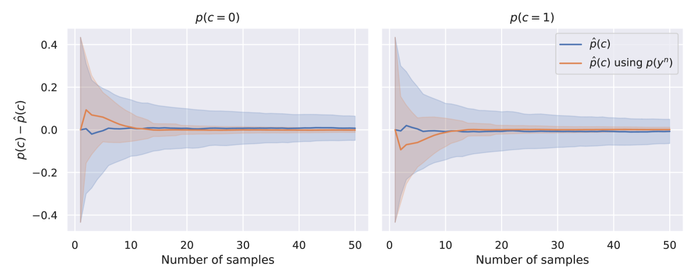
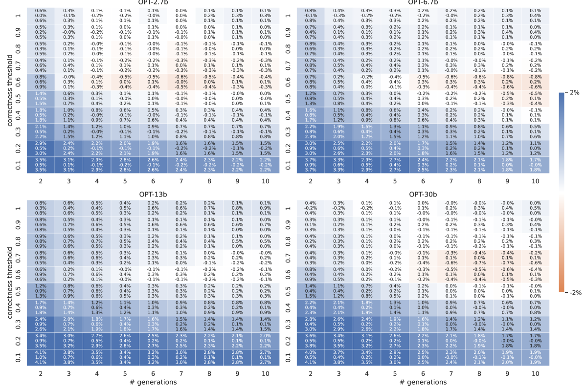
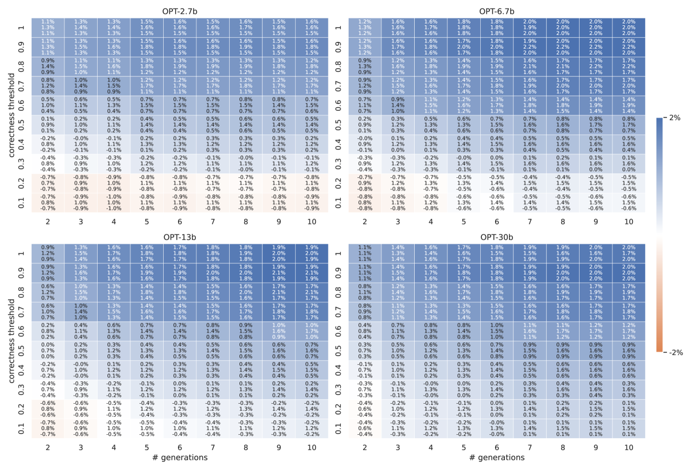
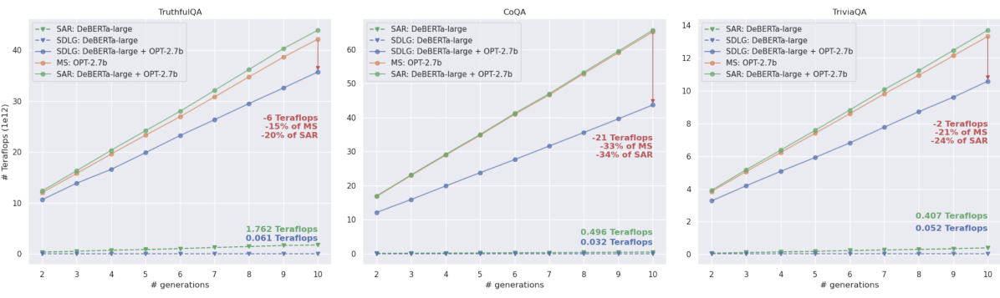
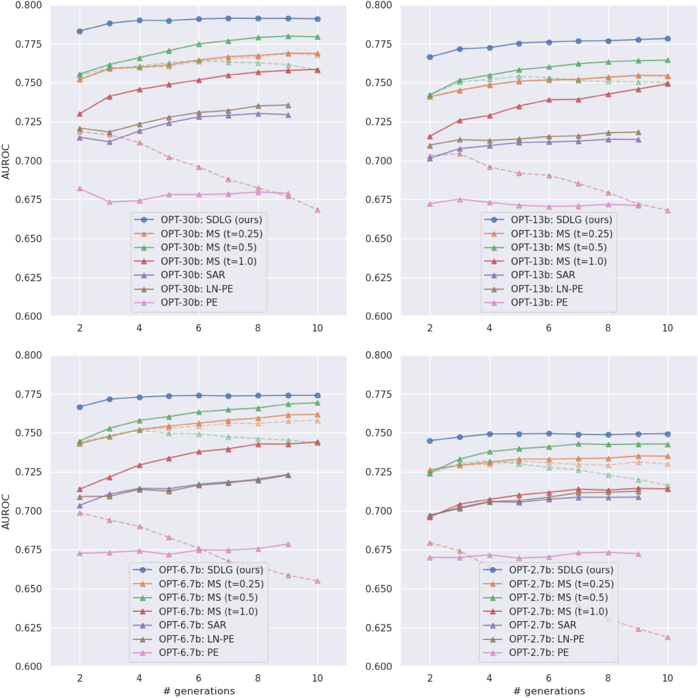
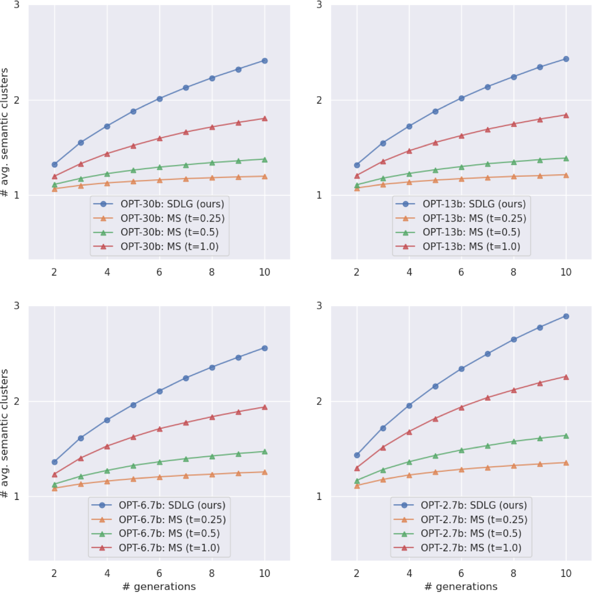
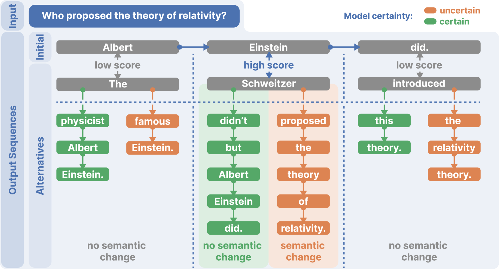
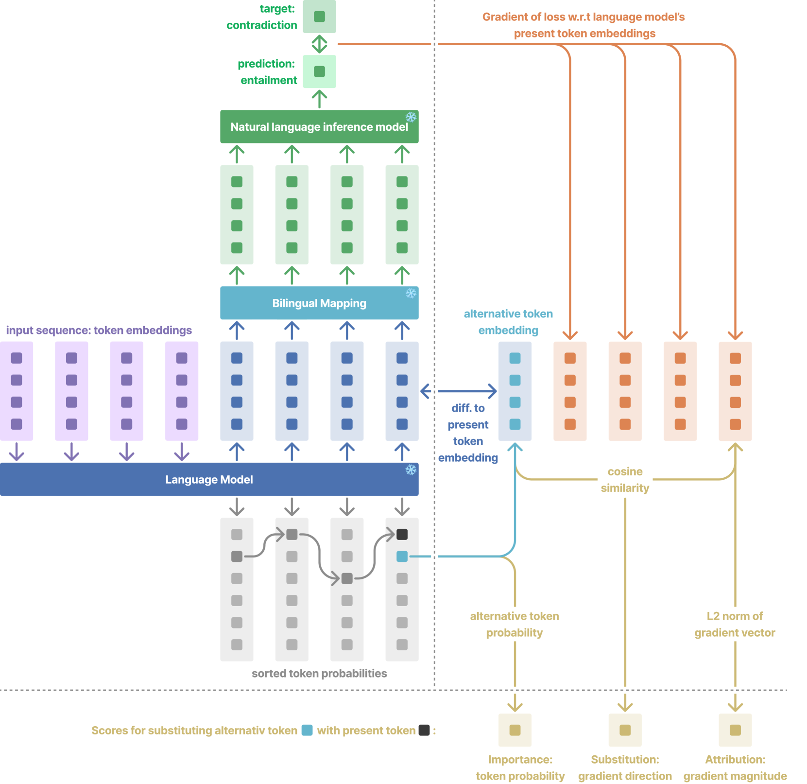

# 语言模型中不确定性估计的语义多样性语言生成

发布时间：2024年06月06日

`LLM理论

这篇论文主要探讨了大型语言模型（LLMs）在生成文本时产生幻觉的问题，并提出了一个名为语义多样性语言生成（SDLG）的新方法来量化和处理这种预测不确定性。论文的核心贡献在于理论上的创新，即通过SDLG来精确衡量语义不确定性，并检测幻觉的可能性。这与LLM的应用实践不同，更多关注于模型内部的理论机制和改进，因此应归类于LLM理论。` `问答系统`

> Semantically Diverse Language Generation for Uncertainty Estimation in Language Models

# 摘要

> 大型语言模型（LLMs）在生成文本时易产生幻觉，这使得它们在社会和工业应用中变得不可靠。目前，LLMs采用自回归方式生成文本，即预测并添加文本令牌。当LLMs对下一个文本令牌的语义含义不确定时，幻觉便可能产生。因此，幻觉被认为是预测不确定性的结果。我们提出了语义多样性语言生成（SDLG），用以量化LLMs中的预测不确定性。SDLG促使LLMs为初始文本生成语义多样且可能的替代方案，从而精确衡量了偶然性语义不确定性，并能检测初始文本是否可能出现幻觉。在问答任务的实验中，SDLG不仅持续超越现有方法，而且在计算效率上达到了最高水平，为LLMs中的不确定性估计树立了新标杆。

> Large language models (LLMs) can suffer from hallucinations when generating text. These hallucinations impede various applications in society and industry by making LLMs untrustworthy. Current LLMs generate text in an autoregressive fashion by predicting and appending text tokens. When an LLM is uncertain about the semantic meaning of the next tokens to generate, it is likely to start hallucinating. Thus, it has been suggested that hallucinations stem from predictive uncertainty. We introduce Semantically Diverse Language Generation (SDLG) to quantify predictive uncertainty in LLMs. SDLG steers the LLM to generate semantically diverse yet likely alternatives for an initially generated text. This approach provides a precise measure of aleatoric semantic uncertainty, detecting whether the initial text is likely to be hallucinated. Experiments on question-answering tasks demonstrate that SDLG consistently outperforms existing methods while being the most computationally efficient, setting a new standard for uncertainty estimation in LLMs.

[Arxiv](https://arxiv.org/abs/2406.04306)