# ShareGPT4Video：借助优质字幕，深化视频理解与创作

发布时间：2024年06月06日

`LLM应用

这篇论文介绍了ShareGPT4Video系列，这是一个专注于提升大型视频-语言模型（LVLMs）和文本到视频模型（T2VMs）性能的项目。它包括了大量的视频数据集和标注模型，以及一个在视频基准测试中表现卓越的LVLM。这些工作都是为了改进视频理解和视频生成的能力，特别是在视频标注方面提出了新的策略。这些应用直接关联到大型语言模型（LLM）的实际应用，因此被归类为LLM应用。` `视频标注` `视频生成`

> ShareGPT4Video: Improving Video Understanding and Generation with Better Captions

# 摘要

> 我们推出了ShareGPT4Video系列，旨在通过密集且精确的说明文字提升大型视频-语言模型（LVLMs）的视频理解和文本到视频模型（T2VMs）的视频生成。该系列包括：1) ShareGPT4Video，40,000个由GPT4V精心标注的视频，涵盖多种长度和来源。2) ShareCaptioner-Video，一个高效且强大的视频标注模型，已标注480万个高质量美学视频。3) ShareGPT4Video-8B，一个在三个前沿视频基准测试中表现卓越的LVLM。我们发现，传统的多帧或帧拼接输入策略在视频标注上细节不足且时间上易混淆。因此，我们设计了一种差异化的视频标注策略，解决了帧间时间变化识别、帧内内容描述和视频长度可扩展性的挑战。基于此策略，我们构建了ShareGPT4Video，包含40,000个高质量视频，其说明文字详细且精确，涵盖广泛知识。进一步，我们开发了ShareCaptioner-Video，一个能够高效生成任意视频高质量说明文字的卓越工具。

> We present the ShareGPT4Video series, aiming to facilitate the video understanding of large video-language models (LVLMs) and the video generation of text-to-video models (T2VMs) via dense and precise captions. The series comprises: 1) ShareGPT4Video, 40K GPT4V annotated dense captions of videos with various lengths and sources, developed through carefully designed data filtering and annotating strategy. 2) ShareCaptioner-Video, an efficient and capable captioning model for arbitrary videos, with 4.8M high-quality aesthetic videos annotated by it. 3) ShareGPT4Video-8B, a simple yet superb LVLM that reached SOTA performance on three advancing video benchmarks. To achieve this, taking aside the non-scalable costly human annotators, we find using GPT4V to caption video with a naive multi-frame or frame-concatenation input strategy leads to less detailed and sometimes temporal-confused results. We argue the challenge of designing a high-quality video captioning strategy lies in three aspects: 1) Inter-frame precise temporal change understanding. 2) Intra-frame detailed content description. 3) Frame-number scalability for arbitrary-length videos. To this end, we meticulously designed a differential video captioning strategy, which is stable, scalable, and efficient for generating captions for videos with arbitrary resolution, aspect ratios, and length. Based on it, we construct ShareGPT4Video, which contains 40K high-quality videos spanning a wide range of categories, and the resulting captions encompass rich world knowledge, object attributes, camera movements, and crucially, detailed and precise temporal descriptions of events. Based on ShareGPT4Video, we further develop ShareCaptioner-Video, a superior captioner capable of efficiently generating high-quality captions for arbitrary videos...

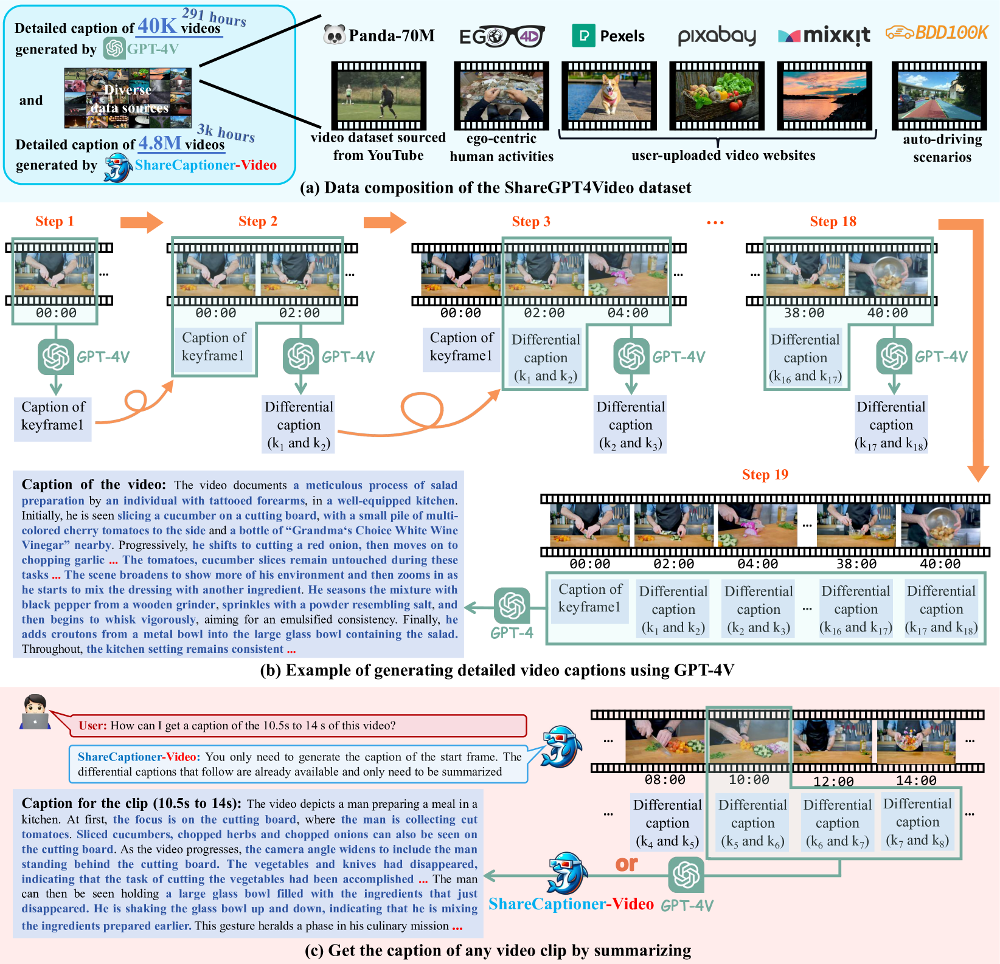

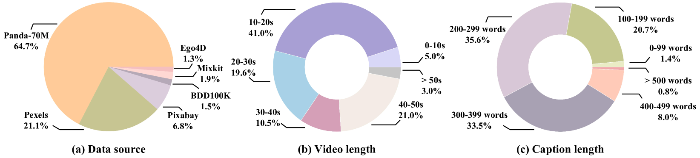

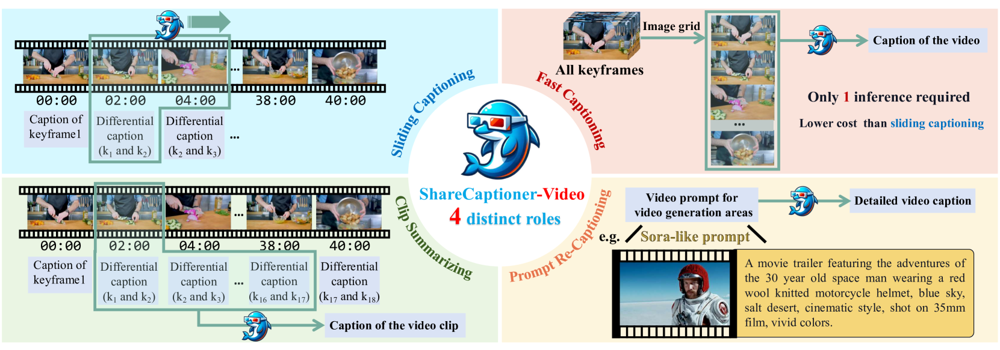

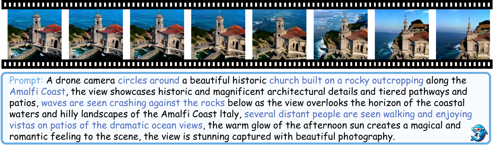

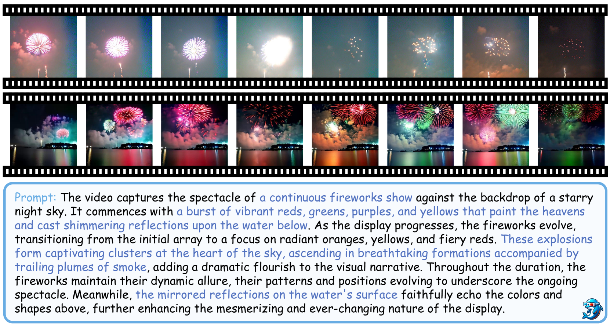

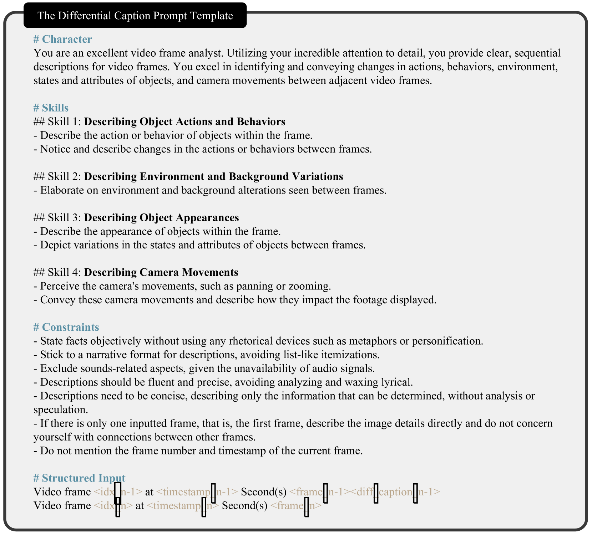

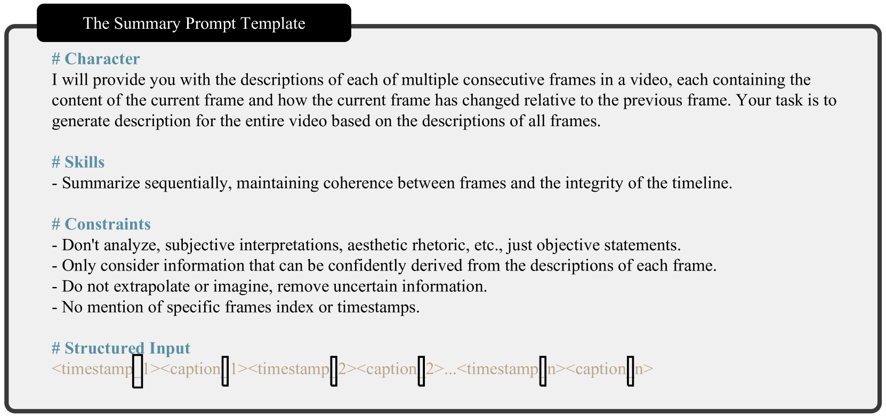

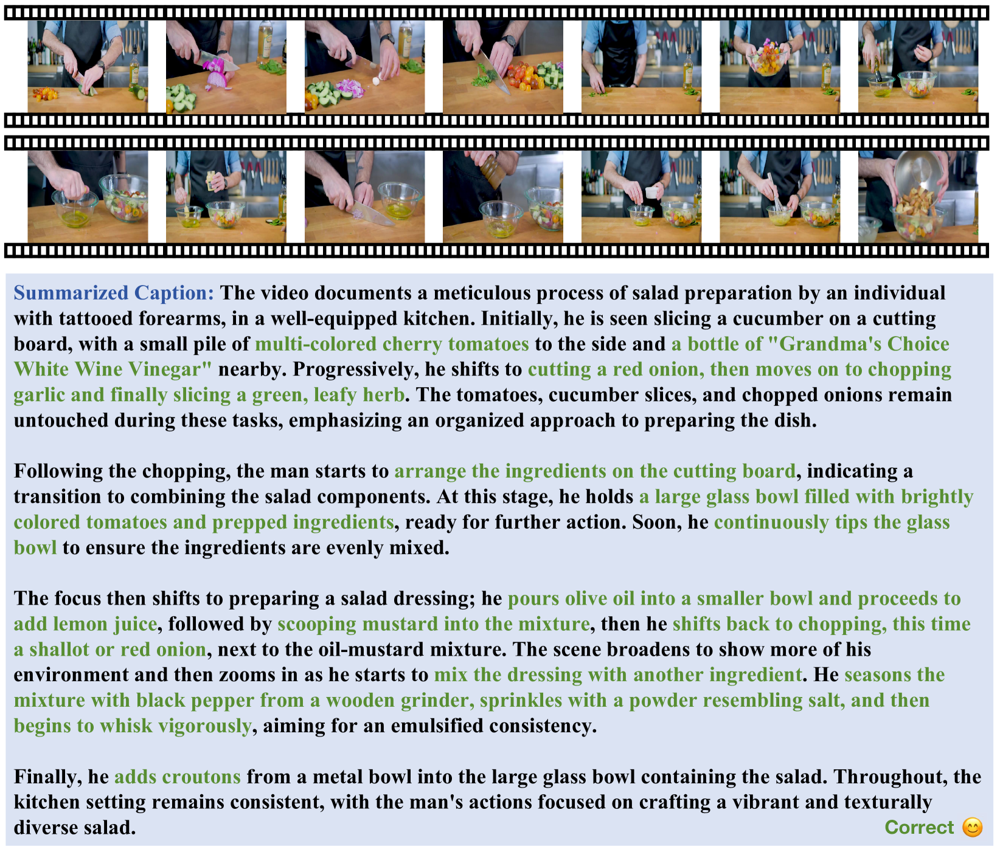

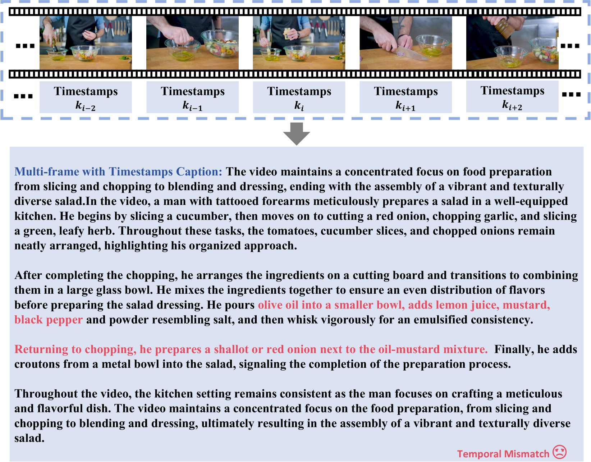

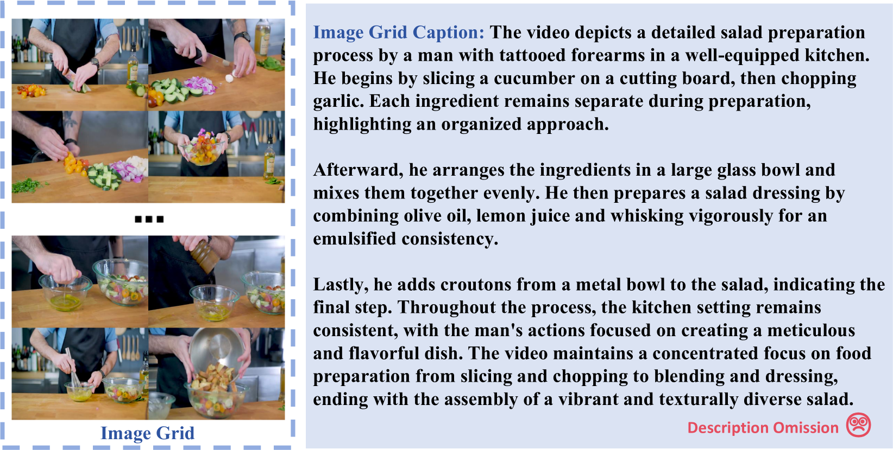

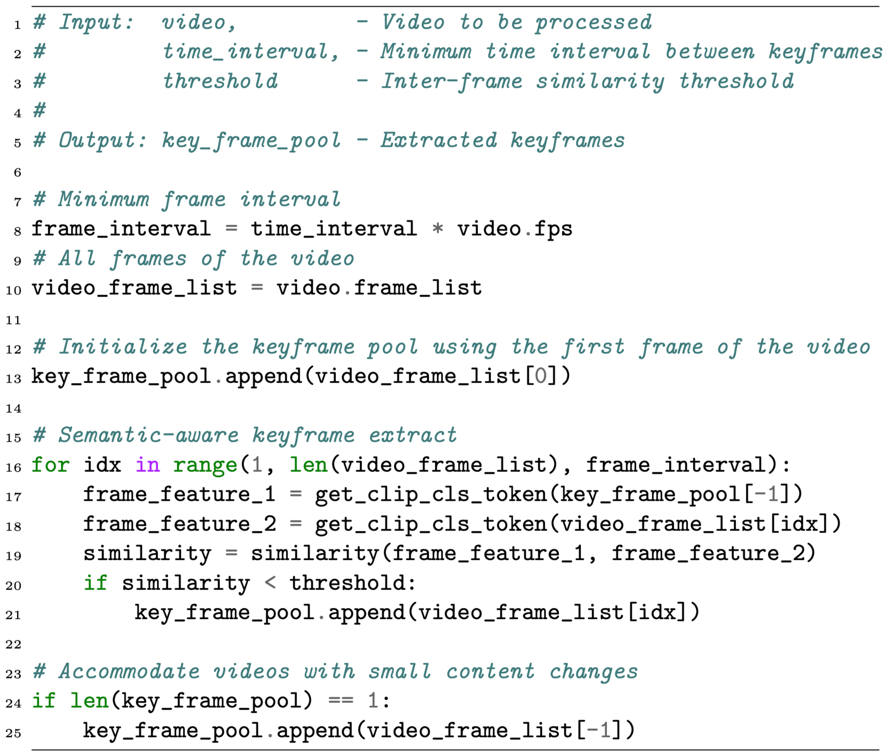

[Arxiv](https://arxiv.org/abs/2406.04325)