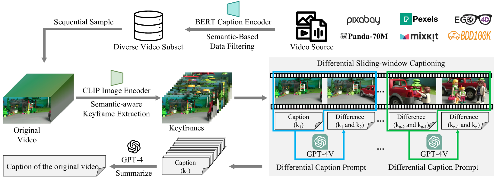
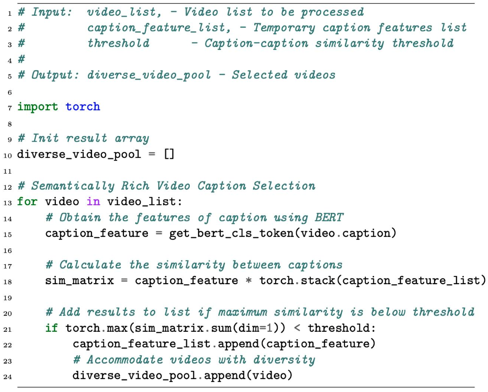

# ShareGPT4Video：借助优质字幕，深化视频理解和生成能力

发布时间：2024年06月06日

`LLM应用

这篇论文介绍了ShareGPT4Video系列，这是一个专注于提升大型视频语言模型（LVLMs）和文本到视频模型（T2VMs）性能的项目。它包括一个视频数据集、一个视频标题生成模型和一个在视频基准测试中表现卓越的LVLM。这些工具和资源旨在增强视频理解和视频生成的能力，特别是在视频标题生成方面，通过创新的策略来处理视频内容的时间和空间细节。这些应用直接关联到大型语言模型（LLM）的实际应用，特别是在视频处理和生成领域，因此属于LLM应用分类。` `视频处理` `人工智能`

> ShareGPT4Video: Improving Video Understanding and Generation with Better Captions

# 摘要

> 我们推出了ShareGPT4Video系列，旨在通过密集且精确的标题提升大型视频语言模型（LVLMs）的视频理解和文本到视频模型（T2VMs）的视频生成能力。该系列包括：1) ShareGPT4Video，精心筛选和标注的40,000个视频，每个视频都配有GPT4V生成的密集标题。2) ShareCaptioner-Video，一个高效且强大的视频标题生成模型，已为480万个美学视频提供了高质量的标题。3) ShareGPT4Video-8B，一个在三个前沿视频基准测试中表现卓越的LVLM。我们发现，传统的多帧或帧拼接输入策略在视频标题生成上存在细节不足和时间混乱的问题。因此，我们设计了一种新的视频标题策略，专注于帧间时间变化的精确识别、帧内内容的详细描述以及对任意长度视频的可扩展性。基于这一策略，我们创建了ShareGPT4Video，包含40,000个高质量视频，其标题详细描述了事件的时间进程，并涵盖了丰富的世界知识、物体属性和摄像机运动。此外，我们还开发了ShareCaptioner-Video，一个能够为任意视频快速生成高质量标题的先进模型。

> We present the ShareGPT4Video series, aiming to facilitate the video understanding of large video-language models (LVLMs) and the video generation of text-to-video models (T2VMs) via dense and precise captions. The series comprises: 1) ShareGPT4Video, 40K GPT4V annotated dense captions of videos with various lengths and sources, developed through carefully designed data filtering and annotating strategy. 2) ShareCaptioner-Video, an efficient and capable captioning model for arbitrary videos, with 4.8M high-quality aesthetic videos annotated by it. 3) ShareGPT4Video-8B, a simple yet superb LVLM that reached SOTA performance on three advancing video benchmarks. To achieve this, taking aside the non-scalable costly human annotators, we find using GPT4V to caption video with a naive multi-frame or frame-concatenation input strategy leads to less detailed and sometimes temporal-confused results. We argue the challenge of designing a high-quality video captioning strategy lies in three aspects: 1) Inter-frame precise temporal change understanding. 2) Intra-frame detailed content description. 3) Frame-number scalability for arbitrary-length videos. To this end, we meticulously designed a differential video captioning strategy, which is stable, scalable, and efficient for generating captions for videos with arbitrary resolution, aspect ratios, and length. Based on it, we construct ShareGPT4Video, which contains 40K high-quality videos spanning a wide range of categories, and the resulting captions encompass rich world knowledge, object attributes, camera movements, and crucially, detailed and precise temporal descriptions of events. Based on ShareGPT4Video, we further develop ShareCaptioner-Video, a superior captioner capable of efficiently generating high-quality captions for arbitrary videos...

[Arxiv](https://arxiv.org/abs/2406.04325)