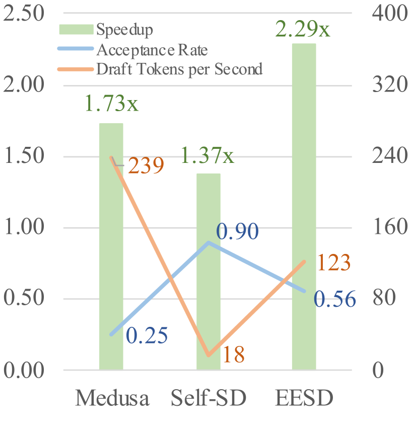
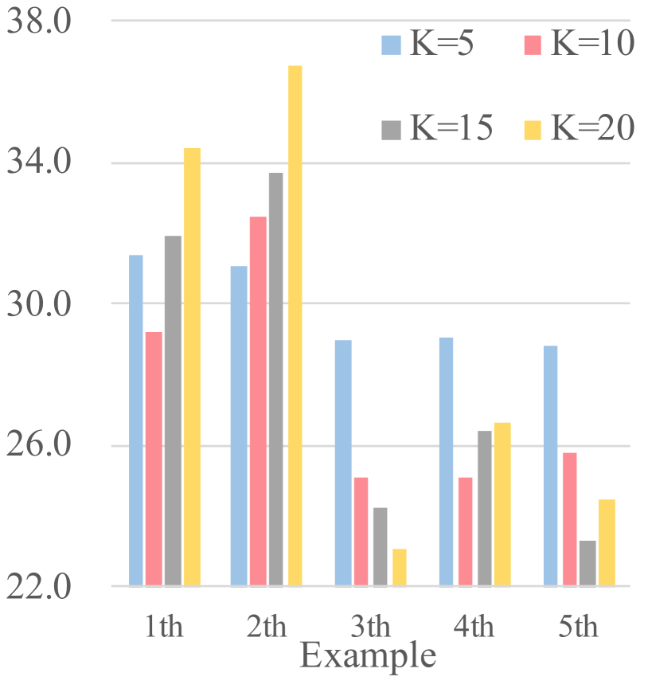
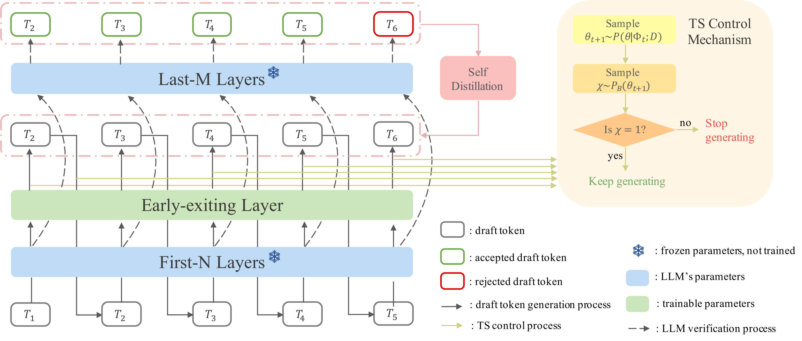
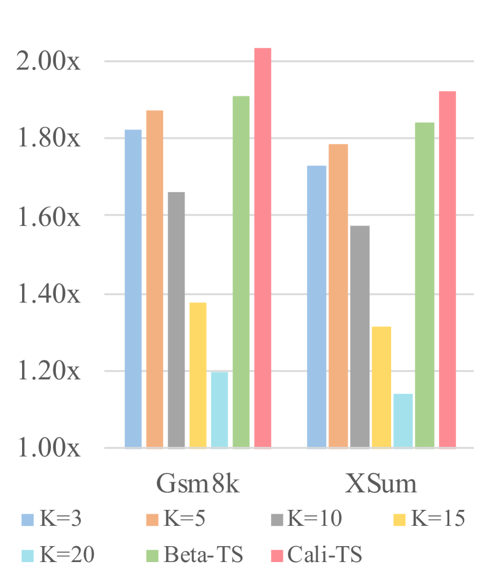
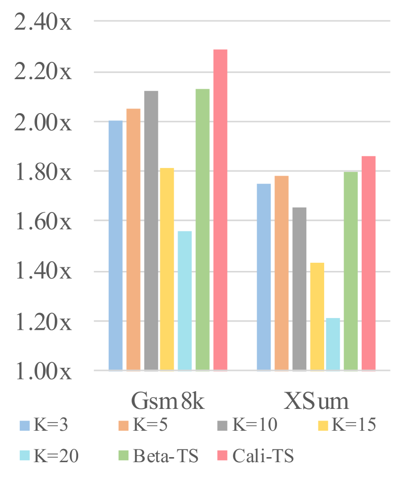
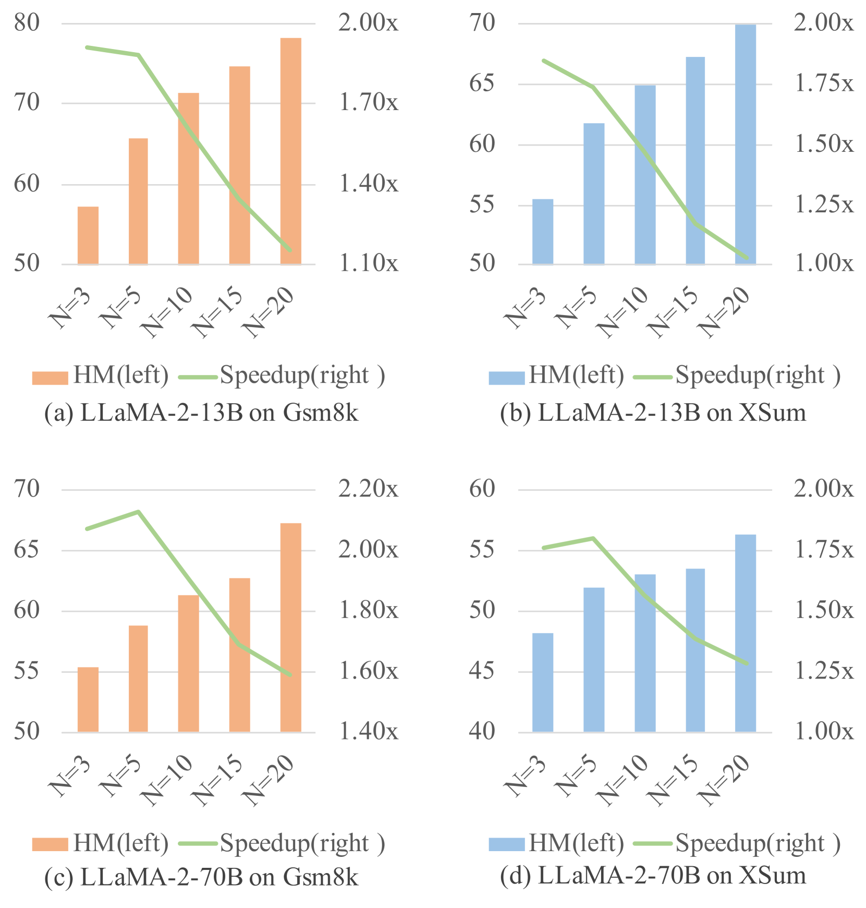
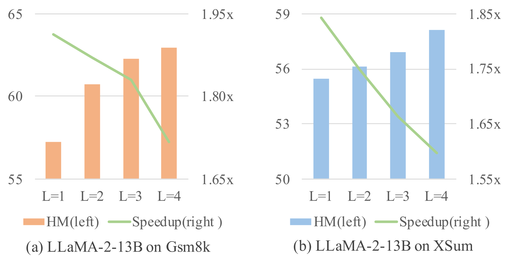
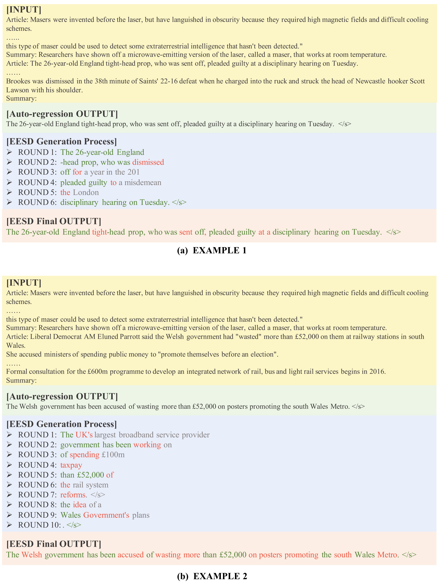

# 借助早期退出与汤普森采样机制，推测解码加速LLM推理

发布时间：2024年06月06日

`LLM应用

这篇论文介绍了一种名为Early-exiting Speculative Decoding（EESD）的创新方法，旨在降低大型语言模型（LLMs）的推理成本并提高效率。EESD通过在LLM的部分结构中生成草稿令牌，并结合Early-exiting机制和自蒸馏技术来提升草稿质量，从而减少成本并提高令牌生成效率。此外，论文还采用了Thompson Sampling的采样机制来智能调控草稿令牌的数量。这种方法的目的是在不影响输出文本质量的前提下，加速LLM的解码过程。因此，这篇论文属于LLM应用分类，因为它专注于改进LLM的实际应用性能，特别是在提高解码速度和降低成本方面。` `模型优化`

> Speculative Decoding via Early-exiting for Faster LLM Inference with Thompson Sampling Control Mechanism

# 摘要

> 大型语言模型（LLMs）的进步已经令人瞩目，但其推理成本的激增在实际应用中构成了挑战。为此，我们提出了一种创新方法——Early-exiting Speculative Decoding（EESD），旨在无损加速。EESD通过LLM的部分结构生成草稿令牌，并在模型前N层后嵌入Early-exiting机制，同时结合自蒸馏技术提升草稿质量。这一设计不仅削减了成本，还大幅提升了令牌生成效率。我们还创新性地采用了Thompson Sampling的采样机制，智能调控每轮草稿令牌的数量。原始LLM随后通过一次前向传播验证这些草稿，确保输出文本与标准自回归解码的分布一致。实验在13B和70B模型上均显示，EESD的解码速度远超以往技术，充分验证了其有效性。

> The recent advancements in large language models (LLMs) have been extraordinary, yet the escalating inference costs associated with them present challenges in real-world applications. To address these challenges, we propose a novel approach called Early-exiting Speculative Decoding (EESD) with lossless acceleration. Specifically, EESD utilizes a segment of the LLM to generate draft tokens, incorporating Early-exiting structures after the first N layers. To enhance the quality of draft tokens, a self-distillation method is integrated. This early-exiting design not only reduces deployment and training costs but also significantly accelerates the token generation speed. Moreover, we introduce a novel sampling mechanism that leverages Thompson Sampling to regulate the generation processes, automatically determining the quantity of draft tokens in each round. The original LLM is then employed to validate these draft tokens through a single forward pass, and thus guarantees that the final output text maintains a distribution consistent with vanilla auto-regressive decoding. The experimental results on both 13B and 70B models demonstrate that our approach decodes tokens at a markedly accelerated rate compared to prior methods, showing the effectiveness of our approach.

[Arxiv](https://arxiv.org/abs/2406.03853)