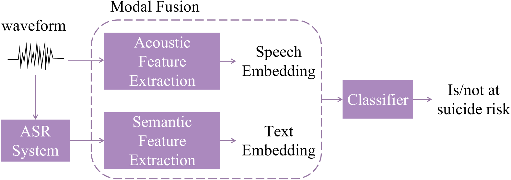
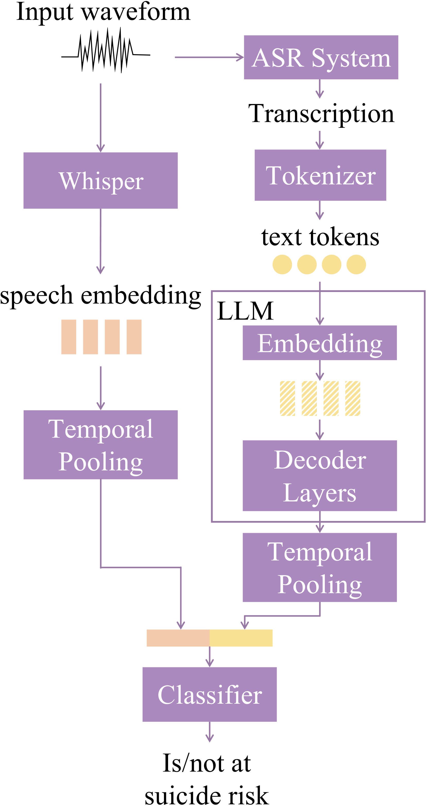
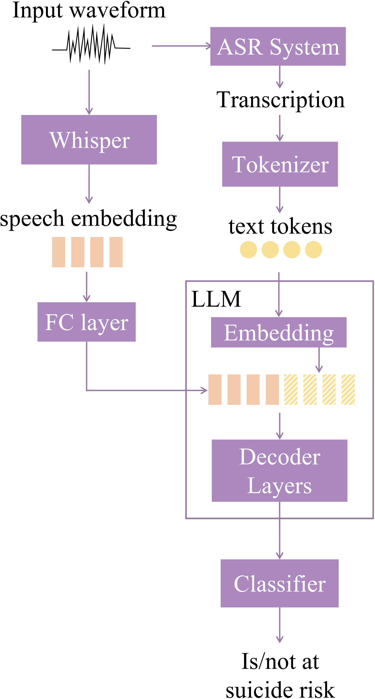

# 利用 Whisper 与大型语言模型进行自发语音的自杀风险检测

发布时间：2024年06月06日

`Agent

理由：这篇论文主要描述了一个系统，该系统结合了Whisper语音模型和大型语言模型（LLMs）来自动检测青少年的自杀风险。这个系统可以被视为一个智能代理（Agent），因为它能够处理输入的语音数据，并基于这些数据做出决策（即评估自杀风险）。此外，论文中提到的全参数微调和参数高效微调技术，以及音视频融合策略，都是为了优化这个代理的性能，使其更加准确和高效。因此，这篇论文更符合Agent分类，而不是RAG、LLM应用或LLM理论。` `心理健康` `语音识别`

> Spontaneous Speech-Based Suicide Risk Detection Using Whisper and Large Language Models

# 摘要

> 早期识别自杀风险对于预防潜在自杀行为至关重要。本研究聚焦于通过青少年的自发性言语自动检测自杀风险，并为此收集了一个包含15小时自杀相关言语的普通话数据集，涉及10至18岁的上千名青少年。研究中，我们结合了Whisper语音模型与大型语言模型（LLMs），利用其丰富的声学和语言特征进行风险评估。通过全参数微调与参数高效微调技术，我们优化了预训练模型，并探索了多种音视频融合策略以整合Whisper与LLM的信息。实验结果显示，该系统在119名测试对象上取得了0.807的准确率和0.846的F1分数，预示着其在实际自杀风险检测中的应用前景。

> The early detection of suicide risk is important since it enables the intervention to prevent potential suicide attempts. This paper studies the automatic detection of suicide risk based on spontaneous speech from adolescents, and collects a Mandarin dataset with 15 hours of suicide speech from more than a thousand adolescents aged from ten to eighteen for our experiments. To leverage the diverse acoustic and linguistic features embedded in spontaneous speech, both the Whisper speech model and textual large language models (LLMs) are used for suicide risk detection. Both all-parameter finetuning and parameter-efficient finetuning approaches are used to adapt the pre-trained models for suicide risk detection, and multiple audio-text fusion approaches are evaluated to combine the representations of Whisper and the LLM. The proposed system achieves a detection accuracy of 0.807 and an F1-score of 0.846 on the test set with 119 subjects, indicating promising potential for real suicide risk detection applications.

[Arxiv](https://arxiv.org/abs/2406.03882)