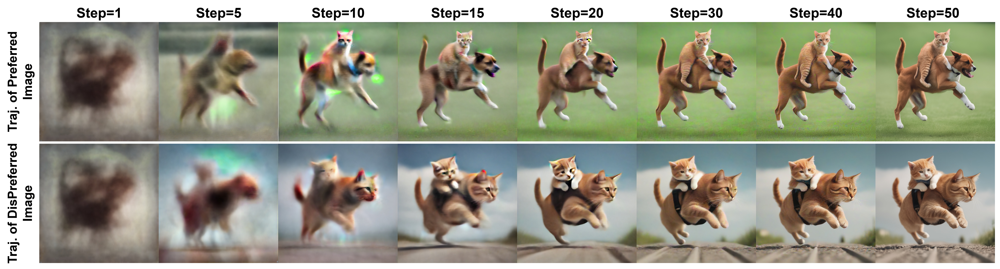
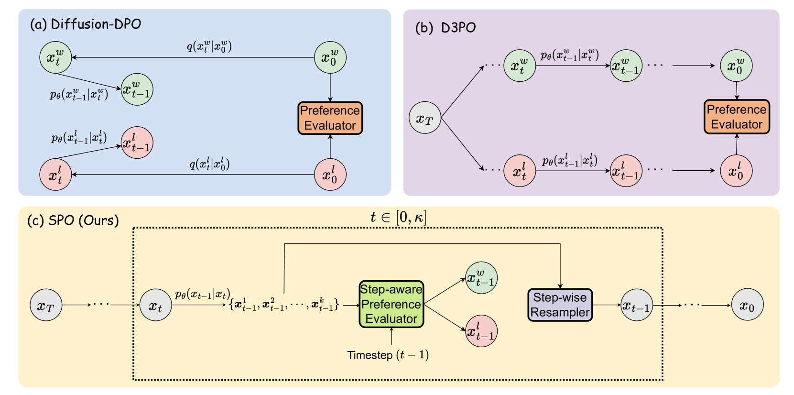
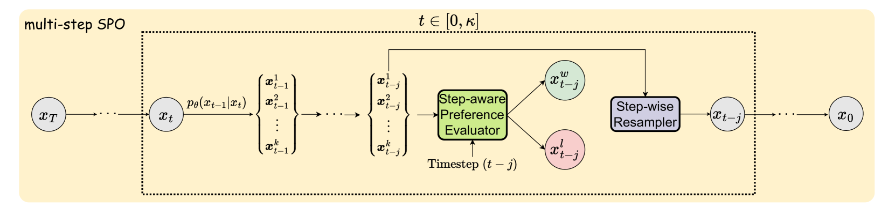
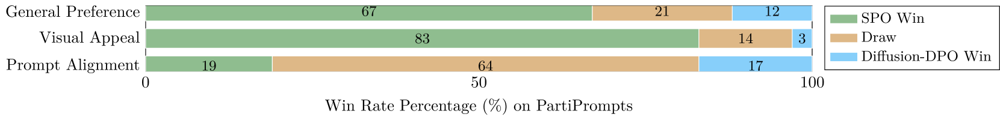
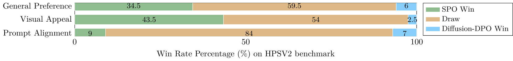

# 逐步偏好优化：确保每一步的去噪效果与用户偏好同步调整

发布时间：2024年06月06日

`RAG

理由：这篇论文主要介绍了一种新的后训练技术——步骤感知偏好优化（SPO），它针对文本到图像扩散模型的每个扩散步骤进行优化，以更好地符合人类偏好。这种方法特别关注于扩散模型的去噪过程，通过定制每个步骤的偏好标签来优化模型。这与RAG（Retrieval-Augmented Generation）的范畴相符，因为RAG通常涉及对生成过程的细粒度控制和优化，尤其是在处理复杂任务时。虽然论文中提到的技术应用于文本到图像扩散模型，但其核心思想——通过细粒度优化来提高模型性能——与RAG的概念相契合。因此，将其归类为RAG是合适的。` `图像生成` `人工智能`

> Step-aware Preference Optimization: Aligning Preference with Denoising Performance at Each Step

# 摘要

> 直接偏好优化（DPO）近期已成功将其应用范围从大型语言模型扩展至文本到图像扩散模型，以更好地符合人类偏好。不同于传统DPO方法，我们提出，应针对每个扩散步骤的独特去噪贡献定制偏好标签，而非假设所有步骤共享统一的偏好顺序。为此，我们开发了步骤感知偏好优化（SPO），一种创新的后训练技术，它通过步骤感知偏好模型和步骤级重采样器，独立优化每个步骤的去噪效果，确保精准的步骤级监督。在每个去噪阶段，SPO从图像池中选取一对胜负图像，并随机挑选一张图像作为下一阶段的起点，确保每次比较的独立性。此外，我们训练了一个专用的步骤感知偏好模型，用于评估噪声和干净图像的偏好。实验结果显示，SPO在Stable Diffusion v1.5和SDXL上不仅在美学和复杂提示对齐方面超越了最新的Diffusion-DPO，而且在训练效率上提升了超过20倍。详细代码和模型可访问：https://rockeycoss.github.io/spo.github.io/

> Recently, Direct Preference Optimization (DPO) has extended its success from aligning large language models (LLMs) to aligning text-to-image diffusion models with human preferences. Unlike most existing DPO methods that assume all diffusion steps share a consistent preference order with the final generated images, we argue that this assumption neglects step-specific denoising performance and that preference labels should be tailored to each step's contribution. To address this limitation, we propose Step-aware Preference Optimization (SPO), a novel post-training approach that independently evaluates and adjusts the denoising performance at each step, using a step-aware preference model and a step-wise resampler to ensure accurate step-aware supervision. Specifically, at each denoising step, we sample a pool of images, find a suitable win-lose pair, and, most importantly, randomly select a single image from the pool to initialize the next denoising step. This step-wise resampler process ensures the next win-lose image pair comes from the same image, making the win-lose comparison independent of the previous step. To assess the preferences at each step, we train a separate step-aware preference model that can be applied to both noisy and clean images. Our experiments with Stable Diffusion v1.5 and SDXL demonstrate that SPO significantly outperforms the latest Diffusion-DPO in aligning generated images with complex, detailed prompts and enhancing aesthetics, while also achieving more than 20x times faster in training efficiency. Code and model: https://rockeycoss.github.io/spo.github.io/

[Arxiv](https://arxiv.org/abs/2406.04314)