# 驾驶行为多样化合成：借助大型语言模型实现文本到驾驶的转变

发布时间：2024年06月06日

`Agent

理由：这篇论文主要介绍了一种名为Text-to-Drive（T2D）的方法，该方法利用大型语言模型（LLMs）生成多样化的驾驶行为，以模拟生成多样化场景，这对于训练和评估自动驾驶等安全关键系统至关重要。T2D方法通过LLM构建状态图，将低级状态映射到高级抽象，从而支持下游任务，如观察总结、策略评估和奖励塑造。这种方法的核心在于使用LLM作为智能体（Agent）来生成和执行驾驶行为，因此属于Agent分类。` `自动驾驶` `模拟训练`

> Text-to-Drive: Diverse Driving Behavior Synthesis via Large Language Models

# 摘要

> 模拟生成多样化场景对训练和评估自动驾驶等安全关键系统至关重要。然而，模拟其他车辆轨迹以实现有意义的近距离交互成本高昂。采用语言描述生成驾驶行为是一种有前景的方法，为操作员提供了一种直观且可扩展的方式来模拟各种驾驶交互。但缺乏大规模注释的语言-轨迹数据使这一挑战重重。为此，我们提出了Text-to-Drive（T2D），利用大型语言模型（LLMs）生成多样化的驾驶行为。我们的方法分为两个阶段：首先，利用LLMs的知识生成场景下的多样化驾驶行为描述；其次，通过LLM的推理能力在模拟中实现这些行为。T2D的核心是使用LLM构建状态图，将低级状态映射到高级抽象，从而无需人类监督即可支持下游任务，如观察总结、策略评估和奖励塑造。我们的方法展示了T2D生成的轨迹比其他方法更丰富，并提供了一个自然语言界面，便于交互式地融入人类偏好。更多示例请访问我们的网站：https://text-to-drive.github.io/

> Generating varied scenarios through simulation is crucial for training and evaluating safety-critical systems, such as autonomous vehicles. Yet, the task of modeling the trajectories of other vehicles to simulate diverse and meaningful close interactions remains prohibitively costly. Adopting language descriptions to generate driving behaviors emerges as a promising strategy, offering a scalable and intuitive method for human operators to simulate a wide range of driving interactions. However, the scarcity of large-scale annotated language-trajectory data makes this approach challenging.
  To address this gap, we propose Text-to-Drive (T2D) to synthesize diverse driving behaviors via Large Language Models (LLMs). We introduce a knowledge-driven approach that operates in two stages. In the first stage, we employ the embedded knowledge of LLMs to generate diverse language descriptions of driving behaviors for a scene. Then, we leverage LLM's reasoning capabilities to synthesize these behaviors in simulation. At its core, T2D employs an LLM to construct a state chart that maps low-level states to high-level abstractions. This strategy aids in downstream tasks such as summarizing low-level observations, assessing policy alignment with behavior description, and shaping the auxiliary reward, all without needing human supervision. With our knowledge-driven approach, we demonstrate that T2D generates more diverse trajectories compared to other baselines and offers a natural language interface that allows for interactive incorporation of human preference. Please check our website for more examples: https://text-to-drive.github.io/

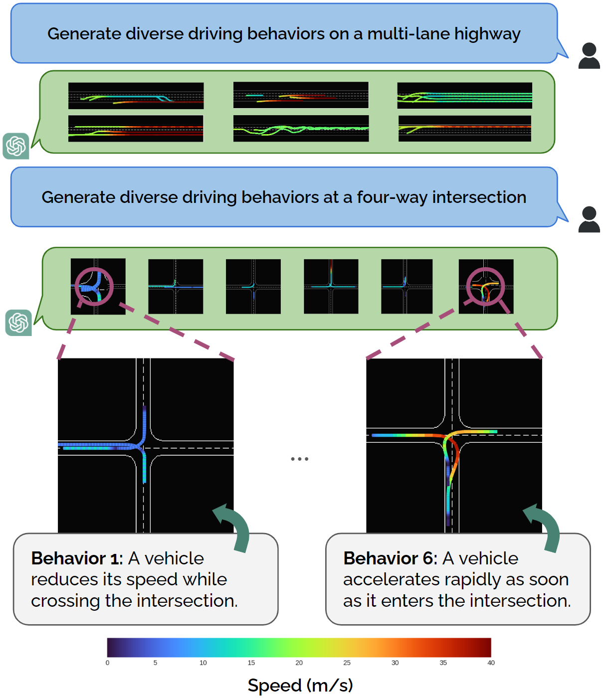

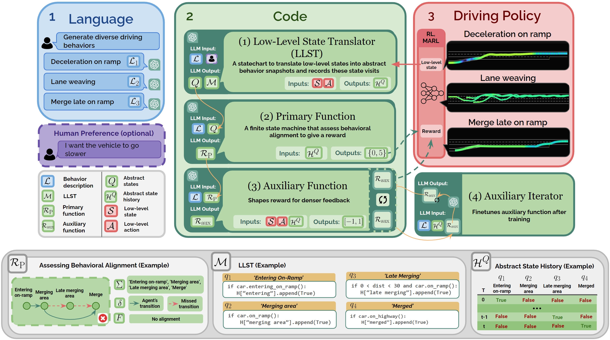

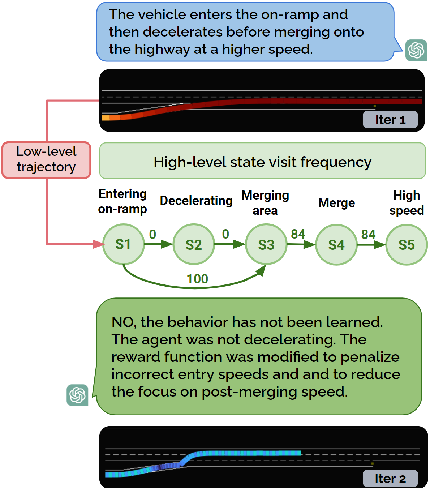

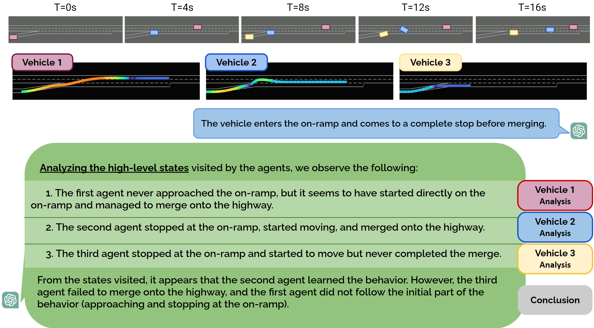

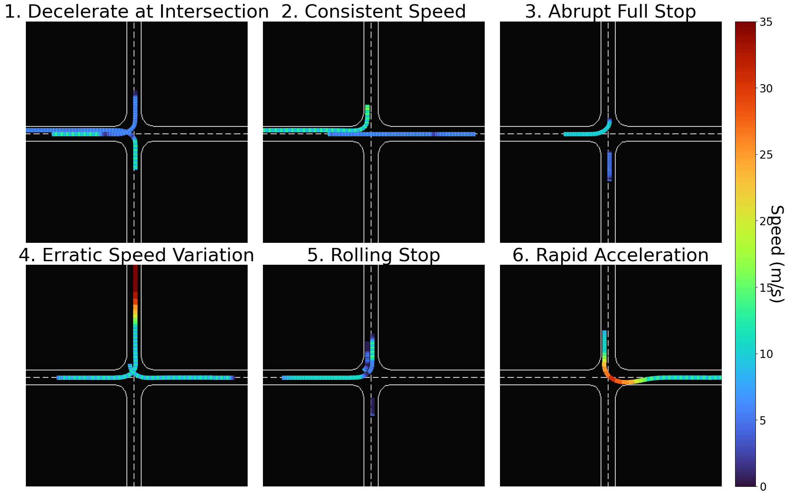

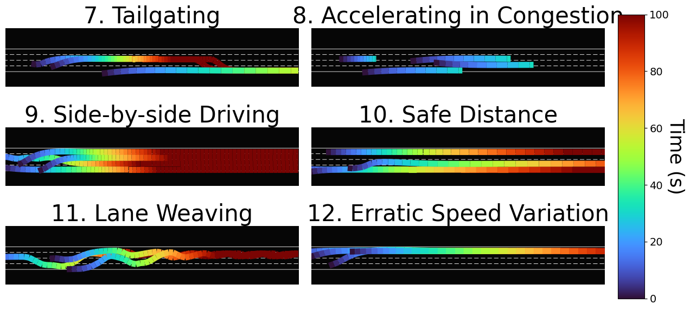

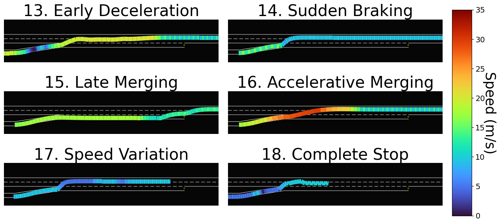

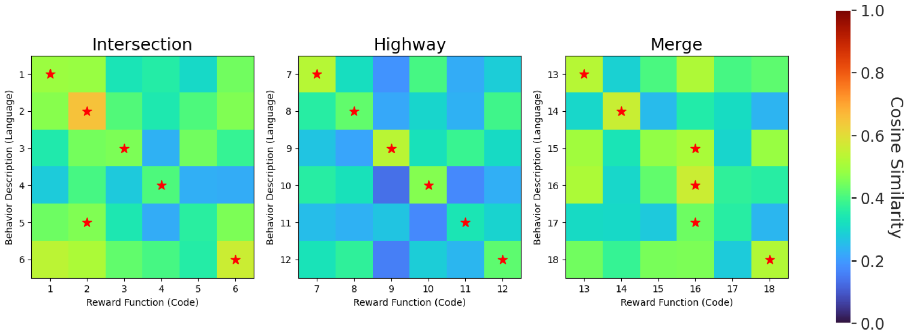

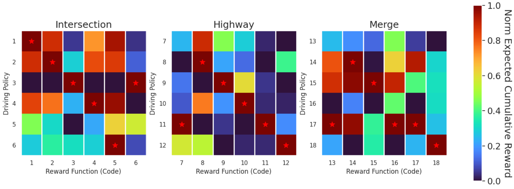

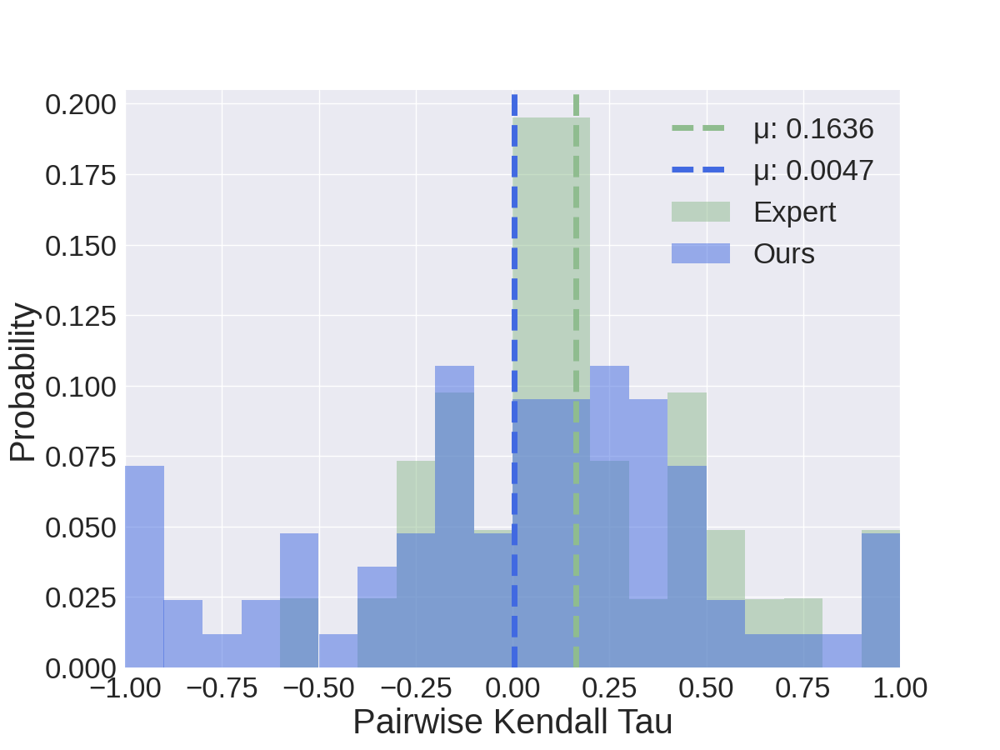

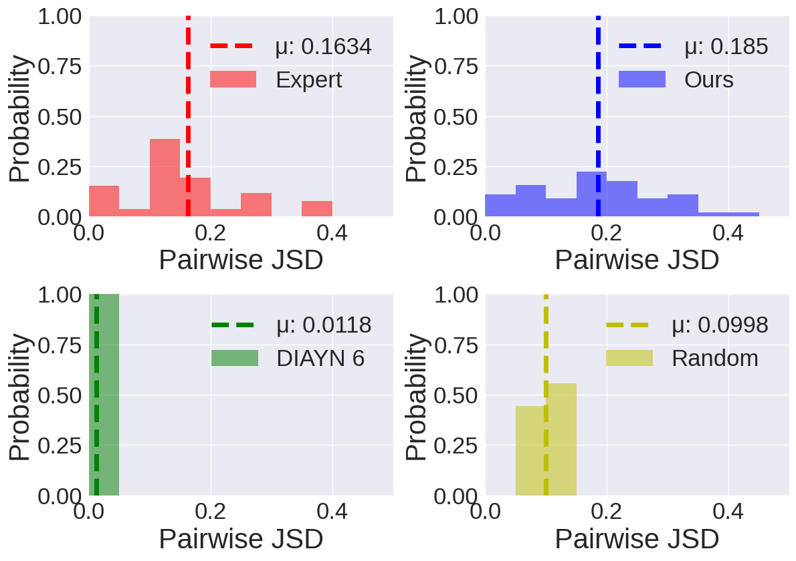

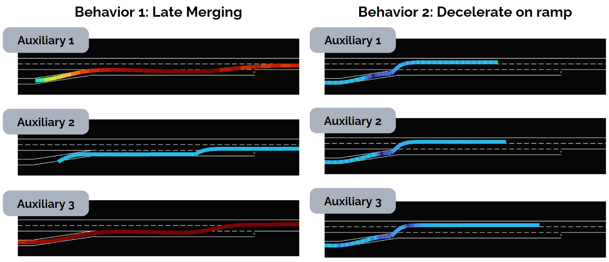

[Arxiv](https://arxiv.org/abs/2406.04300)