# 《提示技术综述：系统性探索》

发布时间：2024年06月06日

`LLM理论

理由：这篇论文主要关注生成式人工智能系统中的提示技术，通过构建分类体系和深入分析，为提示技术建立清晰的框架。这涉及到对大型语言模型（LLM）的理论研究，特别是在提示技术的分类和理解上。因此，这篇论文更符合LLM理论分类，因为它探讨了LLM在提示技术方面的理论基础和分类方法，而不是直接的应用或安全性问题。` `人工智能`

> The Prompt Report: A Systematic Survey of Prompting Techniques

# 摘要

> 生成式人工智能系统正广泛应用于各行各业和研究领域，开发者和用户通过提示或提示工程与之互动。虽然提示的概念广为人知且研究深入，但该领域的新兴性导致了术语混乱和实体理解不足。本文通过构建提示技术的分类体系并深入分析，旨在为提示建立一个清晰的框架。我们详细列出了33个相关术语，分类了58种纯文本提示技术，并介绍了40种其他模态的技术。此外，我们还对自然语言前缀提示的相关文献进行了全面的元分析。

> Generative Artificial Intelligence (GenAI) systems are being increasingly deployed across all parts of industry and research settings. Developers and end users interact with these systems through the use of prompting or prompt engineering. While prompting is a widespread and highly researched concept, there exists conflicting terminology and a poor ontological understanding of what constitutes a prompt due to the area's nascency. This paper establishes a structured understanding of prompts, by assembling a taxonomy of prompting techniques and analyzing their use. We present a comprehensive vocabulary of 33 vocabulary terms, a taxonomy of 58 text-only prompting techniques, and 40 techniques for other modalities. We further present a meta-analysis of the entire literature on natural language prefix-prompting.

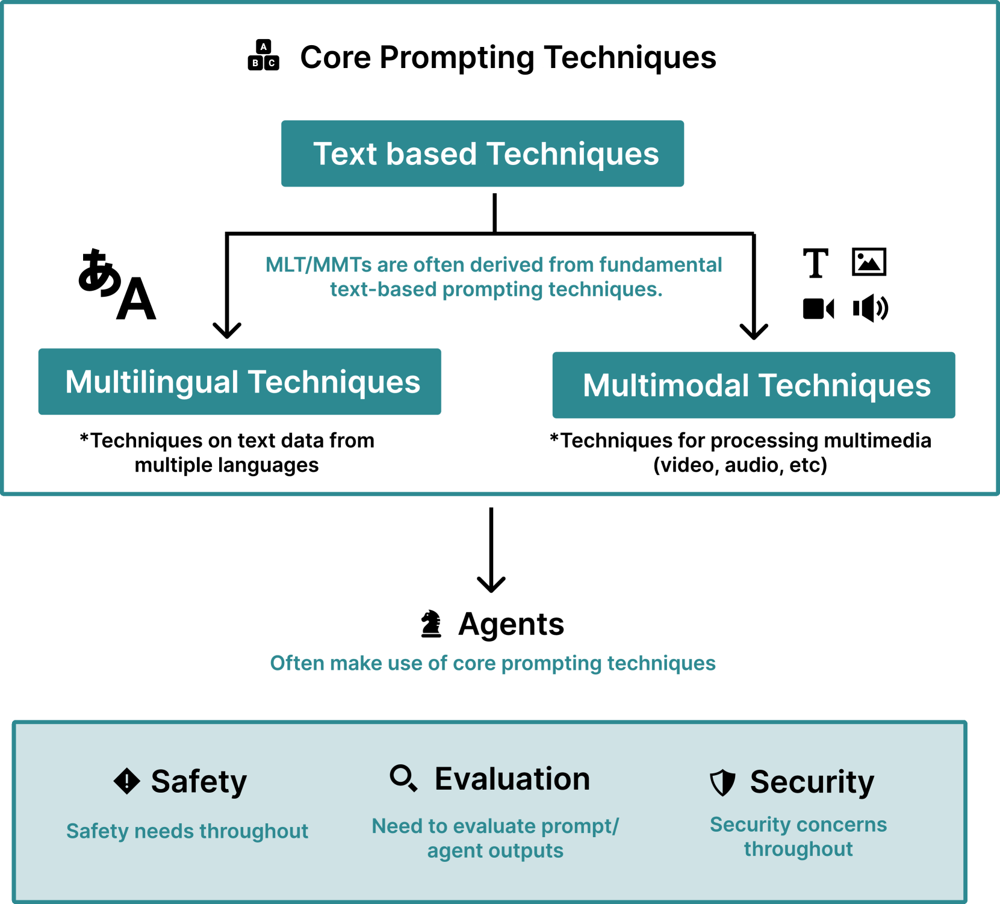

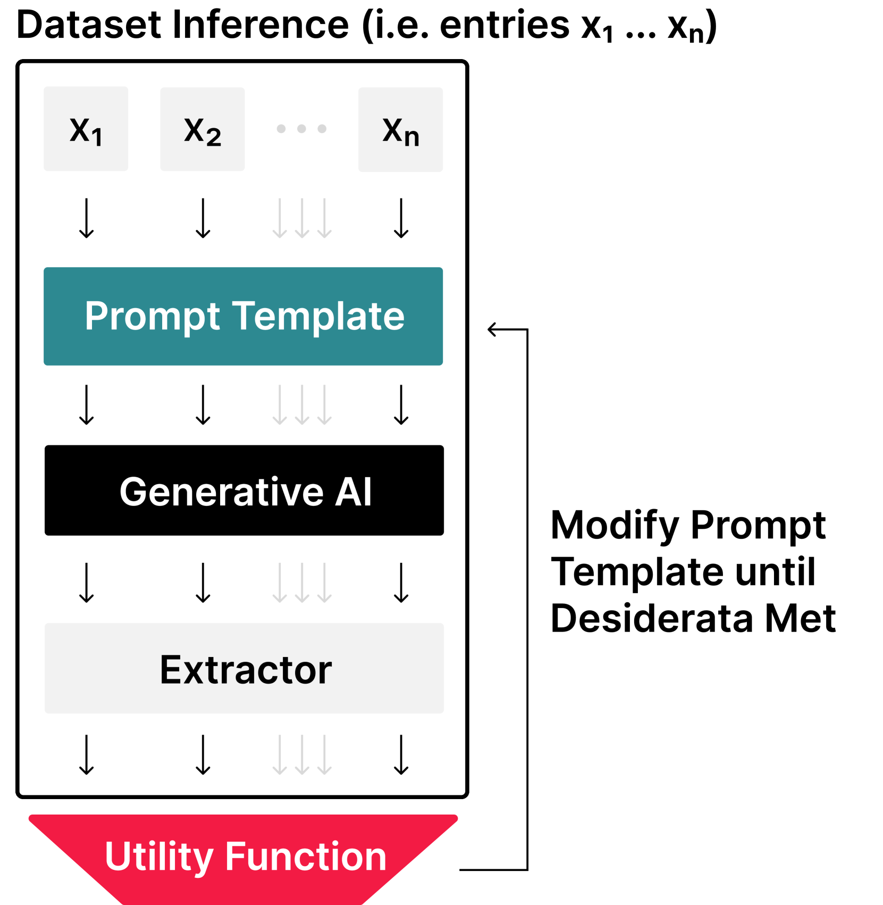

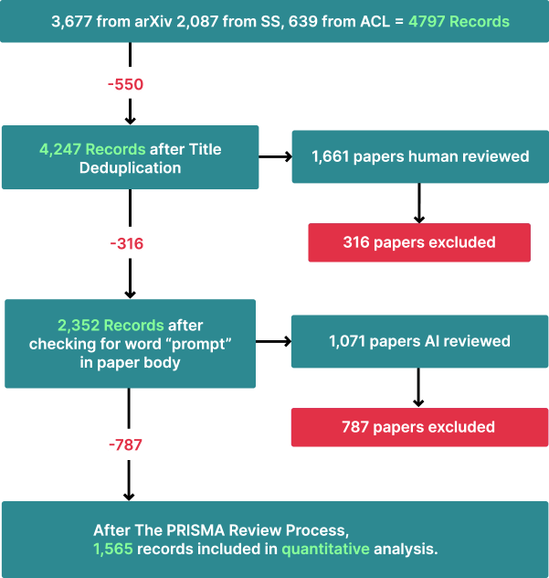

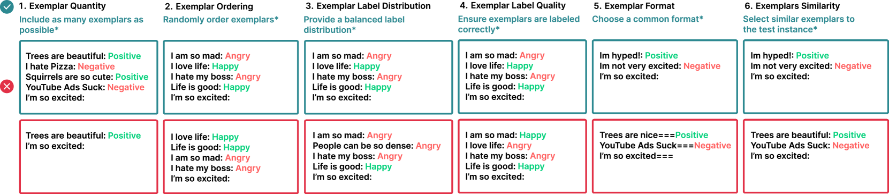

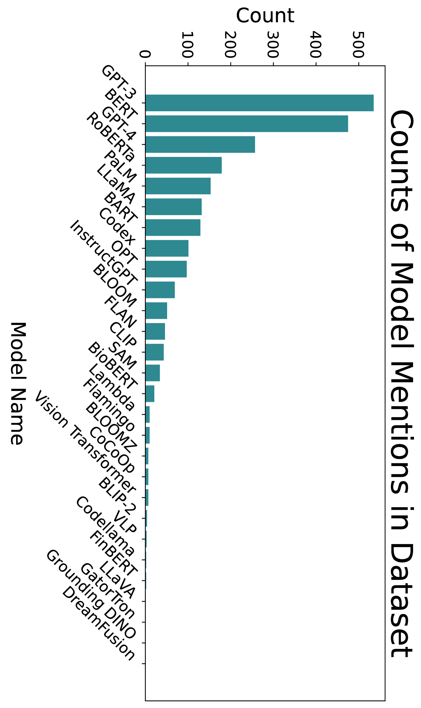

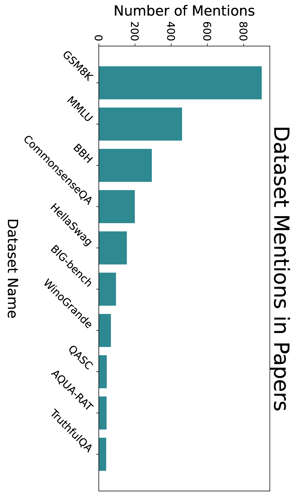

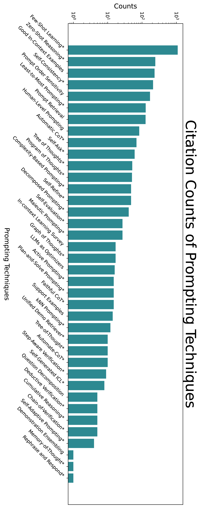

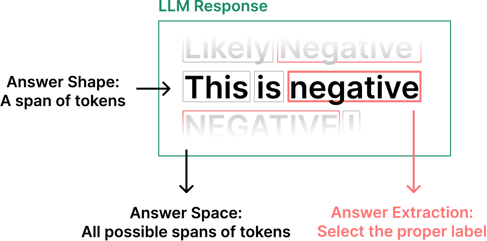

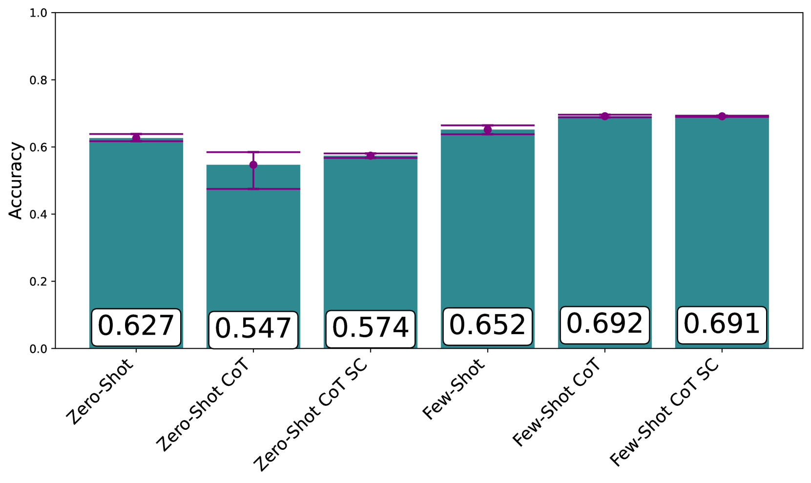

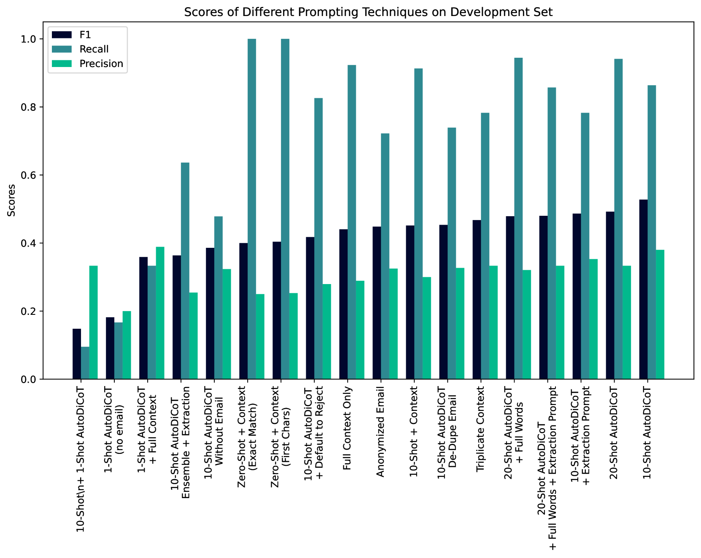

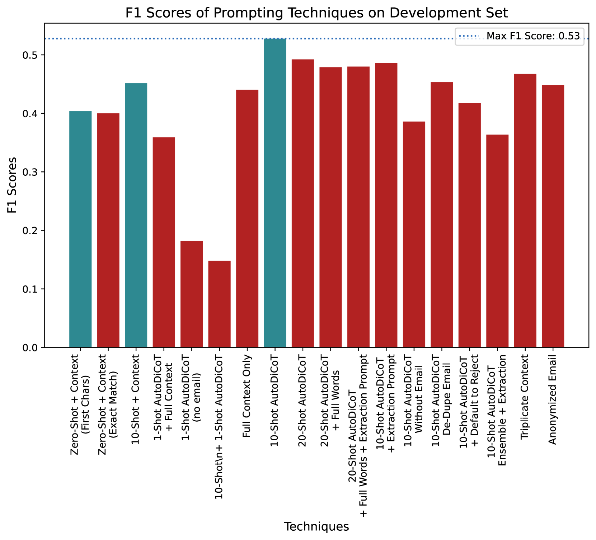

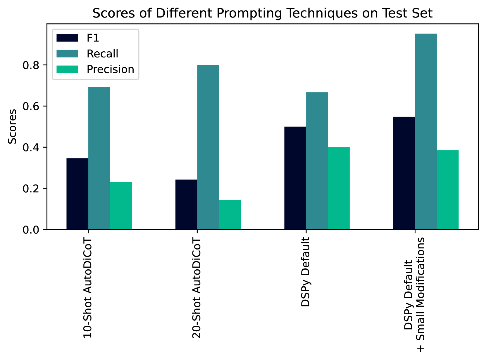

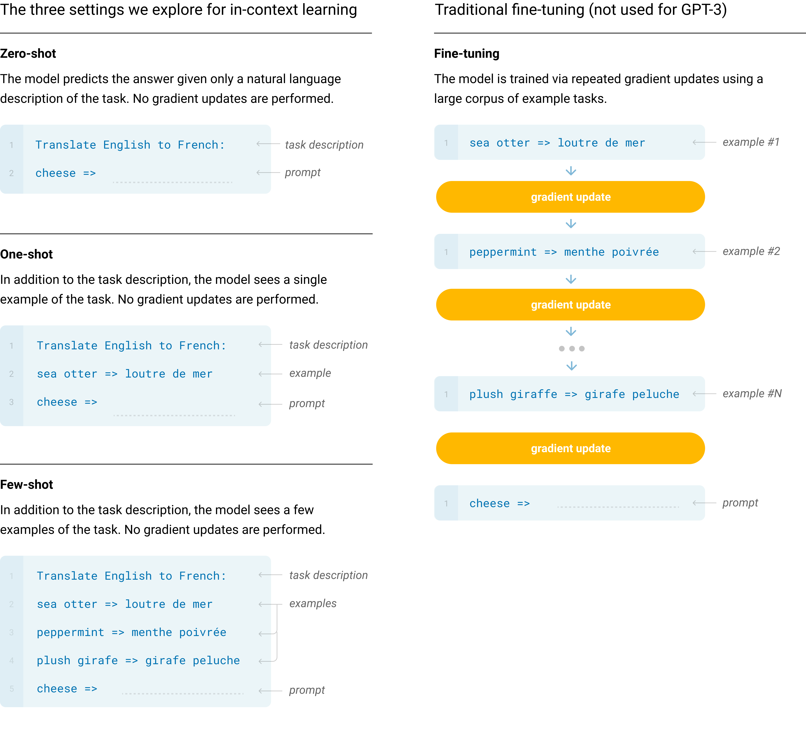

[Arxiv](https://arxiv.org/abs/2406.06608)