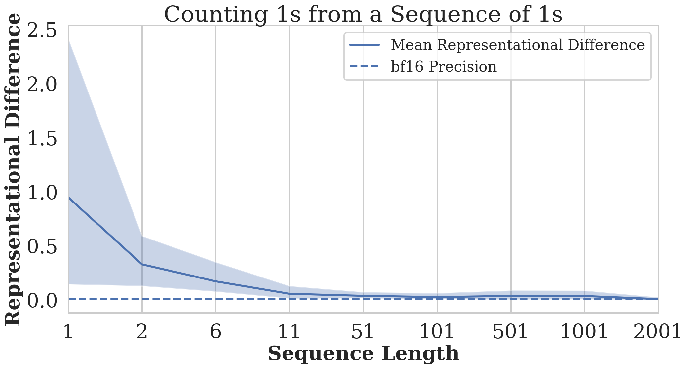

# 变压器也需“配镜”！语言任务中的信息过度压缩现象

发布时间：2024年06月06日

`LLM理论

这篇论文主要探讨了大型语言模型（LLM）中仅解码器的Transformer架构的信息传播机制，并通过理论分析和实证研究揭示了模型在特定情况下可能出现的问题，如无法区分某些输入序列和失去对特定token的敏感性。这些研究内容属于对LLM内部工作原理的理论探讨，因此应归类为LLM理论。` `机器学习`

> Transformers need glasses! Information over-squashing in language tasks

# 摘要

> 我们探讨了信息在仅解码器的Transformer架构中的传播机制，这一架构是众多前沿大型语言模型的核心。通过理论信号传播分析，我们聚焦于Transformer最后一层最后一个token的表示，该表示用于预测下一个token。研究发现，某些输入序列可能导致最后一个token的表示极度接近，这种现象在采用低精度浮点格式的现代LLMs中尤为明显。这使得模型在处理这些序列时无法做出区分，从而在计数或复制等任务中产生错误。此外，我们还发现这些模型可能对输入中的特定token失去敏感性，这与图神经网络中的过度压缩现象相似。我们通过实证研究验证了这些发现，并提出了改善这些问题的简单方法。

> We study how information propagates in decoder-only Transformers, which are the architectural backbone of most existing frontier large language models (LLMs). We rely on a theoretical signal propagation analysis -- specifically, we analyse the representations of the last token in the final layer of the Transformer, as this is the representation used for next-token prediction. Our analysis reveals a representational collapse phenomenon: we prove that certain distinct sequences of inputs to the Transformer can yield arbitrarily close representations in the final token. This effect is exacerbated by the low-precision floating-point formats frequently used in modern LLMs. As a result, the model is provably unable to respond to these sequences in different ways -- leading to errors in, e.g., tasks involving counting or copying. Further, we show that decoder-only Transformer language models can lose sensitivity to specific tokens in the input, which relates to the well-known phenomenon of over-squashing in graph neural networks. We provide empirical evidence supporting our claims on contemporary LLMs. Our theory also points to simple solutions towards ameliorating these issues.

[Arxiv](https://arxiv.org/abs/2406.04267)