# UltraMedical：打造生物医学中的全能专家

发布时间：2024年06月06日

`LLM应用

这篇论文主要关注大型语言模型（LLMs）在生物医学领域的应用，特别是通过构建高质量的数据集和使用监督微调、强化学习及直接偏好优化等技术来增强模型的性能。论文介绍了UltraMedical系列，这是一个包含生物医学领域高质量数据集的项目，并展示了如何利用这些数据集来微调专业医疗模型，以及开发奖励模型以推动生物医学LLM社区的发展。这些内容主要涉及LLM的实际应用，特别是在特定领域的优化和改进，因此属于LLM应用分类。` `生物医学`

> UltraMedical: Building Specialized Generalists in Biomedicine

# 摘要

> 大型语言模型（LLMs）在多个领域展现了卓越性能，并正向更专业化的领域迈进。GPT-4和Gemini等先进模型在生物医学领域取得显著成就，同时也引发了隐私和安全问题。构建专业通才模型的关键在于高质量数据集，这些数据集通过监督微调、强化学习及直接偏好优化等技术得到增强。然而，由于缺乏专业数据，开源社区中的偏好学习等领先技术仍受限。本文推出的UltraMedical系列，包含生物医学领域的高质量人工与合成数据集，并附有多个先进LLMs的偏好注释。我们利用这些数据集，基于Llama-3系列微调出一系列专业医疗模型，在多个医疗基准上表现出色。此外，我们还开发了擅长生物医学和通用奖励基准的强大奖励模型，进一步推动了生物医学LLM社区内的在线偏好学习。

> Large Language Models (LLMs) have demonstrated remarkable capabilities across various domains and are moving towards more specialized areas. Recent advanced proprietary models such as GPT-4 and Gemini have achieved significant advancements in biomedicine, which have also raised privacy and security challenges. The construction of specialized generalists hinges largely on high-quality datasets, enhanced by techniques like supervised fine-tuning and reinforcement learning from human or AI feedback, and direct preference optimization. However, these leading technologies (e.g., preference learning) are still significantly limited in the open source community due to the scarcity of specialized data. In this paper, we present the UltraMedical collections, which consist of high-quality manual and synthetic datasets in the biomedicine domain, featuring preference annotations across multiple advanced LLMs. By utilizing these datasets, we fine-tune a suite of specialized medical models based on Llama-3 series, demonstrating breathtaking capabilities across various medical benchmarks. Moreover, we develop powerful reward models skilled in biomedical and general reward benchmark, enhancing further online preference learning within the biomedical LLM community.

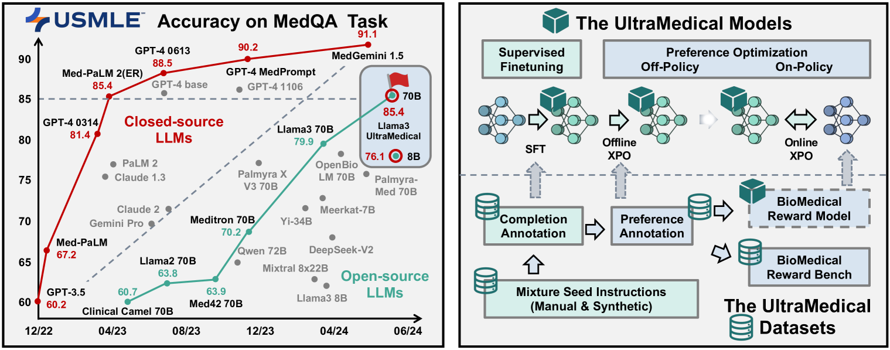

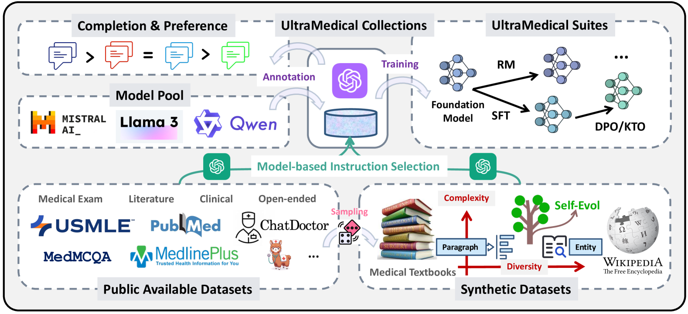

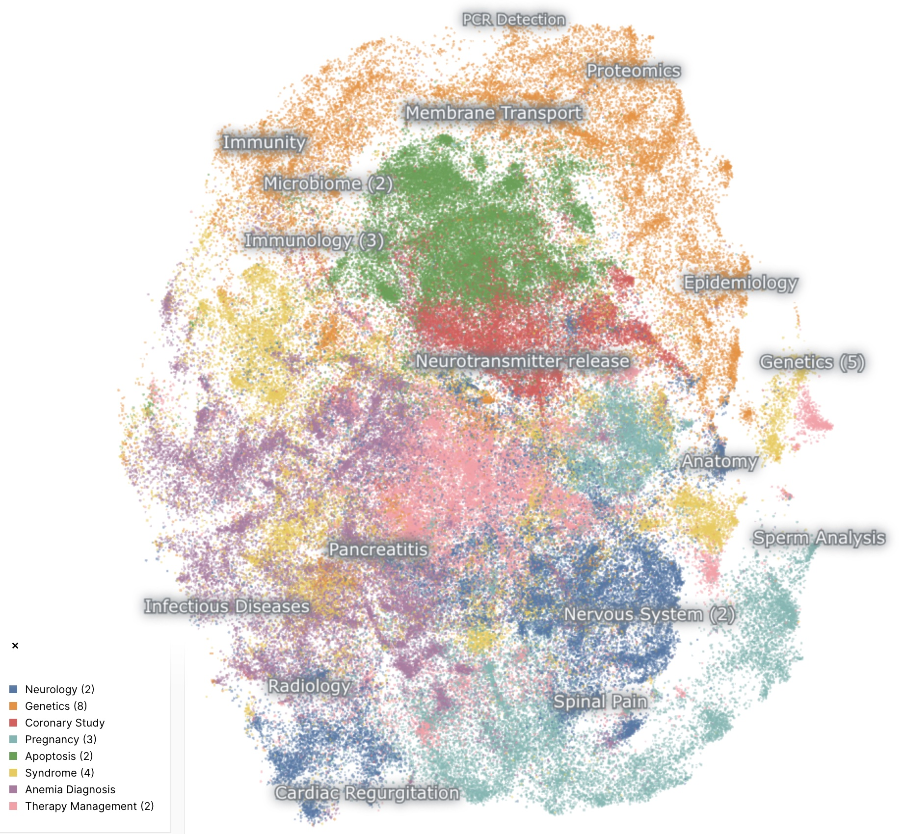

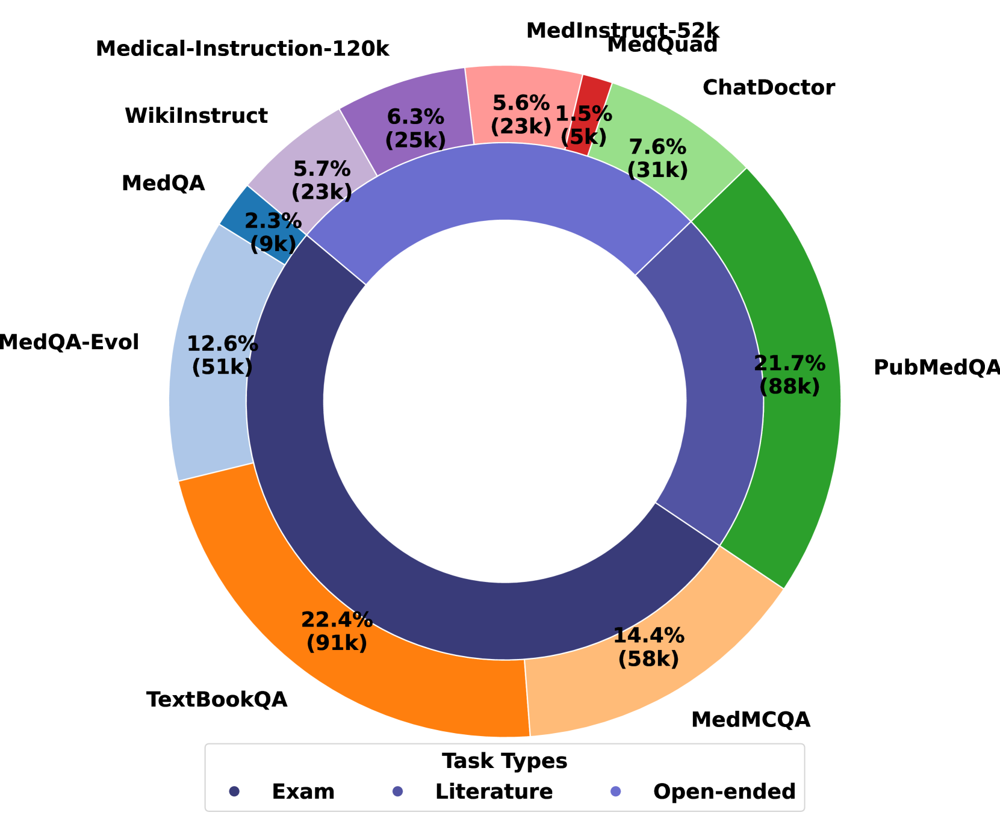

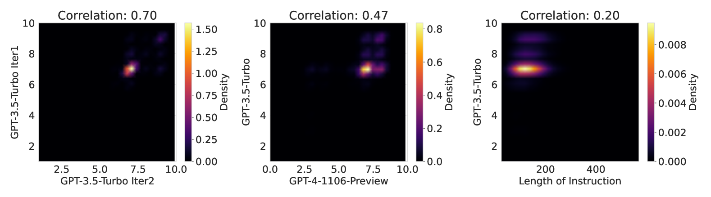

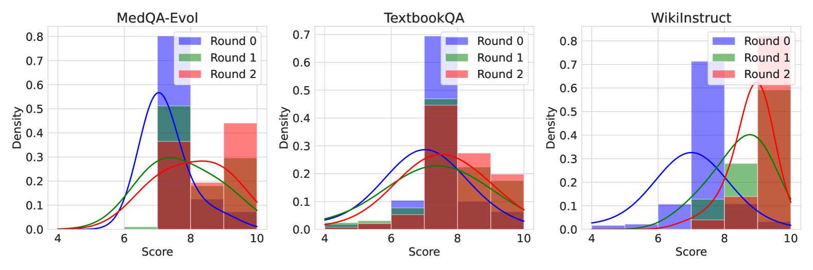

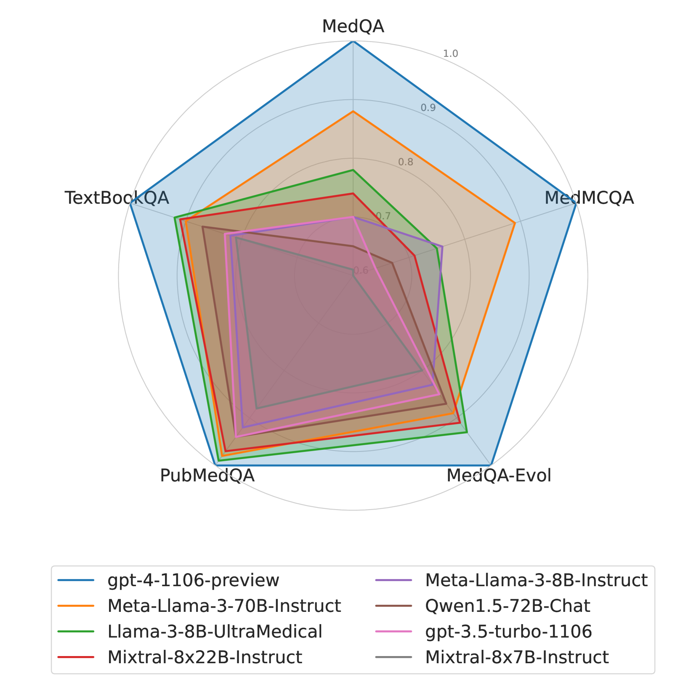

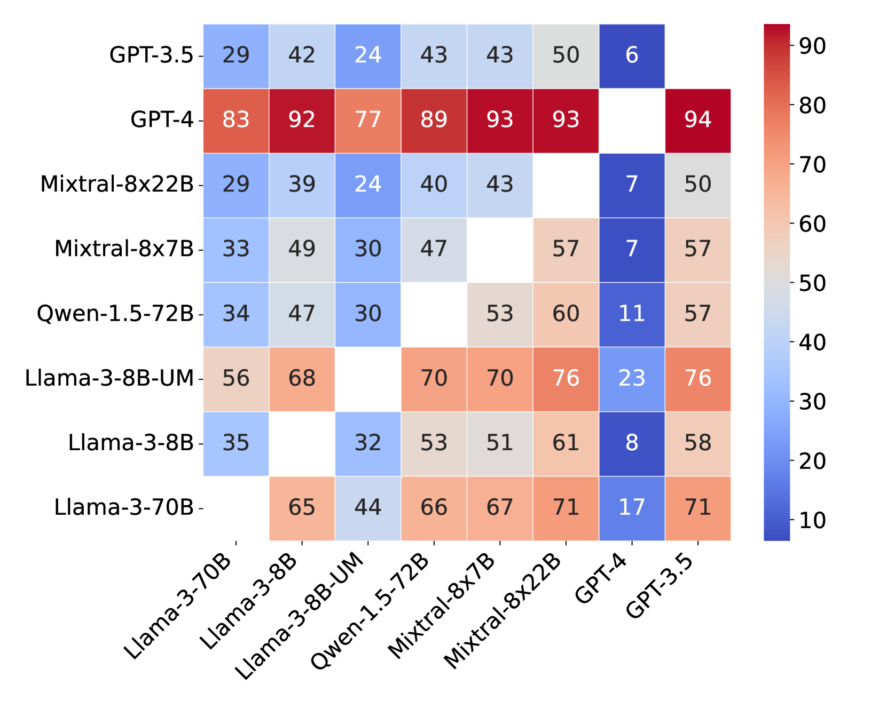

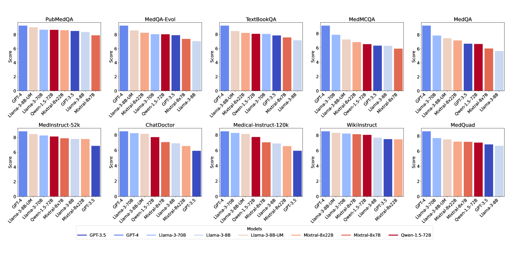

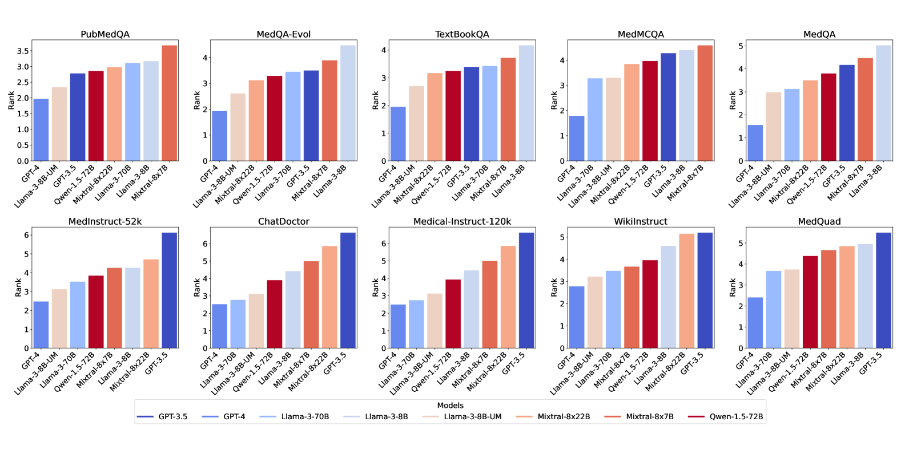

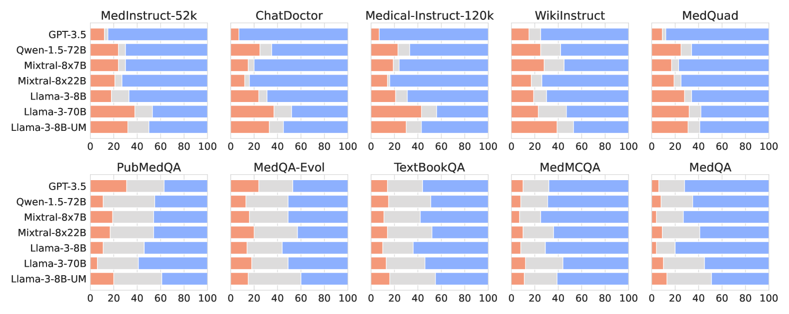

[Arxiv](https://arxiv.org/abs/2406.03949)