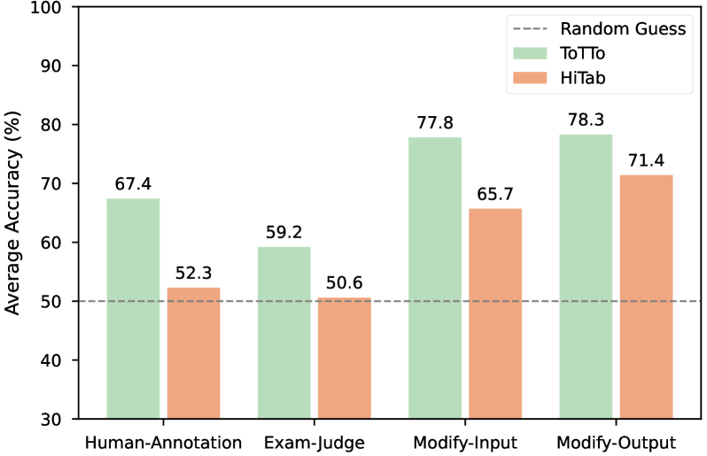

# 探究大型语言模型在表格信息检索中的局限性

发布时间：2024年06月06日

`LLM应用

这篇论文主要探讨了大型语言模型（LLMs）从表格中提取信息的能力，特别是在基于知识的问答系统中的应用。论文通过推出一个新的基准TabIS来评估这一能力，并分析了不同LLMs在此任务上的表现和局限性。这直接涉及到LLMs的实际应用，特别是在处理表格数据方面的挑战和限制，因此属于LLM应用分类。` `问答系统` `数据处理`

> Uncovering Limitations of Large Language Models in Information Seeking from Tables

# 摘要

> 表格因其信息密度高且应用广泛，成为不可或缺的信息源。大型语言模型（LLMs）从表格中提取信息（TIS）的能力至关重要，支撑着基于知识的问答系统。但目前该领域评估不足，缺乏可靠性。为此，本文推出了一个更为可靠的表格信息检索（TabIS）基准，采用单选题形式（每题两选项），避免了基于文本相似度的评估不准确性。我们构建了一套高效的选项生成机制，确保题目难度与质量。实验涵盖12种LLMs，结果显示，尽管GPT-4-turbo表现尚可，其他模型则不尽人意。深入分析发现，LLMs在理解表格结构上存在短板，且在TIS性能与抵御伪相关表格（检索增强系统中常见）的鲁棒性之间难以取舍。这些发现揭示了LLMs在表格信息检索方面的局限与挑战。我们已公开数据与代码，以期推动该领域的深入研究。

> Tables are recognized for their high information density and widespread usage, serving as essential sources of information. Seeking information from tables (TIS) is a crucial capability for Large Language Models (LLMs), serving as the foundation of knowledge-based Q&A systems. However, this field presently suffers from an absence of thorough and reliable evaluation. This paper introduces a more reliable benchmark for Table Information Seeking (TabIS). To avoid the unreliable evaluation caused by text similarity-based metrics, TabIS adopts a single-choice question format (with two options per question) instead of a text generation format. We establish an effective pipeline for generating options, ensuring their difficulty and quality. Experiments conducted on 12 LLMs reveal that while the performance of GPT-4-turbo is marginally satisfactory, both other proprietary and open-source models perform inadequately. Further analysis shows that LLMs exhibit a poor understanding of table structures, and struggle to balance between TIS performance and robustness against pseudo-relevant tables (common in retrieval-augmented systems). These findings uncover the limitations and potential challenges of LLMs in seeking information from tables. We release our data and code to facilitate further research in this field.

[Arxiv](https://arxiv.org/abs/2406.04113)