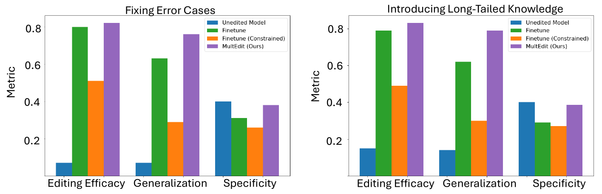

# 探究多模态大型语言模型中信息存储与传输的奥秘

发布时间：2024年06月06日

`LLM理论

理由：这篇论文主要探讨了多模态大型语言模型（MLLMs）中信息存储与传递的机制，特别是在视觉问答任务中的应用。它提出了一种新的方法来追踪因果信息，并分析了模型如何处理视觉和文本约束。这些研究内容更偏向于理论探索和模型内部机制的分析，而不是具体的应用开发或Agent的设计，因此归类为LLM理论。` `视觉问答` `多模态学习`

> Understanding Information Storage and Transfer in Multi-modal Large Language Models

# 摘要

> 理解Transformer模型中信息存储与传递的机制，对于深化我们对模型的认识至关重要。近期研究已针对大型语言模型（LLMs）揭示了信息如何在参数中存储及如何响应特定提示进行流动。然而，这些研究尚未触及多模态大型语言模型（MLLMs）。鉴于MLLMs的日益增强的能力和实际应用，我们首先探讨了MLLMs在事实性视觉问答任务中的信息处理方式。我们采用了一种基于约束的方法，将视觉问题视为需满足特定视觉或文本约束的挑战（例如，这张照片中的导演执导的哪部电影荣获金球奖？）。在此框架下，我们提出了i）一种将因果信息追踪扩展至多模态环境的方法，以及ii）VQA-Constraints，一个包含9.7K个约束标注视觉问题的测试平台。我们利用这些工具分析了开源MLLMs，LLaVa和多模态Phi-2。研究发现，与LLMs相比，MLLMs更依赖于早期层的MLP和自注意力机制进行信息存储。此外，视觉编码器输出的一小部分视觉令牌负责将图像信息传递至因果处理块。我们通过MultEdit模型编辑算法，针对这些因果块进行错误修正和长尾信息插入，验证了这些机制的有效性。

> Understanding the mechanisms of information storage and transfer in Transformer-based models is important for driving model understanding progress. Recent work has studied these mechanisms for Large Language Models (LLMs), revealing insights on how information is stored in a model's parameters and how information flows to and from these parameters in response to specific prompts. However, these studies have not yet been extended to Multi-modal Large Language Models (MLLMs). Given their expanding capabilities and real-world use, we start by studying one aspect of these models -- how MLLMs process information in a factual visual question answering task. We use a constraint-based formulation which views a visual question as having a set of visual or textual constraints that the model's generated answer must satisfy to be correct (e.g. What movie directed by the director in this photo has won a Golden Globe?). Under this setting, we contribute i) a method that extends causal information tracing from pure language to the multi-modal setting, and ii) VQA-Constraints, a test-bed of 9.7K visual questions annotated with constraints. We use these tools to study two open-source MLLMs, LLaVa and multi-modal Phi-2. Our key findings show that these MLLMs rely on MLP and self-attention blocks in much earlier layers for information storage, compared to LLMs whose mid-layer MLPs are more important. We also show that a consistent small subset of visual tokens output by the vision encoder are responsible for transferring information from the image to these causal blocks. We validate these mechanisms by introducing MultEdit, a model-editing algorithm that can correct errors and insert new long-tailed information into MLLMs by targeting these causal blocks.

[Arxiv](https://arxiv.org/abs/2406.04236)