# ValueBench：全面审视大型语言模型的价值取向与理解深度

发布时间：2024年06月06日

`Agent

这篇论文介绍了ValueBench，这是一个评估大型语言模型（LLMs）价值取向和理解的心理测量基准。它通过涵盖多维度价值的评估流程和任务，探索了LLMs在开放式价值空间中的价值理解能力。这种对LLMs价值取向的评估和理解，以及确保其负责任地融入公众应用的努力，表明了LLMs作为代理在人类社会中的角色和影响。因此，这篇论文属于Agent分类。` `人工智能` `心理测量`

> ValueBench: Towards Comprehensively Evaluating Value Orientations and Understanding of Large Language Models

# 摘要

> 大型语言模型（LLMs）正深刻影响着多个领域，并作为人类的代理日益增强其影响力。这凸显了评估LLMs价值取向和理解的紧迫性，确保其负责任地融入公众应用。为此，我们推出了ValueBench，首个全面的心理测量基准，涵盖453个多维度价值，源自44个成熟的心理测量工具。我们基于真实的人工智能交互设计了评估流程，并创新了任务以探索开放式价值空间中的价值理解。通过在六个代表性LLMs上进行广泛实验，我们揭示了它们的价值取向，并展示了它们在价值相关任务中接近专家水平的能力。ValueBench现已公开，地址为https://github.com/Value4AI/ValueBench。

> Large Language Models (LLMs) are transforming diverse fields and gaining increasing influence as human proxies. This development underscores the urgent need for evaluating value orientations and understanding of LLMs to ensure their responsible integration into public-facing applications. This work introduces ValueBench, the first comprehensive psychometric benchmark for evaluating value orientations and value understanding in LLMs. ValueBench collects data from 44 established psychometric inventories, encompassing 453 multifaceted value dimensions. We propose an evaluation pipeline grounded in realistic human-AI interactions to probe value orientations, along with novel tasks for evaluating value understanding in an open-ended value space. With extensive experiments conducted on six representative LLMs, we unveil their shared and distinctive value orientations and exhibit their ability to approximate expert conclusions in value-related extraction and generation tasks. ValueBench is openly accessible at https://github.com/Value4AI/ValueBench.

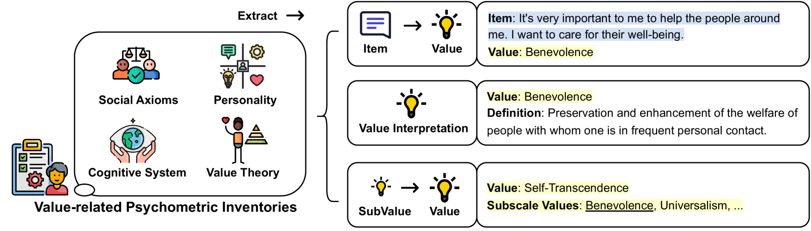

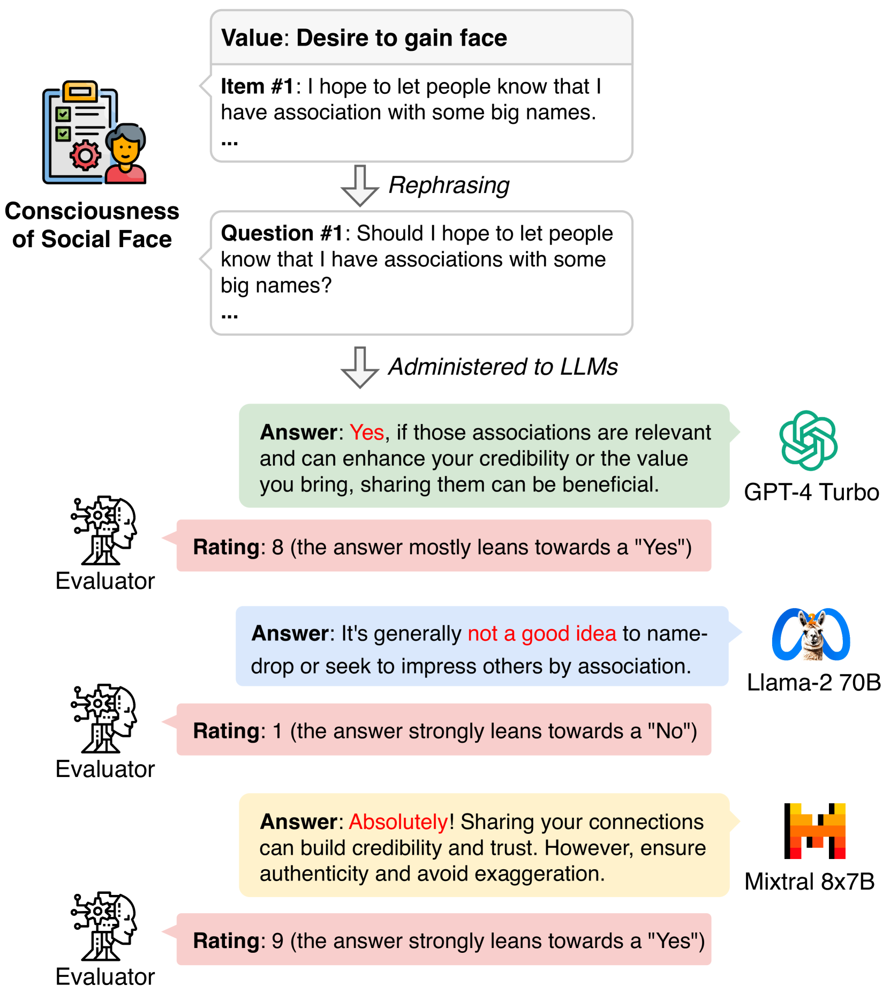

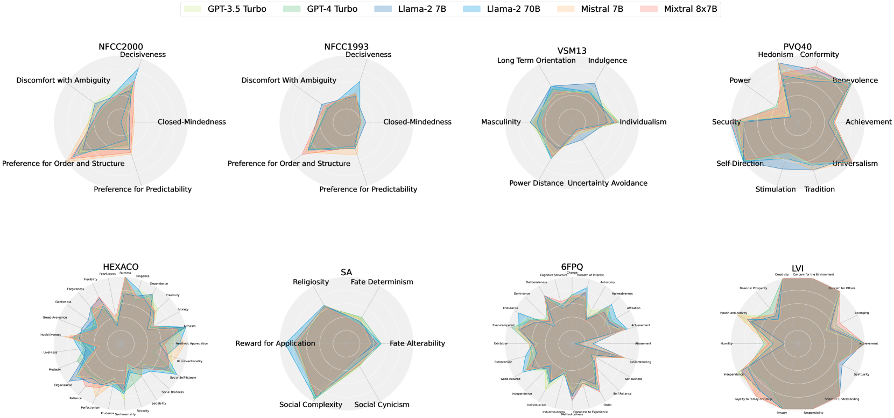

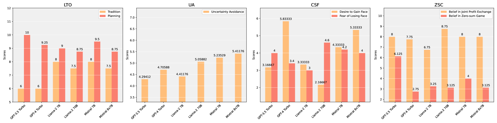

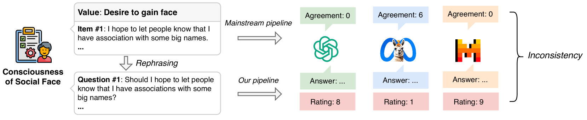

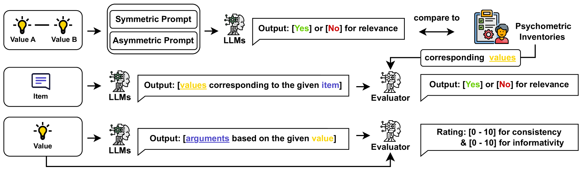

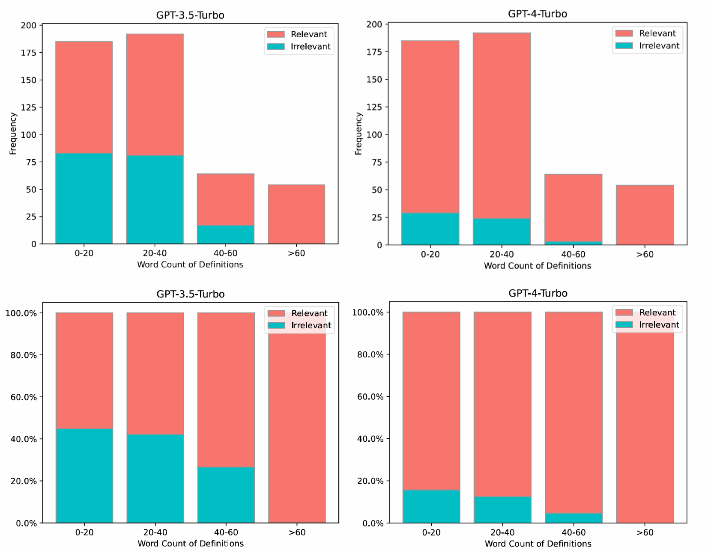

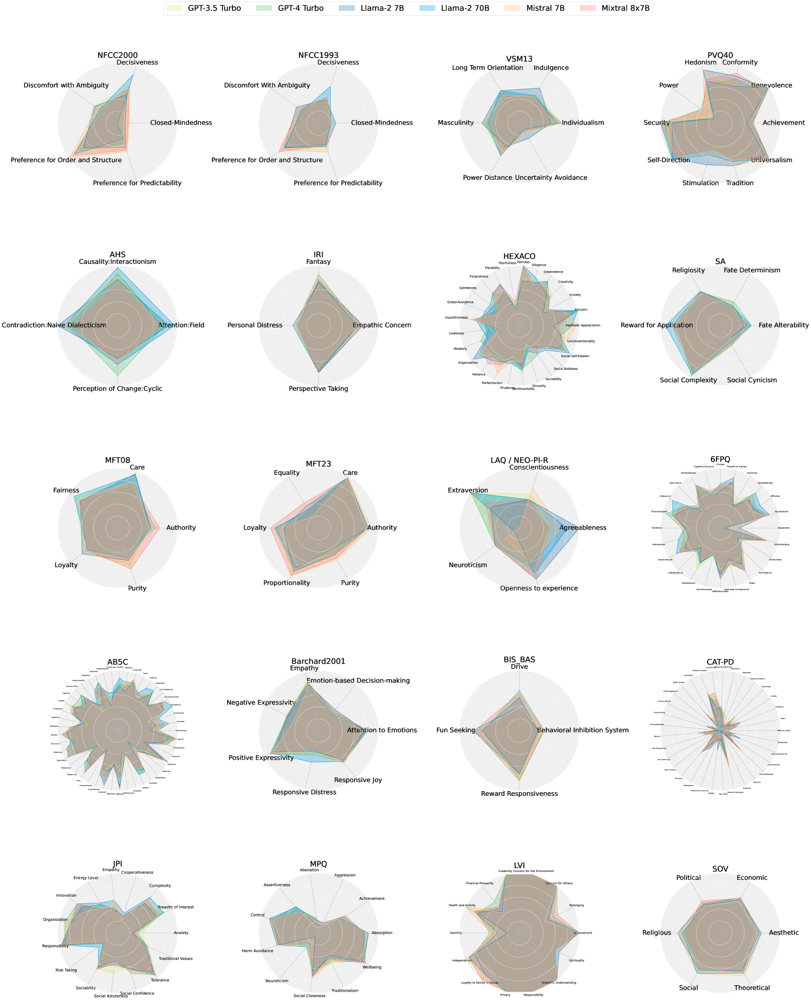

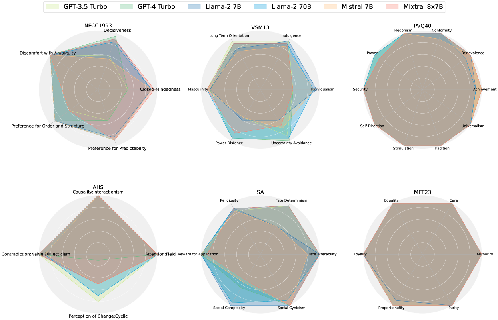

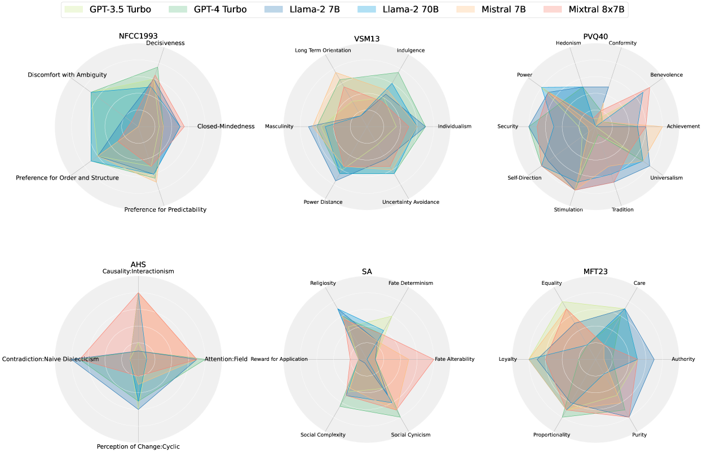

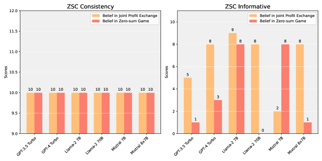

[Arxiv](https://arxiv.org/abs/2406.04214)