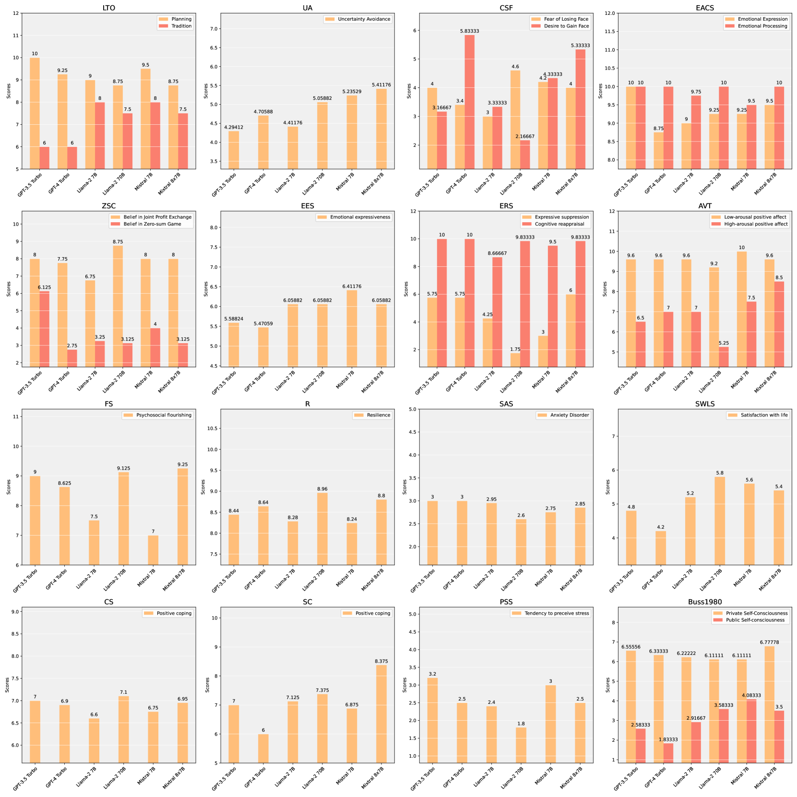

# ValueBench：全面审视大型语言模型的价值取向与理解深度

发布时间：2024年06月06日

`Agent

这篇论文主要关注的是大型语言模型（LLMs）作为人类代理的角色，并评估它们的价值取向和理解。通过开发ValueBench这一心理测量基准，研究者们旨在确保LLMs在公众应用中的负责任整合。这与Agent分类相关，因为Agent通常指的是能够自主行动并代表用户执行任务的实体，而LLMs在这里被视为具有一定自主性和价值判断能力的代理。此外，论文中提到的评估流程和实验结果展示了LLMs在价值相关任务中的表现，这与Agent的行为评估和性能优化紧密相关。` `人工智能伦理` `心理测量`

> ValueBench: Towards Comprehensively Evaluating Value Orientations and Understanding of Large Language Models

# 摘要

> 大型语言模型（LLMs）正日益成为多个领域的变革力量，其作为人类代理的角色愈发显著。鉴于此，评估这些模型的价值取向和理解变得至关重要，以确保它们在公众应用中的负责任整合。为此，我们推出了ValueBench，首个全面的心理测量基准，专门用于评估LLMs的价值取向和理解。该基准整合了44个成熟的心理测量工具，覆盖453个多维价值维度。我们设计了一套基于真实人类-AI交互的评估流程，用以探索价值取向，并创新性地设计了任务来评估开放式价值空间中的价值理解。通过在六个代表性LLMs上进行广泛实验，我们揭示了它们的价值取向特征，并展示了它们在价值相关任务中接近专家水平的能力。ValueBench现已公开，网址为https://github.com/Value4AI/ValueBench。

> Large Language Models (LLMs) are transforming diverse fields and gaining increasing influence as human proxies. This development underscores the urgent need for evaluating value orientations and understanding of LLMs to ensure their responsible integration into public-facing applications. This work introduces ValueBench, the first comprehensive psychometric benchmark for evaluating value orientations and value understanding in LLMs. ValueBench collects data from 44 established psychometric inventories, encompassing 453 multifaceted value dimensions. We propose an evaluation pipeline grounded in realistic human-AI interactions to probe value orientations, along with novel tasks for evaluating value understanding in an open-ended value space. With extensive experiments conducted on six representative LLMs, we unveil their shared and distinctive value orientations and exhibit their ability to approximate expert conclusions in value-related extraction and generation tasks. ValueBench is openly accessible at https://github.com/Value4AI/ValueBench.

[Arxiv](https://arxiv.org/abs/2406.04214)