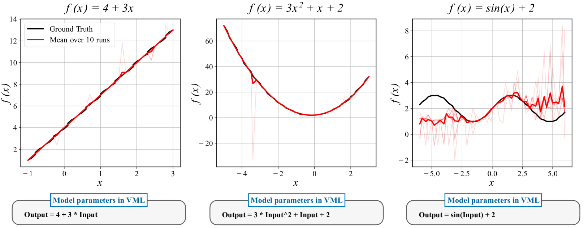

# 语言模型视角下的机器学习再探：口头化机器学习

发布时间：2024年06月06日

`LLM理论

理由：这篇论文提出了一个名为口头化机器学习（VML）的新框架，该框架通过将参数空间限定在自然语言范围内，重新定义了机器学习中的经典问题如回归和分类。这种方法利用了大型语言模型（LLMs）的特性，将文本提示视为函数，并探讨了如何通过LLM参数化的学习与优化机制来解决这些问题。论文强调了VML在增强机器学习解释性和透明度方面的潜力，并通过实证研究验证了其效力。因此，这篇论文更偏向于理论探讨和方法论创新，属于LLM理论分类。` `机器学习`

> Verbalized Machine Learning: Revisiting Machine Learning with Language Models

# 摘要

> 受到大型语言模型（LLMs）显著进展的启发，我们提出了口头化机器学习（VML）框架。与传统模型在连续参数空间上优化不同，VML将参数空间限定在人类可理解的自然语言范围内。这一创新视角使得带有文本提示的LLM可被视为由文本提示定义的函数。基于此，我们重新审视了回归和分类等经典问题，并发现它们能通过LLM参数化的学习与优化机制得到解决。VML的显著优势有三：一是先验知识与假设类能以自然语言形式轻松编码并输入学习者；二是优化器能根据数据及口头先验知识自动选择并更新模型类；三是优化过程的每一步更新都有解释，增强了透明度。我们通过多项实证研究验证了VML的效力，并期待它成为提升机器学习解释性与信任度的关键一步。

> Motivated by the large progress made by large language models (LLMs), we introduce the framework of verbalized machine learning (VML). In contrast to conventional machine learning models that are typically optimized over a continuous parameter space, VML constrains the parameter space to be human-interpretable natural language. Such a constraint leads to a new perspective of function approximation, where an LLM with a text prompt can be viewed as a function parameterized by the text prompt. Guided by this perspective, we revisit classical machine learning problems, such as regression and classification, and find that these problems can be solved by an LLM-parameterized learner and optimizer. The major advantages of VML include (1) easy encoding of inductive bias: prior knowledge about the problem and hypothesis class can be encoded in natural language and fed into the LLM-parameterized learner; (2) automatic model class selection: the optimizer can automatically select a concrete model class based on data and verbalized prior knowledge, and it can update the model class during training; and (3) interpretable learner updates: the LLM-parameterized optimizer can provide explanations for why each learner update is performed. We conduct several studies to empirically evaluate the effectiveness of VML, and hope that VML can serve as a stepping stone to stronger interpretability and trustworthiness in ML.

[Arxiv](https://arxiv.org/abs/2406.04344)