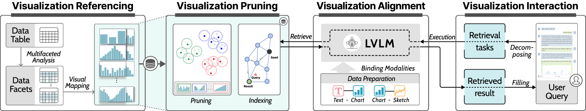
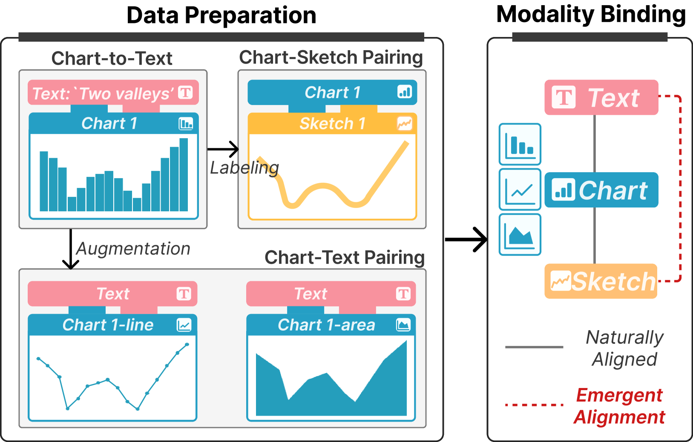
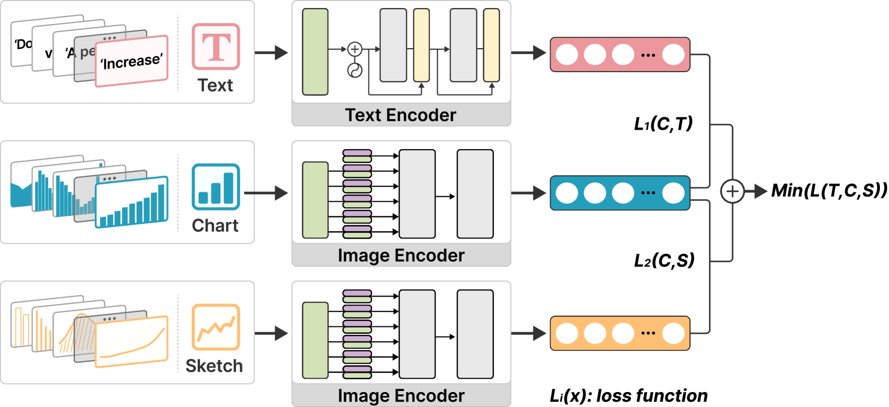
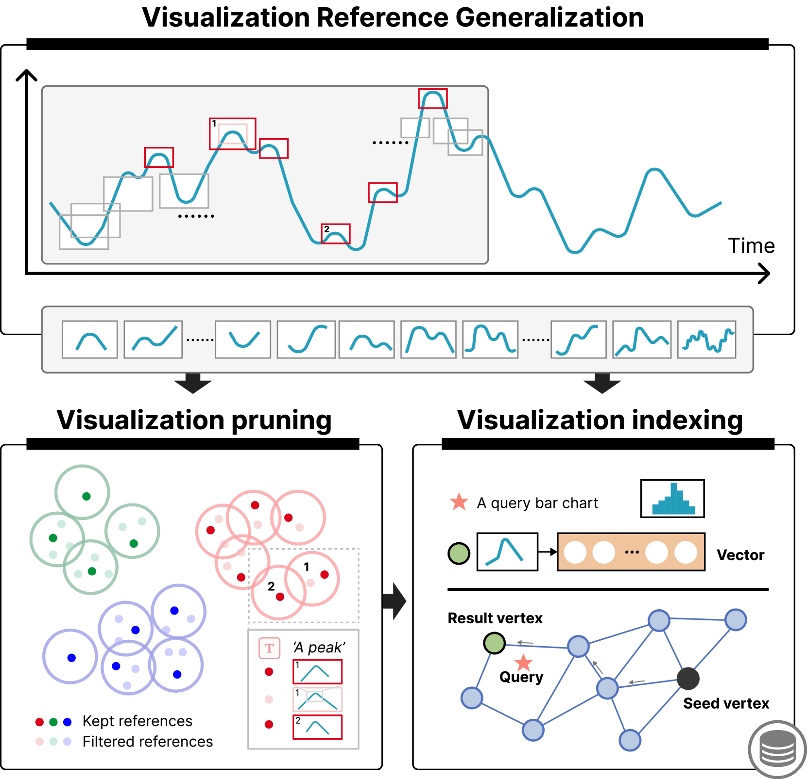
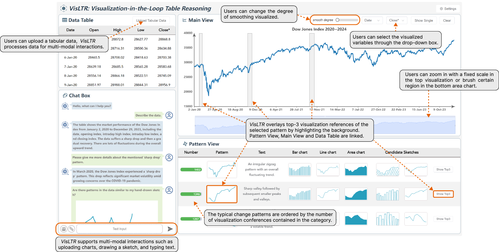
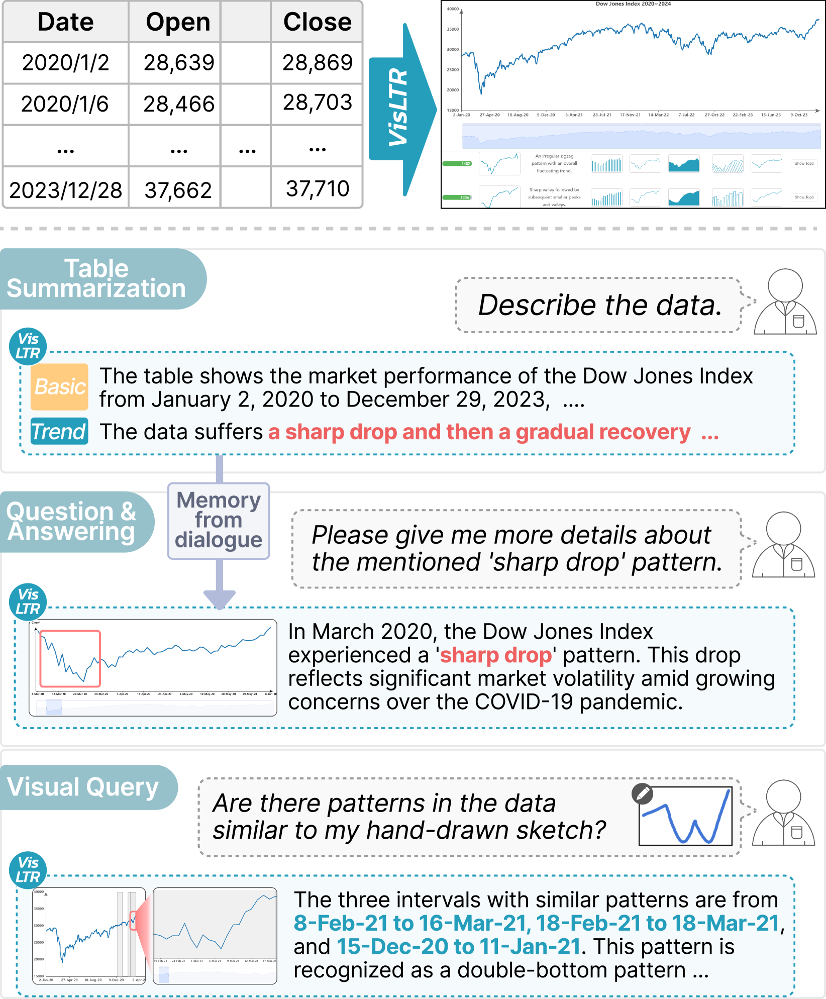
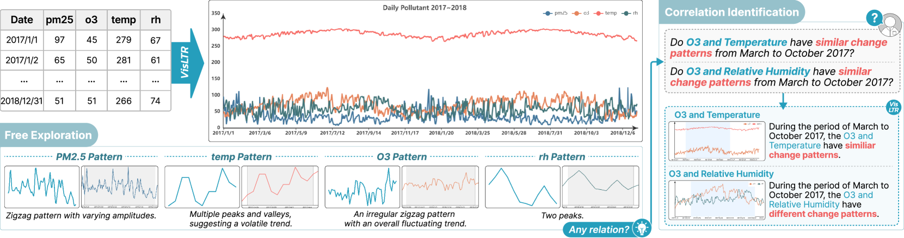

# VisLTR：可视化驱动的表格推理循环

发布时间：2024年06月06日

`Agent

理由：VisLTR框架虽然涉及大型视觉-语言模型的使用，但其核心在于通过可视化手段进行表格推理，并提供交互式界面以优化用户体验。这表明该框架更像是一个智能代理（Agent），它通过整合多种技术和模块来处理和分析数据，并以用户友好的方式呈现结果。因此，将其归类为Agent更为合适。` `数据分析` `可视化`

> VisLTR: Visualization-in-the-Loop Table Reasoning

# 摘要

> VisLTR是一个结合可视化的表格推理框架，它通过可视化手段简化数据呈现，捕捉数据模式，并支持跨模态分析。该框架包含四个关键模块：1）跨模态可视化对齐，使用大型视觉-语言模型确保图表、文本和草图间的视觉一致性；2）多角度可视化引用，将表格数据分解为全面可视化参考；3）可视化优化，通过数据和检索修剪提升信息质量和检索效率；4）交互式可视化界面，支持多模态交互，优化用户体验。实验证明，该框架在跨模态可视化配对中表现出色，并成功应用于表格摘要和模式检测等任务。

> Table reasoning transforms user requirements into corresponding answers according to the provided table, which is often integrated with natural language interfaces for lay users to explore tabular data effortlessly. Recent research exploits large language models to facilitate table reasoning, by transforming vague user requirements into structured query languages (SQLs). However, these SQL-based approaches often overlook changes in data patterns, suffer from LLM drift, and limit exploration to only text queries. To this end, VisLTR is designed as a visualization-in-the-loop table reasoning framework that leverages visualizations as a proxy to provide concise data representations, capture interesting data patterns, and support cross-modal analysis. We describe VisLTR as a process consisting of four major modules: 1) visualization alignment that utilizes large vision-language models to align visualizations across various modalities, including chart, text, and sketch; 2) visualization referencing that decomposes a table into multifaceted visualization references that comprehensively represent the table; 3) visualization pruning that incorporates data and retrieval pruning to excise visualization references with poor information and enhance retrieval efficiency; and 4) visualization interaction that offers an interactive visual interface with multi-modal interactions for user-friendly table reasoning. Quantitative evaluation demonstrates the effectiveness of the alignment model in cross-modal visualization pairings. We further demonstrate applications of the framework on various table reasoning tasks such as table summarization and pattern detection.

[Arxiv](https://arxiv.org/abs/2406.03753)