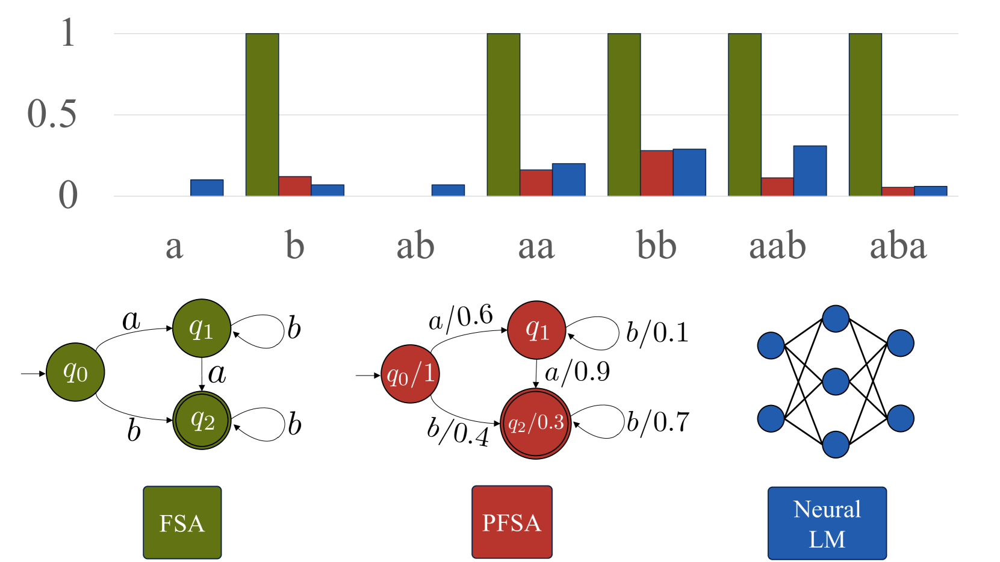
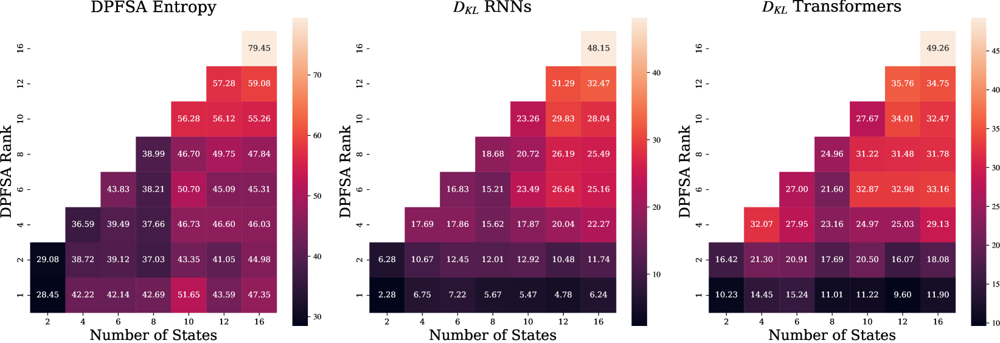
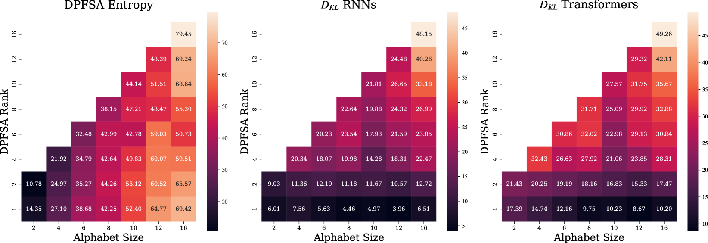
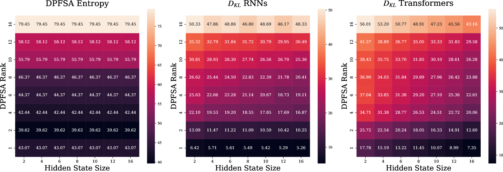
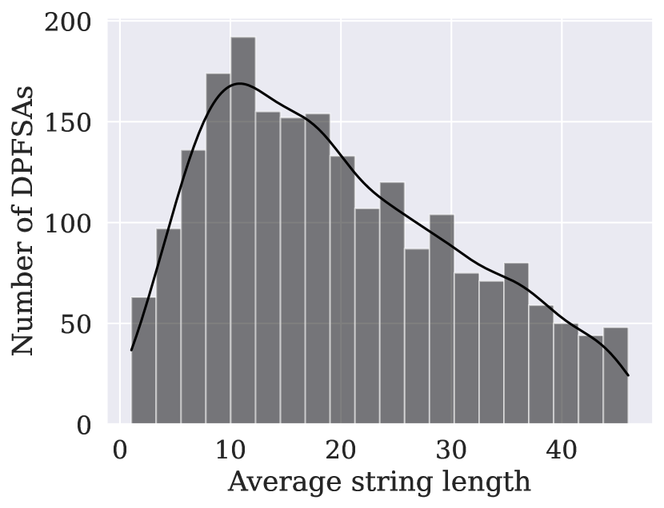
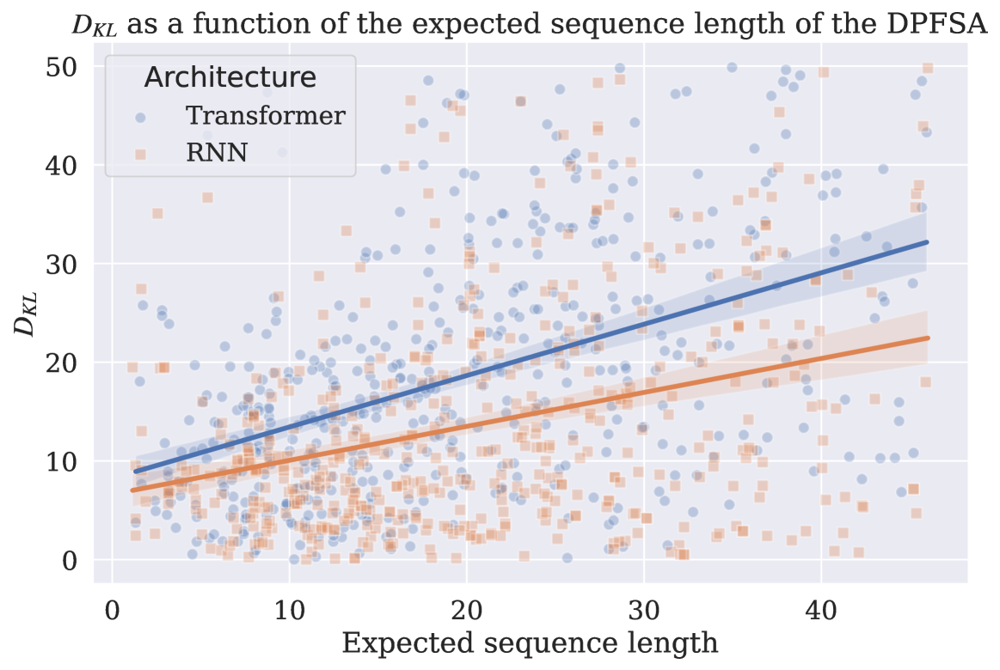

# 哪些语言适合语言建模？从概率正则语言学习的视角探讨

发布时间：2024年06月06日

`LLM理论

这篇论文主要探讨了大型语言模型（LLM）的学习能力和性能，特别是神经语言模型（如RNN和Transformer）在概率语言学习上的表现。研究关注的是这些模型对正则语言模型的学习能力，并通过实验分析了多种复杂度参数和隐藏状态大小对学习能力的影响。这属于对LLM的理论研究，探讨了模型的学习极限和实际可学习性，因此应归类为LLM理论。` `机器学习`

> What Languages are Easy to Language-Model? A Perspective from Learning Probabilistic Regular Languages

# 摘要

> 大型语言模型能学到什么？语言模型本质上是对字符串的概率分布。我们探讨的不仅是理论上的极限，更是实际中的可学习性。与以往研究不同，我们关注的是神经LM在概率语言学习上的表现，而非仅作为形式语言的分类器。我们特别研究了RNN和Transformer模型对正则语言模型的学习能力，并通过多种复杂度参数和隐藏状态大小来实证分析。结果显示，RLM的秩（即条件分布logits张成的线性空间大小）和采样字符串的期望长度，对RNN和Transformer的学习能力有显著影响。此外，其他几个因素也显示出显著性，但RNN和Transformer的表现模式有所不同。

> What can large language models learn? By definition, language models (LM) are distributions over strings. Therefore, an intuitive way of addressing the above question is to formalize it as a matter of learnability of classes of distributions over strings. While prior work in this direction focused on assessing the theoretical limits, in contrast, we seek to understand the empirical learnability. Unlike prior empirical work, we evaluate neural LMs on their home turf-learning probabilistic languages-rather than as classifiers of formal languages. In particular, we investigate the learnability of regular LMs (RLMs) by RNN and Transformer LMs. We empirically test the learnability of RLMs as a function of various complexity parameters of the RLM and the hidden state size of the neural LM. We find that the RLM rank, which corresponds to the size of linear space spanned by the logits of its conditional distributions, and the expected length of sampled strings are strong and significant predictors of learnability for both RNNs and Transformers. Several other predictors also reach significance, but with differing patterns between RNNs and Transformers.

[Arxiv](https://arxiv.org/abs/2406.04289)