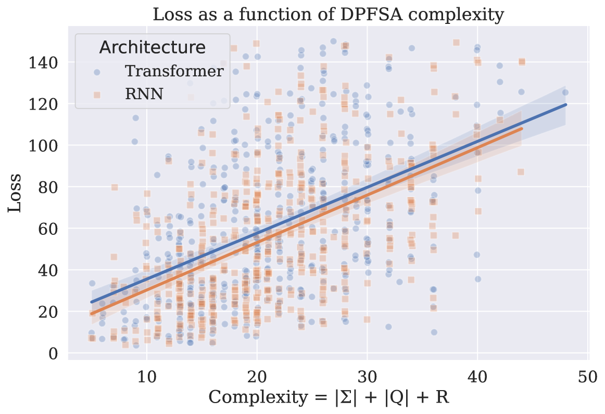

# 哪些语言适合语言建模？从概率正则语言学习的视角探讨

发布时间：2024年06月06日

`LLM理论

这篇论文探讨了大型语言模型（LLM）的学习能力，特别是神经语言模型在概率语言学习方面的能力。它关注的是实际可学习性，而不是理论极限，通过评估RNN和Transformer模型对正则语言模型（RLMs）的学习能力。研究通过实证分析RLM的复杂度参数和神经模型的隐藏状态大小，探讨了影响模型可学习性的因素。这属于对LLM理论层面的研究，因为它深入分析了模型的内部机制和学习能力，而不是直接应用于特定的Agent或RAG系统，也不是讨论LLM的具体应用。因此，将其归类为LLM理论。` `机器学习`

> What Languages are Easy to Language-Model? A Perspective from Learning Probabilistic Regular Languages

# 摘要

> 大型语言模型能学到什么？语言模型本质上是对字符串的概率分布。我们探讨了这一问题，将其视为字符串分布类别的可学习性问题。与以往侧重理论极限的研究不同，我们关注的是实际可学习性。我们评估了神经语言模型在概率语言学习方面的能力，而非作为形式语言的分类器。特别地，我们研究了RNN和Transformer模型对正则语言模型（RLMs）的学习能力。通过实证分析RLM的复杂度参数和神经模型的隐藏状态大小，我们发现RLM的秩（即条件分布logits所形成的线性空间大小）和采样字符串的期望长度对RNN和Transformer的可学习性有显著影响。此外，其他几个因素也显示出显著性，但RNN和Transformer之间存在不同的影响模式。

> What can large language models learn? By definition, language models (LM) are distributions over strings. Therefore, an intuitive way of addressing the above question is to formalize it as a matter of learnability of classes of distributions over strings. While prior work in this direction focused on assessing the theoretical limits, in contrast, we seek to understand the empirical learnability. Unlike prior empirical work, we evaluate neural LMs on their home turf-learning probabilistic languages-rather than as classifiers of formal languages. In particular, we investigate the learnability of regular LMs (RLMs) by RNN and Transformer LMs. We empirically test the learnability of RLMs as a function of various complexity parameters of the RLM and the hidden state size of the neural LM. We find that the RLM rank, which corresponds to the size of linear space spanned by the logits of its conditional distributions, and the expected length of sampled strings are strong and significant predictors of learnability for both RNNs and Transformers. Several other predictors also reach significance, but with differing patterns between RNNs and Transformers.

[Arxiv](https://arxiv.org/abs/2406.04289)