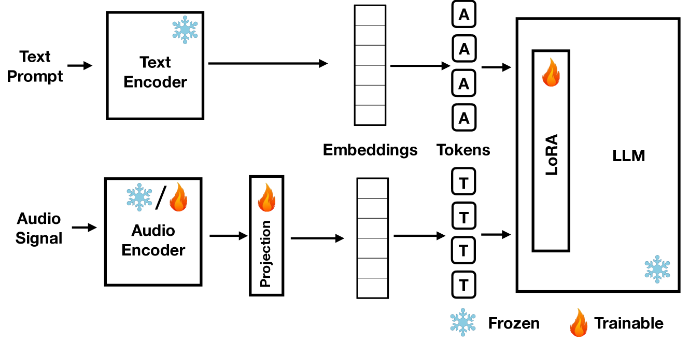

# 多模态大型语言模型（MLLMs）如何通过文本与声音进行推理？

发布时间：2024年06月06日

`LLM应用

这篇论文探讨了多模态大型语言模型（MLLMs）在处理声音和图像时的表现，特别是在其LLM部分冻结的情况下，如何通过音频或视觉编码器来增强基于文本的推理。论文指出了在生成描述时，音频MLLM未能充分利用其LLM的文本推理能力的问题，这可能是由于MLLMs独立处理听觉和文本信息，导致推理路径中断。这一研究关注的是LLM在多模态环境下的应用问题，因此属于LLM应用分类。` `多模态学习` `人工智能`

> What do MLLMs hear? Examining reasoning with text and sound components in Multimodal Large Language Models

# 摘要

> 大型语言模型（LLMs）在连接思想和遵循逻辑规则解决问题方面表现出色。多模态LLMs（MLLMs），能够处理声音和图像，已能描述这些感官数据。以往研究显示，当MLLMs中的LLM部分冻结时，音频或视觉编码器能帮助为输入的声音或图像添加描述，以支持基于文本的推理。本文通过实验揭示，音频MLLM在生成描述时，未能充分运用其LLM的文本推理能力，这可能源于MLLMs独立处理听觉和文本信息，导致推理路径中断。

> Large Language Models (LLMs) have demonstrated remarkable reasoning capabilities, notably in connecting ideas and adhering to logical rules to solve problems. These models have evolved to accommodate various data modalities, including sound and images, known as multimodal LLMs (MLLMs), which are capable of describing images or sound recordings. Previous work has demonstrated that when the LLM component in MLLMs is frozen, the audio or visual encoder serves to caption the sound or image input facilitating text-based reasoning with the LLM component. We are interested in using the LLM's reasoning capabilities in order to facilitate classification. In this paper, we demonstrate through a captioning/classification experiment that an audio MLLM cannot fully leverage its LLM's text-based reasoning when generating audio captions. We also consider how this may be due to MLLMs separately representing auditory and textual information such that it severs the reasoning pathway from the LLM to the audio encoder.

[Arxiv](https://arxiv.org/abs/2406.04615)