# 3D-GRAND：致力于提升3D大型语言模型的基础性并减少幻觉现象

发布时间：2024年06月07日

`Agent

这篇论文主要探讨了将大型语言模型（LLMs）应用于3D环境中的具身代理和机器人，通过创建一个大规模的数据集（3D-GRAND）来提升这些模型在3D场景中的理解和交互能力。这与Agent分类相关，因为论文关注的是开发能够理解并与物理世界互动的具身代理，这是Agent研究的核心内容。同时，论文通过创建数据集和基准来推动3D-LLMs的发展，这进一步强调了其在具身AI领域的应用和研究。` `具身AI` `机器人技术`

> 3D-GRAND: Towards Better Grounding and Less Hallucination for 3D-LLMs

# 摘要

> 语言与3D感知的融合是开发能理解并与物理世界互动的具身代理和机器人的关键。虽然大型语言模型（LLMs）在语言处理上表现出色，但它们在3D环境中的应用（3D-LLMs）尚在起步阶段。关键障碍在于缺乏能够紧密连接语言与3D场景的大规模数据集。本文中，我们推出了3D-GRAND，一个包含40,087个家庭场景及620万条紧密对应的场景-语言指令的前沿数据集。实验表明，3D-GRAND的指令调整大幅提升了3D-LLMs的场景对应能力，并减少了幻觉现象。我们还创建了3D-POPE基准，用于公正评估3D-LLMs的幻觉，促进未来模型的公平比较。实验揭示了数据集规模与3D-LLM性能之间的正比关系，凸显了大规模3D-文本数据集在具身AI研究中的重要性。我们的成果还预示了从模拟到真实世界转移的有效性，表明在合成数据上训练的模型能很好地适应真实3D扫描。通过3D-GRAND和3D-POPE，我们致力于为具身AI领域提供关键资源和洞察，推动更可靠、更精准的3D-LLMs的发展。项目详情请访问：https://3d-grand.github.io。

> The integration of language and 3D perception is crucial for developing embodied agents and robots that comprehend and interact with the physical world. While large language models (LLMs) have demonstrated impressive language understanding and generation capabilities, their adaptation to 3D environments (3D-LLMs) remains in its early stages. A primary challenge is the absence of large-scale datasets that provide dense grounding between language and 3D scenes. In this paper, we introduce 3D-GRAND, a pioneering large-scale dataset comprising 40,087 household scenes paired with 6.2 million densely-grounded scene-language instructions. Our results show that instruction tuning with 3D-GRAND significantly enhances grounding capabilities and reduces hallucinations in 3D-LLMs. As part of our contributions, we propose a comprehensive benchmark 3D-POPE to systematically evaluate hallucination in 3D-LLMs, enabling fair comparisons among future models. Our experiments highlight a scaling effect between dataset size and 3D-LLM performance, emphasizing the critical role of large-scale 3D-text datasets in advancing embodied AI research. Notably, our results demonstrate early signals for effective sim-to-real transfer, indicating that models trained on large synthetic data can perform well on real-world 3D scans. Through 3D-GRAND and 3D-POPE, we aim to equip the embodied AI community with essential resources and insights, setting the stage for more reliable and better-grounded 3D-LLMs. Project website: https://3d-grand.github.io

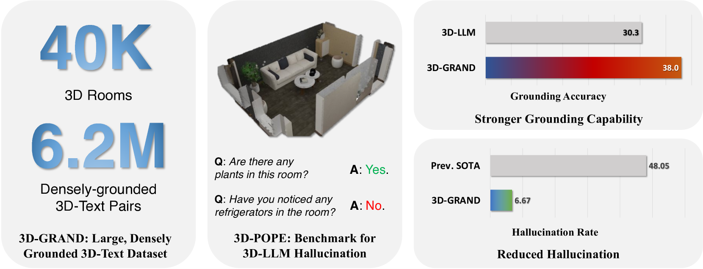

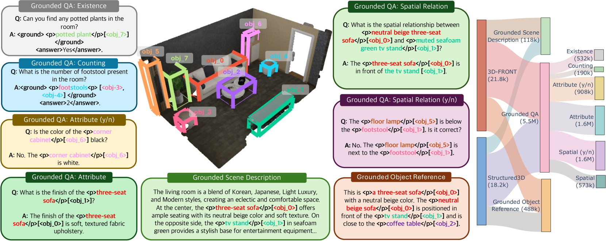

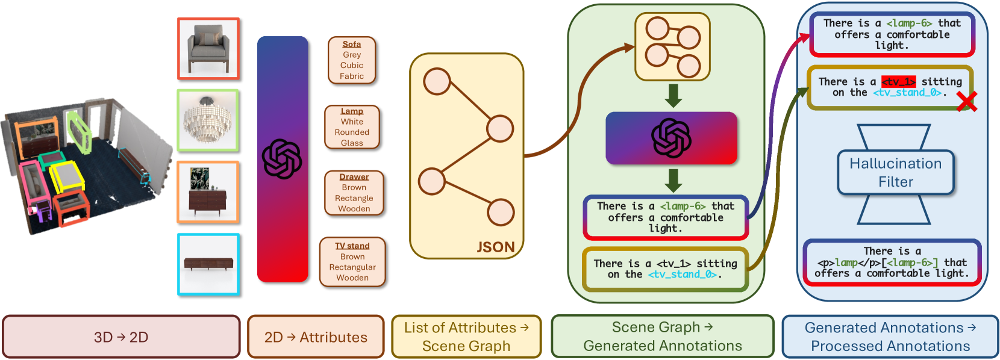

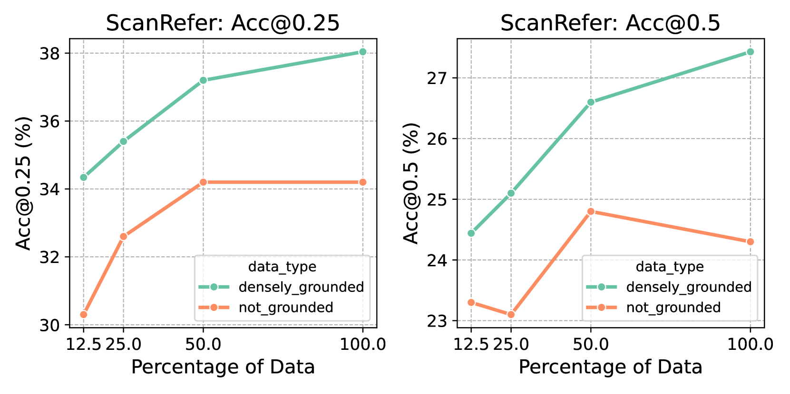

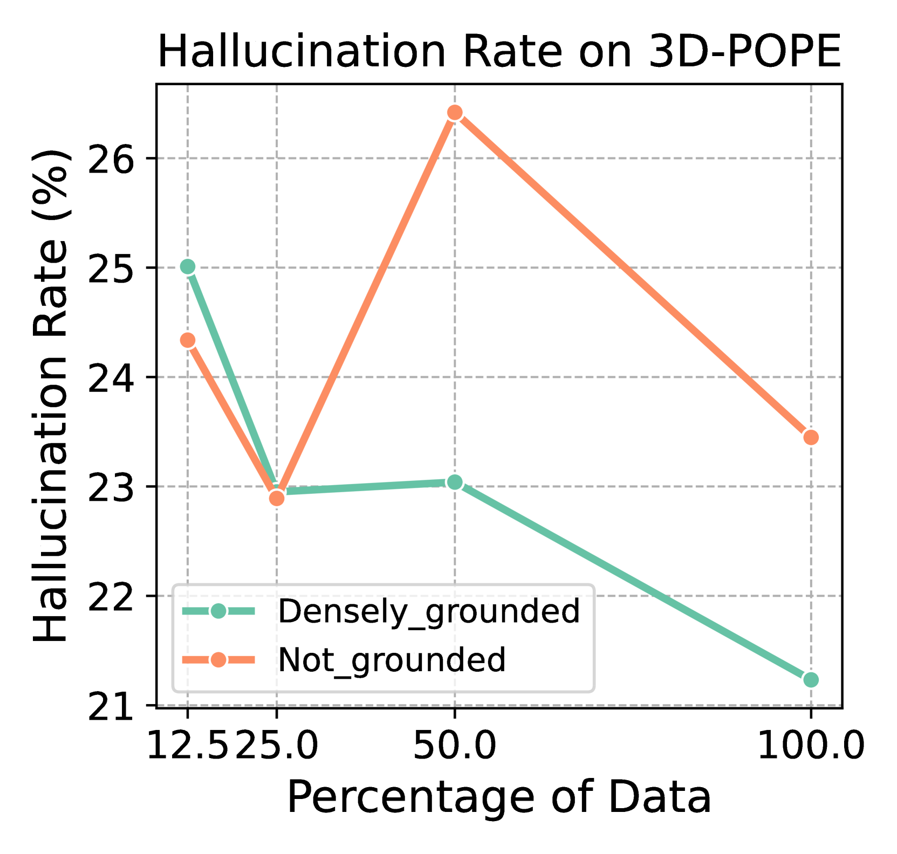

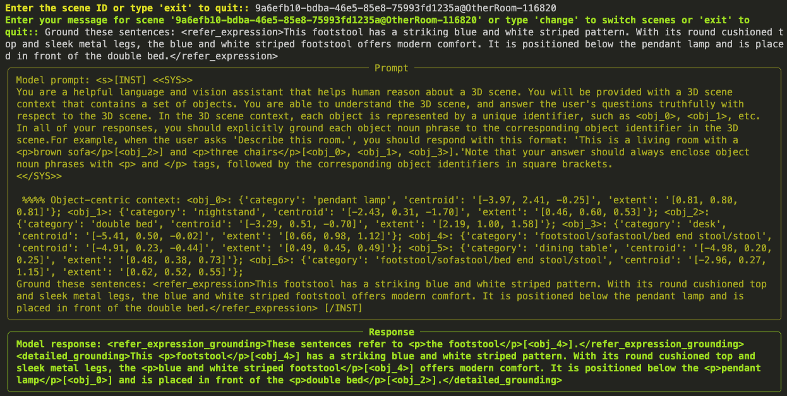

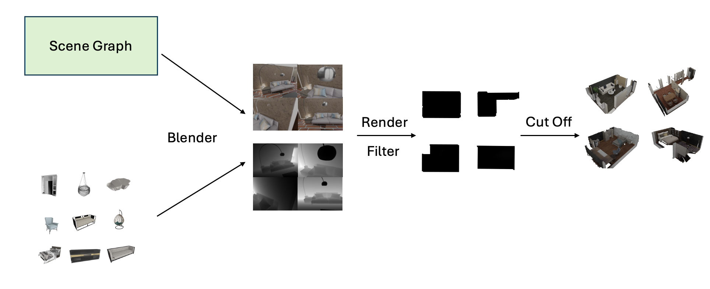

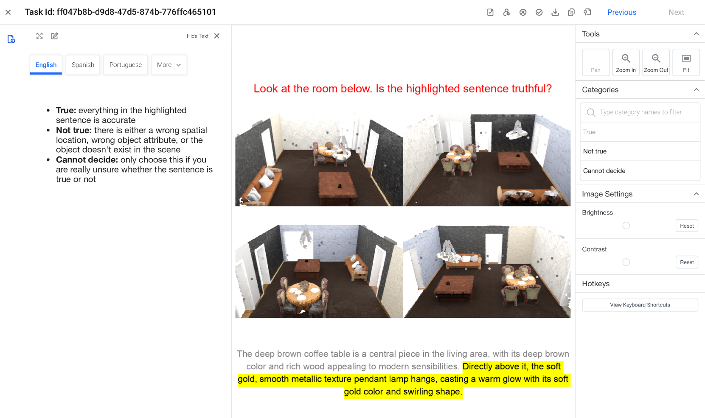

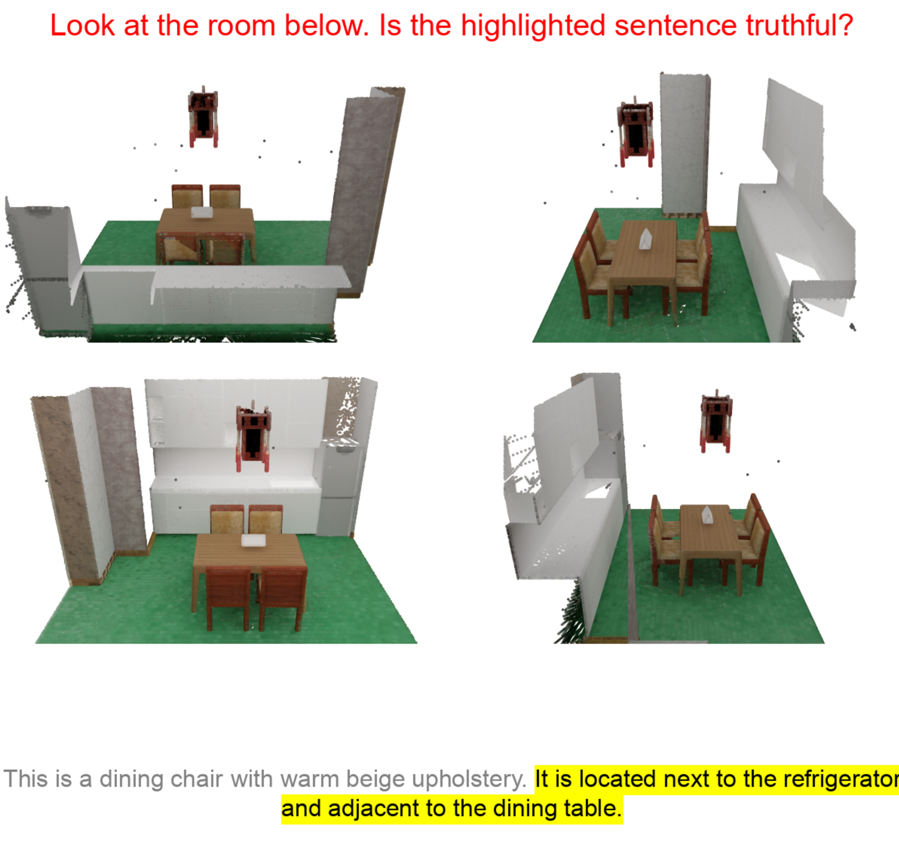

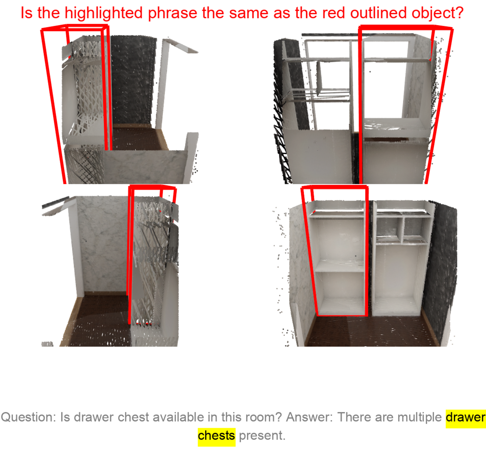

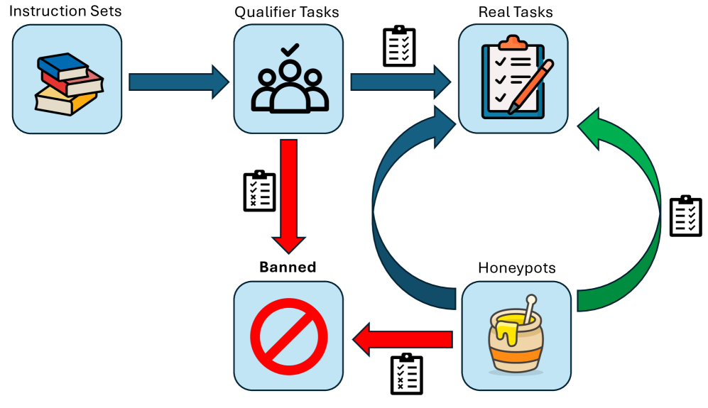

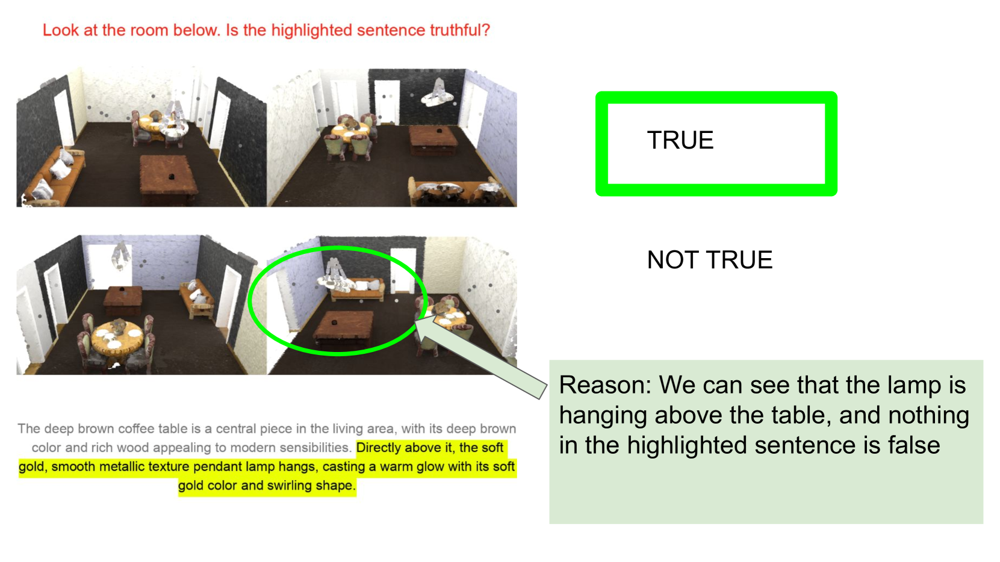

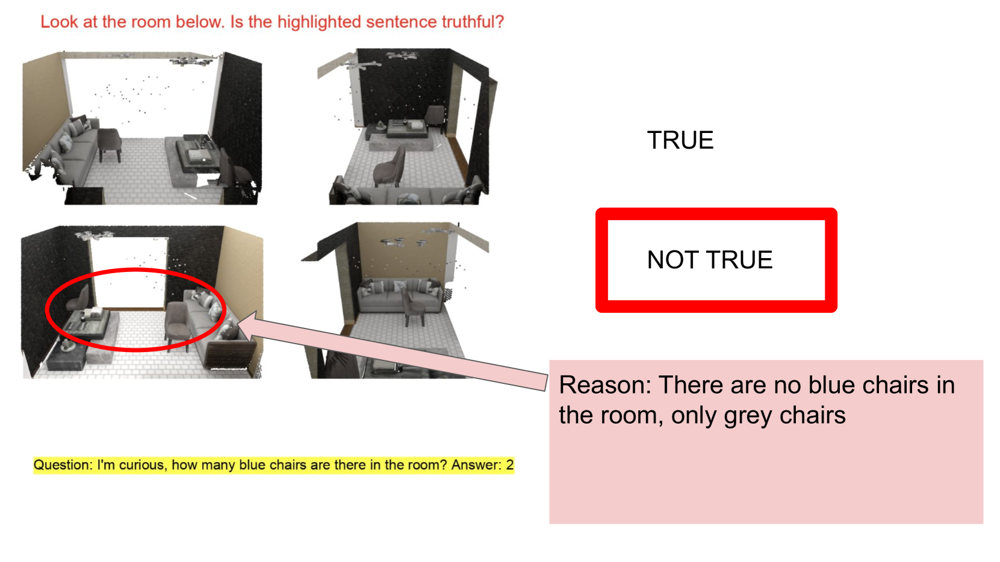

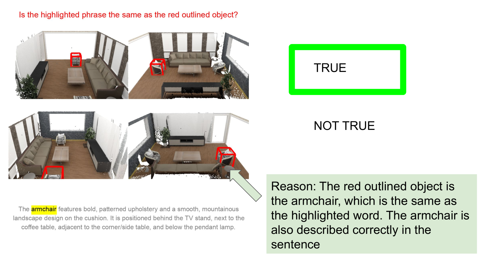

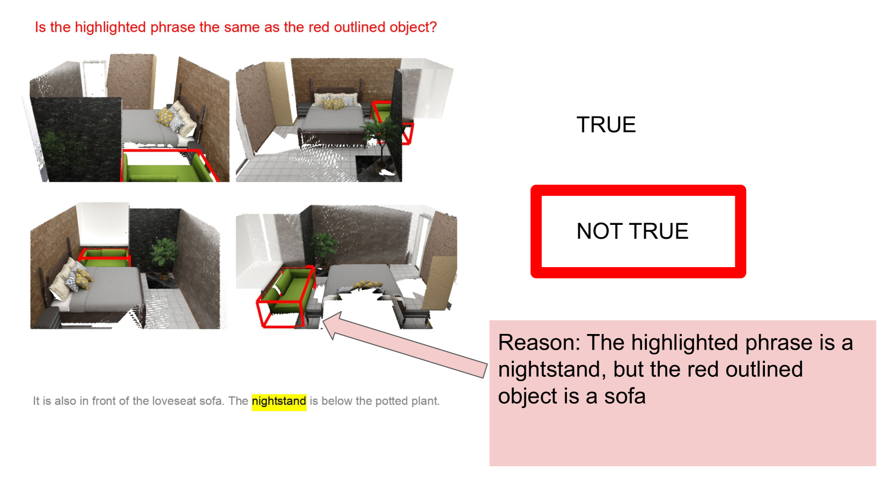

[Arxiv](https://arxiv.org/abs/2406.05132)